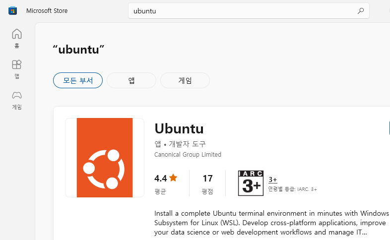

# WSL을 이용한 SISETA 빌드하기

## Contents
1. WSL 설치하기
2. 빌드 전 필요한 패키지 설치하기
3. SIESTA 빌드하기
4. 테스트 계산 해보기

## 1. WSL 설치하기

SIESTA 프로그램은 linux용 프로그램이므로 windows 컴퓨터에 직접 설치가 불가능하다. windows에서 linux를 사용할 수 있게 해주는 WSL을 설치하거나 linux가 깔려있는 컴퓨터가 필요하다. WSL의 설치에 관한 정보는 [위키 페이지](<https://yhkimlab.github.io/yhkimlabwiki/site/setting/>)에 자세히 설명되어있다. 

WSL을 설치한 후 microsoft store에서 ubuntu를 검색해서 우분투를 설치해준다. 이렇게 설치하면 가장 최신 버전인 22.04.1 LTS버전이 설치될 것이다. 원한다면 이전 버전의 우분투를 사용해도 좋다.



## 2. 빌드 전 필요한 패키지 설치하기

프로그램을 빌드하려면 컴파일러가 필요하고, 오픈소스 컴파일러중 가장 유명한 컴파일러는 GNU compiler이다. apt-get을 이용해서 GCC를 설치해 줄 것이고, SIESTA가 fortran언어로 구성되어있어 추가적으로 gfortran도 설치해 줄 것이다. 다음 명령어를 이용해서 빌드에 필요한 가장 기초적인 패키지를 설치할 수 있다.

```bash
    sudo apt install build-essential gfortran
```

위 패키지 만으로도 빌드는 가능하나, 코어를 하나만 사용할 수 있어 계산속도가 느리다. 추가적인 계산속도 향상을 위해 병렬화 패키지를 설치해 줄 필요가 있다. 병렬화를 위해 Message Passing Interface(MPI)를 많이 사용하고, 우분투에서는 대표적으로 OpenMPI가 많이 사용된다. OpenMPI를 설치하는 명령어는 다음과 같다.

```bash
    sudo apt install libopenmpi-dev openmpi-bin
```

SIESTA 4.x 버전에서는 선형 대수학 라이브러리가 기본적으로 제공된다. 그러나, 속도면에서 apt에서 설치가능한 선형 대수학 라이브러리를 사용하는 것이 좋다. apt로 이를 설치하기 위해선 다음의 명령어가 필요하다.

```bash
    sudo apt install libblas-dev liblapack-dev libscalapack-mpi-dev
```

플랫폼에 무관한 입출력과 후처리의 용이성을 위해 NETCDF와 HDF5를 추가로 설치해준다.

```bash
    sudo apt install libhdf5-dev libhdf5-mpi-dev libnetcdf-dev libnetcdff-dev netcdf-bin
```

## 3. SIESTA 빌드하기

### 소스 다운로드

필요한 패키지를 설치했으면 이제 컴퓨터에 SIESTA를 빌드할 수 있다. SIESTA를 빌드하기 위해서는 우선 SIESTA 프로그램들을 다운로드 받아야 한다. SIESTA의 공식 릴리즈판은 [SIESTA Gitlab](https://gitlab.com/siesta-project/siesta/-/releases)에서 받을 수 있다. 가장 최신 릴리즈인 4.1.5버전의 소스코드를 받으려면 다음 명령어를 사용하면 된다.

```bash
    wget https://gitlab.com/siesta-project/siesta/-/releases/v4.1.5/downloads/siesta-4.1.5.tar.gz
```

소스코드를 받았다면, 다음 명령어로 압축을 풀어준다. 그리고, 압축을 푼 폴더로 이동해준다.

```bash
    tar xvzf siesta-4.1.5.tar.gz
    cd siesta-4.1.5
```

### 빌드 설정하기

SIESTA를 빌드하기 전에 몇가지 설정이 필요하다.

1. Obj/ 폴더로 이동하거나 빌드할 폴더를 만든다.
2. arch.make 파일을 만든다.
3. obj_setup.sh 스크립트를 실행시킨다.
4. 빌드 설정이 잘되어있는지 확인한다.

arch.make파일은 다른 프로그램 빌드시의 configure에 해당하는 파일로, 컴파일시 환경설정을 해주는 파일이다. 병렬계산, 그리고 netcdf를 포함하려면 arch.make를 수정해서 빌드해야한다. 필자가 수정한 arch.make 파일은 아래에서 다운로드 받을 수 있다. 이 arch.make 파일을 Obj 폴더에 복사해서 넣어준다.

[arch.make](img/build/arch.make){ .md-button }

이후 Obj 폴더에서 obj_setup.sh 스크립트를 실행한다. 이를 통해 모든 소스는 Src 폴더에 있는 상태로 빌드만 Obj 폴더에서 진행된다. Obj 폴더에서 다음과 같은 명령어를 넣어주면 된다.

```bash
    sh ../Src/obj_setup.sh
```

### SIESTA 빌드

마지막으로 SIESTA 빌드해준다. 터미널에서 Obj 폴더에서 make라고 쳐주면 된다. 그러면 SIESTA 프로그램이 빌드되어 나오고, 이를 이용해 SIESTA 계산을 진행할 수 있다. make도 병렬화가 되기 때문에 코어 수에 맞춰 -j옵션을 넣어 N개의 코어로 빌드를 더 빠르게 할 수 있다. 예를 들어 ==make -j 4== 라는 명령어를 사용하면 cpu에서 4개의 코어로 빌드가 되어 더 빠르게 빌드를 할 수 있다.

```bash
    make -j N (N은 코어의 수)
```

빌드가 되었으면 링크를 생성해 터미널에서도 siesta 명령어를 쳤을 때 동작하게 만들면 편하다. 이를 위해 /usr/bin에 링크를 만들어 줄 것이다. siesta의 절대경로를 pwd 명령어를 통해 안 후, 다음 명령어를 통해 siesta의 링크를 생성한다.

```bash
    ln -s $SIESTA /usr/bin/siesta
```

이때 $SIESTA는 siesta 프로그램의 절대경로를 뜻한다. 추가적으로 siesta 링크에 실행권한을 부여해야 터미널에서 명령어로 사용할 수 있다.

```bash
    sudo chmod +x /usr/bin/siesta
```

이제 터미널에서 siesta 명령어를 쳐보자. 결과가 아래 사진과 같이 나온다면 SIESTA를 성공적으로 빌드한 것이다.


추가적으로 TRANSIESTA 계산의 후처리 과정을 위한 TBTRANS등 유틸을 빌드해야한다. 유틸은 Util 폴더에 있고, Util 폴더 안에 있는 build_all.sh 스크립트를 실행시키면 된다.

```bash
    ./build_all.sh
```

빌드가 완료되면 다음과 같이 빌드가 안된 폴더들이 나온다. 이때 TS와 관련된 폴더가 없다면 빌드가 잘 된 것이다.


마찬가지로 Tbtrans도 /usr/bin/폴더에 링크를 만들어 터미널에서 명령어로 사용하면 좋다. tbtrans는 Utils/TS/TBtrans/tbtrans에 위치해 있고, siesta에서 했던 것과 동일하게 링크를 만들어주면 된다.

## 4. 테스트 계산 해보기

빌드가 다 되었으면 테스트 계산을 해보아 실제로 SIESTA가 잘 동작하는지 확인해보자. Tutorial 예제 중 하나인 gold bulk 계산을 한 경우에 대해 해볼 것이다. 테스트 계산은 아래에서 다운로드 받을 수 있다. 적당한 곳에 이 파일을 복사한 후 다음 명령어로 압축을 풀어준다.

[예제 파일](img/build/test.tar.gz){ .md-button }

```bash
    tar -xvzf test.tar.gz
```

파일의 압축을 풀면 bulk라는 폴더가 나오고, 그 안에 input이라는 폴더가 있을 것이다. input 폴더 안까지 들어간 다음에 다음 명령어를 치면 계산이 진행된다.

```bash
    siesta RUN.fdf
```

위 명령어를 실행시키면 터미널에서 계산이 진행되며, 다음 그림과 같이 scf loop가 돌면서 제 1원리 계산이 수행되는 모습을 볼 수 있다.


다만, 이렇게 진행하면 serial 모드로 동작해서 mpi로 빌드했다 하더라도 코어를 하나밖에 쓰지 못한다. 따라서 병렬계산을 하기 위해 mpirun이라는 명령어를 사용해야한다. mpirun은 프로그램을 병렬로 실행시켜 주는 역할을 한다. 다음과 같은 명령어를 사용하면 코어 4개를 병렬적으로 위 serial 계산과 동일한 계산을 진행하게 된다.


```bash
    mpirun -np 4 siesta RUN.fdf
```

이때 -np뒤의 숫자는 자신의 cpu 사정에 맞게 코어 수를 조절해서 넣어주면 된다. i5-9500F로 계산시 코어를 하나만 쓴 serial 계산과 코어를 4개 쓴 parallel 계산을 비교하면 결과는 다음과 같다.

|     Serial         |    Parallel    |
| :----------------: | :------------: |
|      14.99[s]      |    8.51 [s]    |

위 표처럼 parallel 계산시 시간이 더 단축됨을 확인할 수 있다.