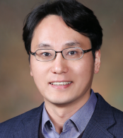

# About

## Professor 

Name : Yong-Hoon Kim

Education:

- 1991.03-1995.02 B.S in Physics, Seoul National University
- 1995.09-2000.07 Ph.D in Physics, University of Illinois at Urbana-Champaign, USA (with Prof. Richard M. Martin)

Vocational Experience:

- 2010.06-Present Assistant & Associate Professor, School of Electrical Engineering & Graduate School of EEWS, KAIST
- 2006.08-2010.06 Assistant Professor, Department of Materials Science and Engineering, University of Seoul 
- 2004.04-2006.07 Assistant Professor, School of Computational Sciences, Korea Institute for Advanced Study
- 2002.03-2004.03 Postdoctoral Researcher, Materials and Simulation Center, California Institute of Technology, USA (with Prof. William A. Goddard III)
- 2000.08-2002.02 Humboldt fellow, Lehrstuhl fur Theoretische Chemie, Technische Universitat Munchen, Germany (with Prof. Andreas Gorling)

Miscellaneous Experience:

- 2002.09-2002.12 Fellow, Institute for Pure and Applied Mathematics, University of California at Los Angeles
- 1995.08-2000.07 Teaching and research assistant, Department of Physics, University of Illinois at Urbana-Champaign

Honors and Awards:

- 2017.07 Nano Korea Research Innovation Award – Minister Award (Ministry of Science, ICT, & Future Planning)
- 2016.10 KAIST Research, Education, Development, & Business Project Outstanding Achievement (KAIST)
- 2015.03 Outstanding Achievement Award - EDISON Simulation S/W Development (National Research Foundation)
- 2011.10 Outstanding Alumni Award (Korea Institute for Advanced Study)​
- 2007.11 Hynix Best Lecture Note Award (Korean Society for Engineering Education)
- 2006.08 Best Oral Presentation Award (IEEE Nanotechnology Materials and Devices Conference)
- 2002 Fall IPAM fellowship for the "Mathematics in Nanoscale Science and Engineering" program (Institute for Pure and Applied Mathematics, UCLA, U.S.)
