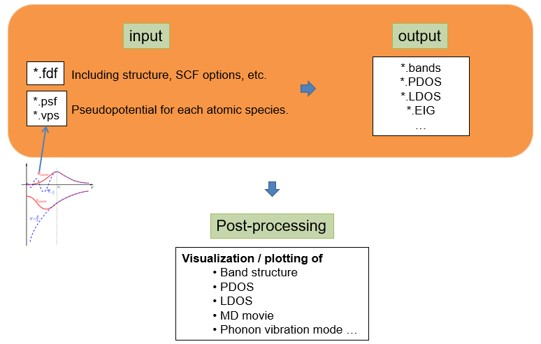
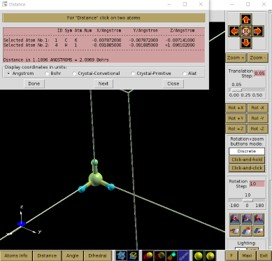
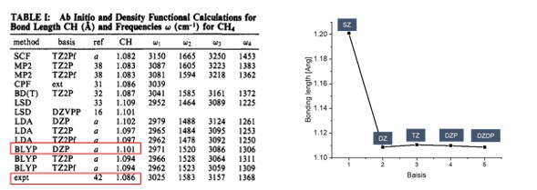

Tutorial 0: Basic SIESTA Calculation
====================================

## Part 1: 이론적 배경 & siesta 개요

참고문헌: SIESTA homepage (<http://www.icmab.es/siesta/>)   Documentation Tutorials 

### 이론적배경
a. SIESTA에서는 Kohn-Sham 방정식을 푸는 시뮬레이션을 진행한다. Kohn-sham 방정식은 아래와 같다.


- Pseudopotential 은 계산의 편의를 위해 원자의 핵심부 전자들을 하나의 포텐셜로 치환하는 것을 의미한다. 아래 그림과 같이 pseudopotential은 원자와의 일정 거리(rc) 이상에서 실제 전자의 파동함수와 같도록 만들어 준다.


- 계산 상에서 간소화로 인해 야기되는 무시된 single-particle problem은 LDA(Local Density approximation)나 GGA(Generalized Gradient Approximation)와 같은 exchange-correlation 함수로 고려한다.
- Kohn-sham 방정식에서 파동함수는 SZ(single zeta), DZ(double zeta), TZ(triple zeta), DZP(double zeta polarized), DZDP(double zeta double polarized)…와 같은 basis로서 표현된다.
- 앞서 언급된, Basis의 결정으로 Basis 의 숫자가 결정되며 이는 계산의 정확도와 관련이 있다.

b. Kohn-Sham DFT(Density Functional Theory)은 화학적 및 재료특성을 예측할 수 있는 가장 널리 사용되는 전자구조 이론이다. 양자 역학에서 원자의 전자 구성을 파동 함수로 설명되는데 수학적 의미에서 이러한 파동 함수는 주어진 원자의 전자를 설명하는 basis 함수로 사용된다. 이러한 basis를 사용하여 여러 개의 원자 오비탈의 계수를 곱한 값의 선형확장(linear expansion)으로 분자 오비탈을 표현한다. DFT 계산은 이러한 가정인 LCAO(linear combination of atomic orbitals)에 기초하고 있다. 계산에서 사용되는 SCF(self-consistent-field) 계산의 알고리즘은  아래의 그림과 같다. 그림과 같은 iteration method을 통해 변분법에 따른 안정된 에너지를 가지는 역학적에너지와 포텐셜 에너지의 합을 뜻하는 연산자 Hamiltonian을 구할 수 있다. 이를 통해 band structure, DOS(Density Of States), PDOS(Projected Density Of States) 등 다양한 물질특성을 분석할 수 있다.


알고리즘에서 H(Hamiltonian)은 LCAO(linear combination of atomic orbitals)로 구성되며 SCF loop를 통해 안정된 에너지를 가지는 H를 구할 수 있다. 이를 통해 Bandstructure, (P)DOS 등 다양한 물질특성을 분석할 수 있다.


### Siesta 개요

- 위와 같은 DFT 계산을 위해서는 아래와 같은 입력(input) 파일과 실행(executable) 파일이 필요하다. Input 파일은 *.fdf,(RUN.fdf, STRUCT.fdf, KPT.fdf, BASIS.fdf) 와 *psf 가 필요하다.
- fdf 파일은 파일을 실행시키는데 필요한 정보들을 가지고 있는 파일이며 psf파일은 pseudopotential 정보를 가지고 있는 파일을 뜻한다.
- 이러한 input 파일을 통해 band structure, PDOS, eigenvalue 등의 결과를 알 수 있다. 
- SIESTA 는 아래 그림과 같은 과정으로 진행된다.




## Part 2: 분자

### Exercise 1: CH4 분자 구조 최적화

DFT 계산을 위해서는 먼저 계산하려는 구조의 최적화가 필요하다.

a. 구조 최적화는 다음과 같은 방식으로 진행된다. 


- Step 1. 분자 구조를 추측하여 구조최적화 계산을 한다.
- Step 2. 위의 계산결과를 바탕으로 구조최적화 조건 없이 구조 계산을 실행한다.

b. STRUCT 파일 구성 

- 사이트 (<https://materialsproject.org>)에서 원하는 원자 구조를 Primitive Cell 로 받는다.


- Material studio 에서 다운받은 파일을 실행시킨 다음 export에서 msi 로 저장한다.


- Xshell에서 아래그림과 같이 새 파일 전송을 누른다.


- 이제 다운받은 파일을 Xftp에서 드래그를 통해 옮긴 후 다음 커맨드를 입력한다. 


첫번째 방법

```bash
$vasptools-linux –poscar (material)_mp-492_primitive.msi
$vi POSCAR
$vasptools-linux –xyz POSCAR
$xyz2structfdf_full.py POSCAR.xyz
```

두번째 방법

```bash
$msi2fdf.sh (material)_mp-492_primitive.msi
$vi STRUCT.fdf
```
이로서 구조최적화를 하기 전 기본적인 STRUCT.fdf 파일을 만들 수 있다.
```bash
$vi STRUCT.fdf
NumberOfAtoms    5           # Number of atoms
NumberOfSpecies  2           # Number of species
%block ChemicalSpeciesLabel
 1 6 C
 2 1 H
%endblock ChemicalSpeciesLabel
LatticeConstant      40.000000000 Ang
%block LatticeVectors
    1.000000000     0.000000000     0.000000000
    0.000000000     1.000000000     0.000000000
    0.000000000     0.000000000     1.000000000
%endblock LatticeVectors
AtomicCoordinatesFormat ScaledCartesian
%block AtomicCoordinatesAndAtomicSpecies
    -0.000196800    -0.000196800    -0.000178525    1    1
     0.025718150    -0.006302475    -0.007980825    2    2
    -0.006302475     0.025718150    -0.007980825    2    3
    -0.002297125    -0.002297125     0.027402550    2    4
    -0.017873200    -0.017873200    -0.012210550    2    5
%endblock AtomicCoordinatesAndAtomicSpecies
```
c.pseudopotentil 파일은 default pseudopotential (ChemicalSpeciesLabel.psf) for each atomic species. (<https://departments.icmab.es/leem/siesta/Databases/Pseudopotentials/periodictable-lda-abinit.html>) 에서 다운 받거나 직접 만들 수 있다. 계산에 필요한 pseudopotential 파일과 BASIS.fdf, KPT.fdf, slm_siesta_run파일은 폴더에 정리해 두었다.

d. 계산을 위한 폴더 만들기

```bash
$ mkdir ch4(폴더이름) 
$ cd ch4
slm_siesta_run을 ch4 폴더에 복사
$ mkdir input(폴더이름)
$ cd input 
C.psf, H.psf, RUN.fdf, STRUCT.fdf, KPT.fdf, BASIS.fdf 파일을 input 폴더에 복사
$  cd ..
$ sbatch slm_siesta_run
```

구조최적화를 위해서는 계산된 결과(OUT)를 통해 새로운 입력(input) 파일을 생성하여 새로운 계산을 실행해야 한다. 

```bash
$ cd input
$ siesta2xyz.py STRUCT.fdf
$ vi STRUCT.xyz
셀정보를 복사(아래그림의 빨간색 영역)
```


```bash
$ cd ..
$ cd OUT
$ vi Test.xyz(cell정보가 포함되어 있는 파일)
셀정보를 붙여넣기

$ xyz2fdf_cell.py Test.xyz
$ cd ../../
$ cp Text.fdf ../input/
새로운 STRUCT.fdf 파일 생성
$ cp Text.fdf STRUCT.fdf
$ cd ..
$ cd input
$ vi RUN.fdf
MD.NumberCGstep을 0으로 바꾼다.
$ cd ..
$ sbatch slm_siesta_run
```
STRUCT.fdf 파일 시각화를 통해 구조최적화 전후의 bonding length 와 bonding angle이 달라짐을 확인 할 수 있다. 

```bash
$ cd (OUT directory)
$ xyz2fdf_cell.py STRUCT.fdf (STRUCT.fdf 파일을 xyz 파일로 변환)
$ xyz2xcrysden.py STRUCT.xyz
```
Display-Unit of Repetition-Translational asymmetric unit 선택


Distance 선택 후 원자 두개를 선택한 후 Done을 선택하면 Distance를 알 수 있다.



Angle 선택 후 원자 세개를 선택한 후 Done을 선택하면 Angle을 알 수 있다.


> 구조 최적화 전 bonding length : 1.30719 Ang, bonding angle : 108.7856 deg
> 구조 최적화 된 bonding length : 1.10977 Ang, bonding angle : 109.4914 deg


### Exercise 2: CH4 분자 basis 확인

 구조최적화를 위와 같이 진행 한 후에는 Basis 확인를 통해 사용한 Basis가 적절한지 테스트를 한다. Basis 테스트는 구조최적화가 완료된 구조에서 각 Basis 별로 계산을 진행하여 안정된 에너지를 가지는 Basis를 선택하면 된다. 

- Siesta code
```bash
$ cd input
$ vi BASIS.fdf
아래 그림의 PAO.BasisSize를 SZ, DZ, TZ, DZDP 등으로 테스트 한다.
```

\


- xyz 파일보기 -Basis 별 bonding length 과 Reference(Handy, Nicholas C., Christopher W. 

```bash
$ cd OUT
Control + Alt + F
Test.xyz 파일을 바탕화면에 옮기고 Vesta 툴을 사용하여 xyz 파일을 볼 수 있다.
또는 xyz2xcrysden.py Test.xyz로 파일을 볼 수 있다. 
아래 그림의 PAO.BasisSize를 SZ, DZ, TZ, DZDP 등으로 테스트 한다.
```

Murray, and Roger D. Amos. "Study of methane, acetylene, ethene, and benzene using Kohn-Sham theory." The Journal of Physical Chemistry 97.17 (1993): 4392-4396.) 와 비교




|   | SZ | DZ | TZ | DZP | DZDP |
|---|:---:|:---:|:---:|:---:|---:|
| `Bonding length [Ang]` | 1.20100 | 1.10876 | 1.11050 | 1.10977 |	1.10861 |
| `Bonding angle [degree]` | 109.4398 |	1.091358 | 109.1567 |	109.4914 | 109.3702|


### Exercise 3: CH3 전자밀도

a. spin에 따른 전자밀도를 보는 방법은 아래와 같다. Spin 에 따른 전자밀도를 시각화 하기 위해서는 RUN.fdf 에서 아래와 같은 코드를 추가하여야한다

```bash
%include STRUCT.fdf
%include BASIS.fdf
%include KPT.fdf
#General system specifications
SystemName          CH3 molecule
SystemLabel         ch3
#Density functional
XC.functional GGA
XC.authors  PBE
#Real space grid 
MeshCutoff    400.0 Ry
# Convergence of SCF 
MaxSCFIterations   100
DM.MixingWeight    0.25
DM.NumberPulay     5
# Type of solution (diagon is the  default for less than 100 atoms)
SolutionMethod diagon
#Geometrical optimization
MD.TypeOfRun         CG
MD.NumCGsteps        100
MD.MaxCGDispl         0.1 Bohr
MD.MaxForceTol        0.02 eV/Ang

#Spin polarization 
 SpinPolarized .ture.

#3DPlos
 SaveRho .true.
%block LocalDensityOfStates
 -6.00 -3.00 eV
%endblock LocalDensityOfStates

WriteCoorXmol        .true.  # SystemLavel.xyz 
WriteMDXmol    .true.

```

b. siesta code

```bash
$ mkdir Ch3 (Ch3폴더 생성)
slm-siesta_run 파일을 여기에 복사
$ mkdir input
$ cd input 
ch3input, c.psf, H.psf 파일을 여기에 복사
$ cp ch3input RUN.fdf
$ cd ..
$ sbatch slm-siesta_run
& cd OUT
rho2xsf 파일을 여기에 복사
$ rho2xsf
$ ch3
$ A
$ -2 -2 -2
$ 5 0 0
$ 0 5 0
$ 0 0 5
$ 100 100 100
$ RHO
$ BYE
$ xcrysden –-xsf *.XSF
입력하면 XCrySDen 창이 열린다.
ToolData Grid(up, down 선택)Isovalue 범위 설정submit으로 charge density를 아래와 같이 그릴 수 있다.
```


rho2xsf 에 입력되는 문장의 의미는 다음과 같다.
A : Ang or Bohr
-2 -2 -2 : 원점
5 0 0
0 5 0 
0 0 5 : x y z 방향 벡터를 통해 구성되는 시스템의 크기를 정의
100 100 100 : 방향에 따른 grid points 정의
RHO : 변환되는 grid 파일 

