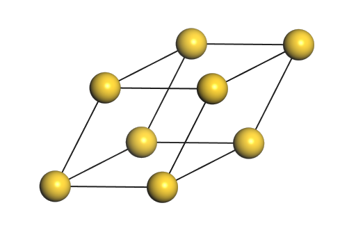
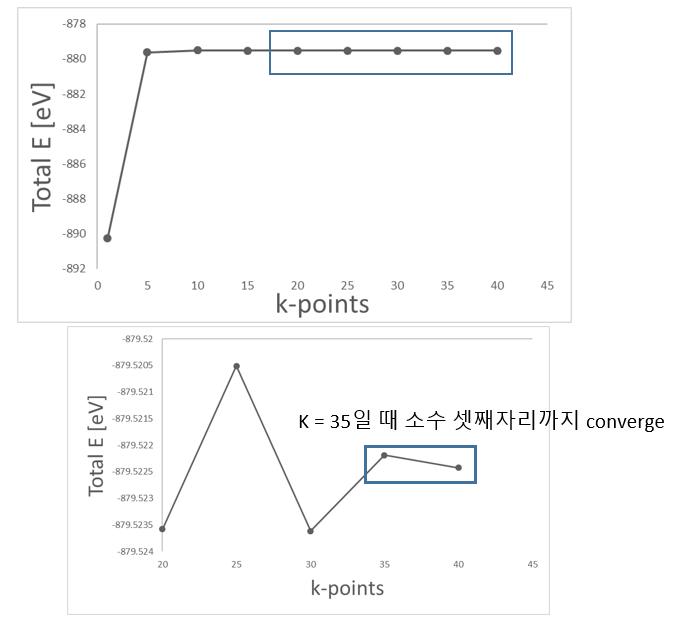
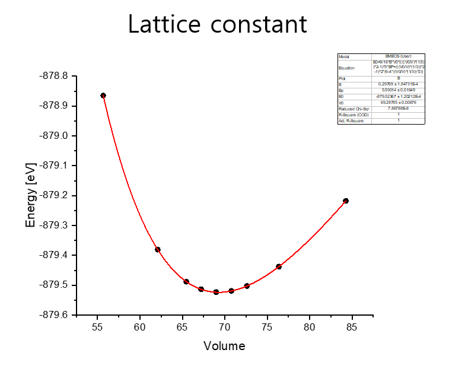
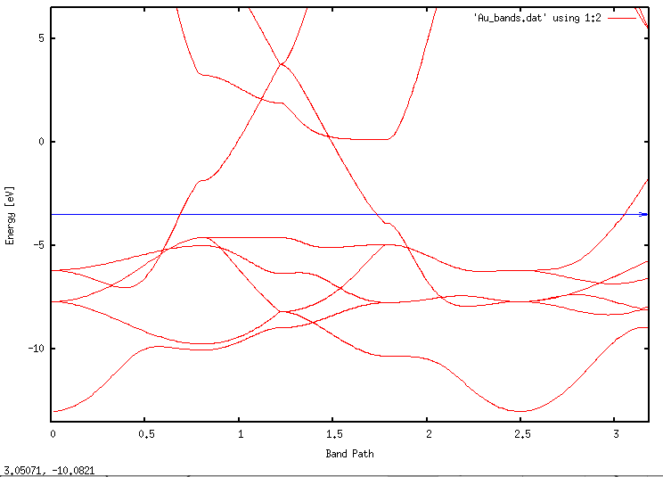

Au 전자 구조 계산
=========================

## Contents

1. Exercise : Structure optimization
2. Exercise : Electronic structure calculation()
3. Exercise : Au Slab electronic structure calculation  

## Exercise 1: Structure optimization

올바른 전자구조를 산출하기 위해서는 정해둔 허용 오차(Tolerance) 내의 최적화된 모델을 분석해야 한다. 이를 위해 실질적인 전자 구조 계산에 앞서 k-point sampling과 lattice constant를 찾아 Au bulk에 대한 geometry optimization을 진행해야 한다. SIESTA 계산을 위한 input 파일들은 ‘1.Gold(band, work function)' 폴더 안에 정리해 두었다.

{: align=left style="width:300px"}

|     Basis size     |      DZP       |
| :----------------: | :------------: |
| Basis energy shift |   100 [meV]    |
|         XC         |      LDA       |
|       DM.tol       | $10^{-3}$ [eV] |

### 1) k-point sampling

첫 번째로 찾아야 할 것은optimal한 k point의 수이다. KPT.fdf 파일에서 k-point 값들을 변경해가며 Total Energy가 converge 하는지 확인한다. Gold bulk 모델은 3차원이므로 kx, ky, kz 모두 동일하게 더한다. 이 때 RUN.fdf의 CG step은 0을 주어 single point 계산을 한다.

```bash
$ vi RUN.fdf
MD.NumCGsteps         0

$ vi KPT.fdf
# 1 x 1 x 1 k-points                  # 5 x 5 x 5 k-points
%block kgrid_Monkhorst_Pack	    %block kgrid_Monkhorst_Pack
1   0   0   0.0			     5   0   0   0.0
0   1   0   0.0			     0   5   0   0.0
0   0   1   0.0			     0   0   5   0.0
%endblock kgrid_Monkhorst_Pack	    %endblock kgrid_Monkhorst_Pack

$ qsub slm_siesta_run
$ grep "Total =" */stdout.txt
01/stdout.txt:siesta:         Total =    -890.242694
05/stdout.txt:siesta:         Total =    -879.628064
10/stdout.txt:siesta:         Total =    -879.501538
15/stdout.txt:siesta:         Total =    -879.521142
20/stdout.txt:siesta:         Total =    -879.523580
25/stdout.txt:siesta:         Total =    -879.520510
30/stdout.txt:siesta:         Total =    -879.523611
35/stdout.txt:siesta:         Total =    -879.522186
40/stdout.txt:siesta:         Total =    -879.522421

```



앞선 계산의 DFT parameter 중 SCF Convergence의 Tolerance를 10-3 eV로 설정하였기 때문에 k-point가 35에서 수렴한다고 판단할 수 있다.


### 2) Lattice constant
다음으로는 최적화된 lattice constant를 구하기 위해서 1)에서 구한 k-point 값(35, 35, 35)으로 고정시킨 뒤 lattice constant를 변화시킴으로써 그 값을 구할 수 있다.  이 때 RUN.fdf의 CG step은 300을 주어 계산한다

```bash
$ vi RUN.fdf
MD.NumCGsteps         300

$ vi STRUCT.fdf
# lattice constant = 2.5 Ang
LatticeConstant	2.7 Ang
%block LatticeVectors
0.81649  0.28867   0.50000
0.00000  0.86602   0.50000
0.00000  0.00000   1.00000
%endblock LatticeVectors
$ qsub slm_siesta_run
```
Lattice constant를 0.1Ang 단위로 변화시켜 계산한 결과는 다음과 같다.

```bash
$ grep ‘Total =’ */stdout.txt
2.7/OUT/stdout.txt:siesta:         Total =    -878.864652
2.8/OUT/stdout.txt:siesta:         Total =    -879.380658
2.9/OUT/stdout.txt:siesta:         Total =    -879.523113
3.0/OUT/stdout.txt:siesta:         Total =    -879.437956
3.1/OUT/stdout.txt:siesta:         Total =    -879.217521

```

보다 정확한 값을 얻기 위해 2.9 근처에서 0.25Ang 단위로 계산해준다.

```bash
2.7/OUT/stdout.txt:siesta:         Total =    -878.864652
2.85/OUT/stdout.txt:siesta:         Total =    -879.488093
2.875/OUT/stdout.txt:siesta:         Total =    -879.513503
2.8/OUT/stdout.txt:siesta:         Total =    -879.380658
2.925/OUT/stdout.txt:siesta:         Total =    -879.519227
2.95/OUT/stdout.txt:siesta:         Total =    -879.502431
2.9/OUT/stdout.txt:siesta:         Total =    -879.523113
3.0/OUT/stdout.txt:siesta:         Total =    -879.437956
3.1/OUT/stdout.txt:siesta:         Total =    -879.217521

```
3d 물질에서 lattice constant를 찾기에 적합한 fitting은 murnaghan fitting이다. 계산된 결과를 이용해 에너지가 가장 낮은 lattice constant를 murnaghan fitting을 통해 찾았다. 최적화된 volume은 69.28785$\overset{\circ}{A}^3$이고, 이를 통해 lattice constant를 구하려면 부피의 세제곱근을 하면 된다. 따라서 lattice constant는 4.107$\overset{\circ}{A}$이고,이를 FCC unit cell의 한 변의 길이로 치환하면 2.904$\overset{\circ}{A}$이 된다.



> lattice constant = 2.904 $\overset{\circ}{A}$


### 3) Optimize
마지막으로 1)에서 구한 k point (35x35x35)을 KPT.fdf에 입력해주고, 2)에서 찾은 lattice constant(2.904$\overset{\circ}{A}$)를 STRUCT.fdf에 입력해 준 뒤 RUN.fdf에 CG step 값을 300을 주어 최종적으로 구조를 optimize한다.

```bash
$ vi KPT.fdf
# 1 x 1 x 1 k-points 
%block kgrid_Monkhorst_Pack	
35   0   0   0.0
0   35   0   0.0
0   0   35   0.0
%endblock kgrid_Monkhorst_Pack
```
```bash
$ vi STRUCT.fdf
LatticeConstant	2.91154 Ang
%block LatticeVectors
0.81649  0.28867   0.50000
0.00000  0.86602   0.50000
0.00000  0.00000   1.00000
%endblock LatticeVectors
```
```bash
$ vi RUN.fdf
MD.NumCGsteps         300
$ qsub slm_siesta_run
```

## Exercise 2: Electronic structure calculation

Gold Bulk에 대한 geometry optimization은 끝났으므로 지금부터 CG step 값은 0으로 두고 계산한다.

### 1) Bands
이번에는 Au의 Band를 한번 그려볼 것이다. Band 계산에서는 path에 따라 band가 다르게 보이므로 high symmetry band point를 우선으로 하되, 계산하는 물성의 특성상 주목해야할 band point가 있는지 확인해야 한다. band structure를 그릴 때 사용할 [reference](https://www.sciencedirect.com/science/article/pii/S0927025614007940#t0015)는 이 band 그래프이다. 우리는 이 band 그래프를 siesta 계산을 통해 동일하게 한번 그려볼 것이다.  

{: style="width:300px"}

위 그래프에서 band path는 $\Gamma-X-W-L-\Gamma-K$순으로 진행되고 있음을 볼 수 있다. 이와 같은 순서로 그리려면 siesta의 옵션을 이용하여 동일한 band path를 잡아줘야 한다. 우선 xcrysden으로 band path를 잡는 방법과 이를 siesta에 적용하는 방법을 소개하도록 하겠다.
처음으로 model을 xcrysden로 불러온다. 그 다음에 tools의 k-path selection을 선택하면 band path의 좌표를 계산해주는 화면이 나온다.

{: style="width:300px"}

그 다음에는 그리려고 하는 물질의 critical point를 골라 band path를 올바르게 선택하면 된다. Au는 FCC구조이므로 아래 그림과 같은 brillouin zone에서 살펴봐야 할 점을 xcrysden으로 선택하면 된다. [brillouin zone](https://wiki.fysik.dtu.dk/ase/ase/dft/bztable.html)

{: align=left style="height:300px"}

{style="height:300px"}

band path의 좌표를 알아냈다면 xcrysden 창의 오른쪽에 적힌 숫자들을 tutorial 1에서 했던 것처럼 RUN.fdf에 넣으면 된다. RUN.fdf에는 다음의 부분을 추가해주면 된다.

```bash
    BandLinesScale ReciprocalLatticeVectors
    %block BandLines
    1  0.0000 0.0000 0.0000 G
    60  0.5000 0.5000 0.0000 X
    60  0.7500 0.5000 0.2500 W
    60  0.5000 0.5000 0.5000 L
    60  0.0000 0.0000 0.0000 G
    60  0.7500 0.3750 0.3750 K
    %endblock BandLines
```

계산을 수행하면 *.bands파일이 나온다. 정확한 범위의 band structure를 그리려면 이 bands파일을 잘 이용해야 한다. 우선, bands파일에 있는 맨 첫번째 숫자는 fermi energy를 뜻한다. 그리고 맨 마지막 부분에 라벨이 달려있는 숫자가 있는데 이 숫자들이 brillouin zone으로 band structure 그래프의 x축에 대응되는 숫자들이다. 적절한 band를 그리려면 x축과 y축을 비교하려는 reference의 숫자들로 정해야 한다.

*.bands

```bash
  -3.50583946128311     #fermi energy
  0.000000000000000E+000   3.18573135134061     
  -10.7870979412504        78.0781178548763     
          15           1         301

    ...

           6            #band path
    0.000000   'G'       
    0.770656   'X'       
    1.155984   'W'       
    1.700920   'L'       
    2.368327   'G'       
    3.185731   'K'       
```

### Band 시각화

계산 결과에서 우리는 band를 그릴 때 필요한 요소가 무엇인지 알 수 있었다. 이제 실제로 이 요소들을 이용해 band 그림을 그려볼 차례이다.

```bash
$ cd (PATH)/output
$ new.gnubands Goldbulk.bands > Au_bands.dat
$ gnuplot
plot 'Au_bands.dat' using 1:2 w l
set xrange [0:3.185731] // 위 band file의 G부터 K까지 band path 
set yrange [-13.505839:6.494161] // 분석할 에너지 범위. Fermi level ±10
set xlabel 'Band Path'
set ylabel 'Energy [eV]'
set set arrow from 0, -3.505839, graph 1 to 3.185731, -3.505839 ls 3 // Fermi level plot
```



이와 같이 그리게 되면 reference와 흡사한 band 그림을 만들 수 있다. 그러나, 보통 band 그래프를 그리게 되면 y축은 $E-E_F$을 사용하고, x축은 band path는 숫자가 아닌 $\Gamma-X-W-L-\Gamma-K$와 같은 band point로 표현한다.
Origin을 사용해서 에너지를 Fermi Energy에 맞춰준 band path를 그려보면 결과는 다음과 같다.


## Exercise 3: Au Slab electronic structure calculation
Exercise 3에서는 Au slab의 work function을 계산하는 방법에 대해 배워 볼 것이다. Slab 모델 생성과 테스트, 그리고 work function을 구하는 방법까지 살펴볼 것이다.

### 1) slab model design
Work function을 구하기 위해서는 bulk 모델로 바로 구할 수 없고, 금속 표면을 모사한 slab model을 만들어야 한다. Slab 모델은 위에서 구한 최적화된 bulk model을 이용해서 [1, 1, 1]면을 표면으로 설정해줄 것이다.

slab 모델을 만드는 방법에는 여러가지 방법이 있지만, 이번에는 NanoCore library를 이용해서 slab 모델을 만들어 볼 것이다. NanoCore는 Siesta를 더 편하게 사용하기 위해서 사용하는 패키지로 원자 모델을 수정, 생성하고, siesta를 실행시키는 등 다양한 것을 할 수 있다.

```bash
from NanoCore import *
import os, sys

# Seunghyun Yu, KAIST
# Last revision: 2021/4/29
#
#--REVISION HISTORY--
#210429 make slab model from bulk with NanoCore library.

# command
# python make_slab.py {vacuum length}
# output
# "STRUCT.fdf", generated slab model

if __name__ == "__main__" :
    # input
    vacuum = float(sys.argv[1])

    # make slab model with 5 layers Au atoms in 111 surface.
    # vacuum is added from input
    modified = surflab.fccsurfaces('Au' , '111', (1, 1, 5), vac=vacuum )

    #generate STRUCT.fdf file
    sim = s2.Siesta(modified)
    sim.write_struct()
    print("STRUCT.fdf generated")
```

위 python 코드를 복사해서 make_slab.py 파일을 만들어준다. 그리고 다음의 명령어를 입력해준다.

```bash
  $ python make_slab.py 20 //vacuum 길이
```

위의 코드를 실행시키면 vacuum의 길이가 20$\overset{\circ}{A}$이고, Au가 5층 으로 쌓인 Au slab모델을 생성할 수 있다.


Slab model을 만들고, 구조 최적화를 진행 할 때 주목해야 할 변경사항은 RUN.fdf에서 constraint를 설정해주는 것이다. Work funciton을 계산하기 위한 Slab model은 surface에서 bulk로 이어지는 부분을 묘사할 수 있어야 하기 때문에, 표면에서 먼 원자들만 위치를 고정하고 최적화를 진행해야 한다. 이와 같은 조건을 추가하고 최적화를 진행하기 위해 RUN.fdf에 다음과 같은 Constraint option을 추가해야 한다.

```bash
# Geometry Constraints
%block GeometryConstraints
  position from 1 to 3
%endblock GeometryConstraint
```

위의 코드에서 Position은 STRUCT.fdf 파일에 적힌 atom의 번호를 뜻한다. STRUCT.fdf를 보면 Atom 번호 2번은 [1.442497834, 0.832826513, 2.355589098]에 위치한 Au 원자임을 알 수 있다. 따라서 위 코드는 atom 번호 1, 2, 3번을 고정시키므로 z축 아래 3개는 고정시키고 위에 2개의 원자만 풀어놓은 코드임을 확인할 수 있다. 이제 이 코드를 바탕으로 구조 최적화를 진행해주면 Work function을 구할 수 있다.

```bash
NumberOfAtoms    5           # Number of atoms
NumberOfSpecies  1           # Number of species

%block ChemicalSpeciesLabel
 1 79 Au
%endblock ChemicalSpeciesLabel

#(3) Lattice, coordinates, k-sampling

LatticeConstant       1.000000000 Ang
%block LatticeVectors
    2.884995667     0.000000000     0.000000000
    1.442497834     2.498479538     0.000000000
    0.000000000     0.000000000    27.066767295
%endblock LatticeVectors

AtomicCoordinatesFormat Ang
%block AtomicCoordinatesAndAtomicSpecies
     0.000000000     0.000000000     0.000000000    1    1
     1.442497834     0.832826513     2.355589098    1    2
     0.000000000     1.665653025     4.711178197    1    3
     0.000000000     0.000000000     7.066767295    1    4
     1.442497834     0.832826513     9.422356393    1    5
%endblock AtomicCoordinatesAndAtomicSpecies
```

### 2) before work function calculation

Slab 모델을 만든 후에는 basis를 설정해야 한다. 특히 중요하게 봐야할 항목은 PAO.EnergyShift 항목이다. Lattice constant를 구할 때 우리는 이 항목을 100meV를 주고 계산한다. 그러나, work function을 구할 때는 cutoff에 의해 결정되는 basis의 크기가 결과에 큰 영향을 주기 때문에 PAO.EnergyShift 항목을 50meV로 설정하고 계산을 진행하는 것이 좋다.

|     Basis size     |      DZP      |
| :----------------: | :-----------: |
| Basis energy shift |    50[meV]    |
|         XC         |      LDA      |
|       DM.tol       | $10^{-3}$[eV] |

Work function 계산을 위해 RUN.fdf 또한 바꿔줘야 한다. 우선적으로 slab 모델 계산에 필요한 옵션과 work function의 시각화를 위한 옵션을 넣어준다.

```bash
$ vi RUN.fdf
SaveElectrostaticPotential T // VH를 뽑아내는 옵션
SlabDipoleCorrection T // 매 SCF cycle에서 시스템의 dipole moment로 인해 생성된 진공에서의 전기장을 보정해준다.
```

Work function을 계산하기 전 우선적으로 k-point를 설정해야한다. K-point는 1, 1, 1]부터 시작해서 x, y값은 계속 늘려주고, z값은 1로 고정해둔다. 그리고 수렴하는 지점을 찾을 때까지 x, y값을 늘려간다. K-point를 이런 방식으로 찾아보면 [31, 31, 1]일 때 소수 셋째자리까지 converge하는 것을 확인할 수 있다.


###  Work Function 계산 및 Hartree Potential 시각화

구조 최적화가 완료되면 work function을 구할 수 있다. work function은 $Φ= E_{vac}- E_{Fermi}$로 정의되는데, 두 에너지는 stdout.txt에서 확인할 수 있다.

```bash
$ qsub slm_siesta_run

$ vi stdout.txt
siesta:         Fermi =      -4.506018
...
dhscf: Vacuum level (max, mean) =    0.751977    0.750869 eV
```

$Φ= E_{vac}- E_{Fermi}=(0.750869 eV)-(-4.506018 eV)= 5.256887
eV$

Metal work function의 [reference](https://public.wsu.edu/~pchemlab/documents/Work-functionvalues.pdf)에서 Au의 111면에서 실험 결과 work function은 5.31eV이다. 계산 결과와 유사함을 알 수 있다.

Output 폴더에 Au_slab 폴더 안에 들어있는 macroave.in 파일을 넣어준다. macroave는 *.VH를 읽는다. VH파일의 이름에 맞게 macroave.in을 수정해준다. 예시로 여기서는 *.VH 파일 이름이 Au_111.VH라고 하겠다.

```bash
$ vi macroave.in 
  Au_111         # Name of the file where the input data is stored
$ macroave macroave.in // Au_111.MAV, Au_111.PAV 생성
```

gnuplot을 이용하여 work function을 시각화해본다.

```bash
$ gnuplot
plot 'Au_111.PAV' using 1:2 w l
set xrange [0 : 55.58547] // Au_111 모델의 z lattice 크기[bohr]
set xlabel 'z [Ang]'
set ylabel 'Potential energy [eV]'
set arrow from 0, -4.592337, graph 1 to 55.58547, -4.592337 ls 3 // Fermi level plot
replot
```

