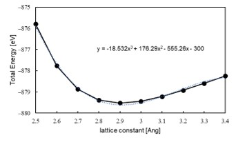

Tutorial : Au 전자 구조 계산
=========================
  
  

## Contents

1. Exercise : Structure optimization
2. Exercise : Electronic structure calculation()
3. Exercise : Au Slab electronic structure calculation  
  
  
  
  
  

## Exercise 1: Structure optimization

올바른 전자구조 산출하기 위해서는 설정한 허용 오차(Tolerance) 내의 최적화된 모델을 분석해야 한다. 이를 위해 실질적인 전자 구조 계산에 앞서 k-point sampling과 lattice & geometry optimization을 해주어 Au bulk 모델에 대한 최적화된 구조를 찾아야 한다. SIESTA 계산을 위한 input 파일들은 ‘1.Gold(band, work function)' 폴더 안에 정리해 두었다.

### 1) k-point sampling
첫 번째로 해주어야 할 것은 k-point sampling이다. KPT.fdf 파일에서 k-point 값들을 변경해가며 Total Energy가 converge 하는지 확인한다. Gold bulk 모델은 3차원이므로 kx, ky, kz 모두 변경한다. 이 때 RUN.fdf의 CG step은 0을 주어 single point 계산을 한다

```bash
$ vi RUN.fdf
MD.NumCGsteps         0
$ vi KPT.fdf
# 1 x 1 x 1 k-points                  # 5 x 5 x 5 k-points
%block kgrid_Monkhorst_Pack	    %block kgrid_Monkhorst_Pack
1   0   0   0.0			     5   0   0   0.0
0   1   0   0.0			     0   5   0   0.0
0   0   1   0.0			     0   0   5   0.0
%endblock kgrid_Monkhorst_Pack	    %endblock kgrid_Monkhorst_Pack
$ qsub slm_siesta_run
$ grep ‘Total =’ */stdout.txt
01/stdout.txt:siesta:         Total =    -889.489063
05/stdout.txt:siesta:         Total =    -879.566311
09/stdout.txt:siesta:         Total =    -879.489800
13/stdout.txt:siesta:         Total =    -879.464803
17/stdout.txt:siesta:         Total =    -879.464020
21/stdout.txt:siesta:         Total =    -879.463076
25/stdout.txt:siesta:         Total =    -879.463734
30/stdout.txt:siesta:         Total =    -879.466618
35/stdout.txt:siesta:         Total =    -879.465548
40/stdout.txt:siesta:         Total =    -879.465400
45/stdout.txt:siesta:         Total =    -879.466060
50/stdout.txt:siesta:         Total =    -879.465537

```


앞선 계산의 DFT parameter 중 SCF Convergence의 Tolerance를 10-3 eV로 설정하였기 때문에 k-point가 30에서 수렴한다고 판단할 수 있다


### 2) Lattice constant
다음으로는 최적화된 lattice constant를 구하기 위해서 1)에서 구한 k-point 값(30, 30, 30)으로 고정시킨 뒤 lattice constant를 변화시킴으로써 그 값을 구할 수 있다.  이 때 RUN.fdf의 CG step은 300을 주어 계산한다

```bash
$ vi RUN.fdf
MD.NumCGsteps         300
$ vi STRUCT.fdf
# lattice constant = 2.5 Ang                 # lattice constant = 3.3 Ang
LatticeConstant	2.5 Ang                    LatticeConstant	3.3 Ang
%block LatticeVectors                          %block LatticeVectors
0.81649  0.28867   0.50000                     0.81649  0.28867   0.50000
0.00000  0.86602   0.50000                     0.00000  0.86602   0.50000
0.00000  0.00000   1.00000                     0.00000  0.00000   1.00000
%endblock LatticeVectors                      %endblock LatticeVectors
$ qsub slm_siesta_run
```
Lattice constant를 0.1Ang 단위로 변화시켜 계산한 결과는 다음과 같다.

```bash
$ grep ‘Total =’ */stdout.txt
2.5/stdout.txt:siesta:         Total =    -875.797432
2.6/stdout.txt:siesta:         Total =    -877.767637
2.7/stdout.txt:siesta:         Total =    -878.864850
2.8/stdout.txt:siesta:         Total =    -879.380657
2.9/stdout.txt:siesta:         Total =    -879.523249
3.0/stdout.txt:siesta:         Total =    -879.438140
3.1/stdout.txt:siesta:         Total =    -879.217551
3.2/stdout.txt:siesta:         Total =    -878.923570
3.3/stdout.txt:siesta:         Total =    -878.592923
3.4/stdout.txt:siesta:         Total =    -878.248242
```

이 값을 Excel로 복사하여 plot한 뒤 추세선을 그려 최적의 lattice constant를 찾을 수 있다



> lattice constant = 2.91154Ang


### 3) Optimize
마지막으로 1)에서 구한 k point (30x30x30)을 KPT.fdf에 입력해주고, 2)에서 찾은 lattice constant(2.91154Ang)를 STRUCT.fdf에 입력해 준 뒤 RUN.fdf에 CG step 값을 300을 주어 최종적으로 구조를 optimize한다.

```bash
$ vi KPT.fdf
# 1 x 1 x 1 k-points 
%block kgrid_Monkhorst_Pack	
30   0   0   0.0
0   30   0   0.0
0   0   30   0.0
%endblock kgrid_Monkhorst_Pack
```
```bash
$ vi STRUCT.fdf
LatticeConstant	2.91154 Ang
%block LatticeVectors
0.81649  0.28867   0.50000
0.00000  0.86602   0.50000
0.00000  0.00000   1.00000
%endblock LatticeVectors
```
```bash
$ vi RUN.fdf
MD.NumCGsteps         300
$ qsub slm_siesta_run
```

## Exercise 2: Electronic structure calculation

또한 이제부터 optimize는 끝났으므로 CG step 값은 항상 0을 주고 계산한다.

### 1) Bands
Band 계산을 위해 RUN.fdf에 다음과 같은 옵션들을 삽입해 주어야 한다. 특히, Band 계산에서는 결과값이 Band path에 민감하게 결정되므로 high symmetry band point를 우선으로 하되, 계산하는 물성의 특성상 주목해야할 band point가 있는지 확인해야 한다. 각 path는 물질의 구조에 따라 달라지는데 Gold bulk는 FCC구조이므로 다음과 같은 path를 잡았다.


```bash
$ Vi RUN.fdf
BandLinesScale ReciprocalLatticeVectors
%block BandLines
  1  0.0000 0.0000 0.0000 G
 60  0.0000 0.5000 0.5000 X
 60  0.2500 0.7500 0.5000 W
 60  0.3750 0.7500 0.3750 K
 60  0.0000 0.0000 0.0000 G
%endblock BandLines
$ qsub slm_siesta_run
```

### Band 시각화

```bash
$ cd (PATH)/output
$ new.gnubands Goldbulk.bands > Au_bands.dat
$ gnuplot
plot ‘Au_bands.dat’ using 1:2 w l
set xrange [0: 2.3532] // Goldbulk.bands의 total band length 
set yrange [-7:3] // 분석할 에너지 범위. Fermi level 주위를 잡았다.
set xlabel ‘Band Path’
set ylabel ‘Energy [eV]’
set arrow from 0, -3.167151, graph 1 to 2.3532, -3.167151 ls 3 // Fermi level plot
```


## Exercise 3: Au Slab electronic structure calculation


Exercise 3에서는 Au slab의 work function을 계산하는 방법에 대해 배워 볼 것이다. SIESTA 계산을 위한 input 파일들은 ‘Au_slab’ 폴더 안에 정리해 두었다. 이 input 파일들은 위에 적힌 최적화 과정을 모두 수행한 파일들이다.

### 1) work function
Work function 계산을 위해 RUN.fdf에서 다음과 같은 옵션을 넣어주고 계산을 수행한다. 그리고 work function을 계산하기 위해(Φ= E_vac- E_Fermi) stdout.txt를 열고 맨 밑으로 가면 다음과 같은 data를 볼 수 있다.


```bash
$ vi RUN.fdf
SaveElectrostaticPotential T // VH를 뽑아내는 옵션
SlabDipoleCorrection T // 매 SCF cycle에서 시스템의 dipole moment로 인해 생성된 진공에서의 전기장을 보정해준다.
$ qsub slm_siesta_run
$ vi stdout.txt
siesta:         Fermi =      -4.506018
...
dhscf: Vacuum level (max, mean) =    0.751977    0.750869 eV
```

Φ= E_vac- E_Fermi=(0.750869eV)-(-4.506018eV)=5.256887eV


### Work function 시각화

Output 폴더에 Au_slab 폴더 안에 들어있는 macroave.in 파일을 넣어준다. 여기서 다음과 같은 명령어를 입력하면 Au_111.PAV 파일이 나온다. 이를 gnuplot을 이용하여 그려주면 된다.

```bash
$ macroave macroave.in // Au_111.MAV, Au_111.PAV 파일 생성
$ gnuplot
plot 'Au_111.PAV' using 1:2 w l
set xrange [0 : 54.59271] // Au_111 모델의 z lattice 크기
set xlabel ‘z [Ang]’
set ylabel ‘Potential energy [eV]’
set arrow from 0, -4.506018, graph 1 to 54.59271, -4.506018 ls 3 // Fermi level plot
replot
```

