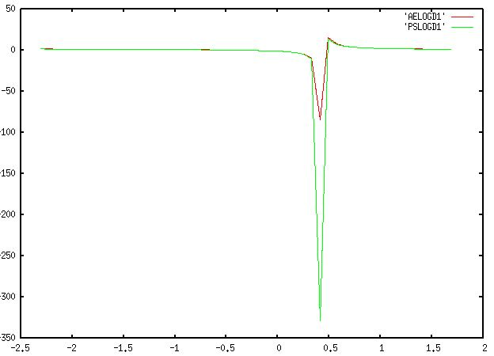

Tutorial 3: Pseudopotential generations
------------------------------------------
###Preliminary information

`ATOM` 프로그램을 통해 `SIESTA`에 이용되는 원자의 `psf` 파일을 만들 수 있다. 그 외에도 `ATOM`은 다음과 같은 목적에 이용된다.  
- 특정 전자 배치에 대한 All-electron DFT (density functional theory) 계산 수행  
- ab-initio pseudopotentials 생성  
- 만들어진 pseudopotential를 통해 원자핵이 미치는 효과 계산  
`ATOM`를 설치하기 앞서 다음과 같은 패키지를 준비해야한다.  

`xmlf90` : <https://launchpad.net/libgridxc/+download> (1.5.0. 버전)

`libGridXC` : <https://launchpad.net/libgridxc/+download> (0.7.3 버전)

리눅스 환경에 설치한 후에 다음과 같은 명령어를 통해 압축을 풀어준다.

```bash
$ tar xvzf xmlf90-1.5.0.tgz
$ tar xvzf libgridxc-0.7.3.tgz
```
압축을 풀어준 위치에서 다음과 같은 과정을 통해 컴파일을 진행한다.

`xmlf90` :
```bash
$ cd xmlf90-1.5.0
$ mkdir Gfortran
$ cd Sys
$ cp gfortran.make ../Gfortran/fortran.mk
$ cd ../Gfortran
$ sh ../config.sh
$ make
```
`xmlf90.mk` 생성확인

`libgridxc` :
```bash
(설치한 위치로 돌아와서)
$ cd libgridxc-0.7.3
$ mkdir Gfortran
$ cd Gfortran
$ cp ../extra/fortran.mk
$ sh ../src/config.sh
$ make clean
$ make
```
`gridxc.mk` 생성확인

`ATOM`를 위한 라이브러리가 준비되었으니 이제 `ATOM`을 설치한다.  
`ATOM` : <https://departments.icmab.es/leem/SIESTA_MATERIAL/Pseudos/Code/downloads.html> (4.2.7 버전)  
리눅스 환경에 설치하고 다음과 같은 커맨드로 압축을 풀어준다.  
`ATOM` :
```bash
$ tar xvzf atom-4.2.7-100.gz
```
`ATOM`도 마찬가지로 컴파일을 해야 한다. 압축을 풀어준 위치에서 컴파일을 진행한다.

`ATOM` :
```bash
$ cd atom-4.2.7-100
$ cp arch.make.sample arch.make
$ vi arch.make
(파일이 열리면 아래 부분에 ROOT를 수정한다)
XMLF90_ROOT= <설치한 xmlf90 위치>/xmlf90-1.5.0/Gfortran
GRIDXC_ROOT= <설치한 libgridxc 위치>/libgridxc-0.8.5/Gfortran
include $(XMLF90_ROOT)/xmlf90.mk
include $(GRIDXC_ROOT)/gridxc.mk
$ make
```
`ATOM` 프로그램이 준비되었다.

###All-electron calculations

바닥 상태의 Si 원자를 예시로 `ATOM`의 입력파일을 살펴보겠다. 보통 `ATOM` 입력 파일의 확장자는 `.inp`로 표시한다. 설치된 `ATOM` 위치에서 `/Tutorial/All_electron`에 다음과 같은 파일이 있다.
`Si.ae.inp`
```
ae Si Ground state all-electron	   # 계산 종류 (ae : All-electron) / 시스템 이름
   Si   ca			   # 원소기호 / Exchange correlation 종류 (ca : non-realistic)
       0.0
    3    2			   # 핵(core) 오비탈 (1s, 2s, 2p) / 원자가(valence) 오비탈 (3s, 3p)
    3    0      2.00		   # 주 양자수(n) / 방위 양자수(l) / 전자 수
    3    1      2.00

12345678901234567890123456789012345678901234567890      Ruler
```
`../Utils/` 위치에 `ATOM` 프로그램 계산을 위한 쉘 스크립트들이 있다. 다음과 같은 명령어로 All-electron 계산을 수행한다.
```bash
$ sh ../Utils/ae.sh si.ae.inp
=> si.ae 폴더 생성
```
생성된 `si.ae` 위치에 가면 결과 파일들이 생성되어 있다. 결과 파일들에 대한 자세한 설명은 `Manual` 참조하길 바란다. 
`.gplot`, `.gps` 형식 파일은 `gnuplot`과 관련한 결과 파일들이다. `gnuplot` 패키지가 설치되어 있다면 다음과 같은 명령어로 그래프를 생성할 수 있다. (`-persist` 옵션을 추가하지 않으면 그래프가 유지되지 않는 현상이 있다)
```bash
$ gnuplot -persist 
```

##Pseudopotential generations

다시 `/Tutorial` 위치로 돌아가서 `/PS_Generation`에 들어가본다. Pseudopotential를 만들기 위한 예시 파일들이 있다. 우리는 Si을 예시로 살펴본다. `Si.tm2.inp` 파일을 열어본다.
`Si.tm2.inp`
```bash
#
#  Pseudopotential generation for Silicon
#  pg: simple generation
#
   pg      Silicon
        tm2      3.0             # PS flavor, logder R
 n=Si c=car                       # Symbol, XC flavor,{ |r|s}
       0.0       0.0       0.0       0.0       0.0       0.0
    3    4                       # norbs_core, norbs_valence
    3    0      2.00      0.00   # 3s2
    3    1      2.00      0.00   # 3p2
    3    2      0.00      0.00   # 3d0
    4    3      0.00      0.00   # 4f0
      1.90      1.90      1.90      1.90      0.00      0.00
#
# Last line (above): 
#    rc(s)     rc(p)     rc(d)     rc(f)   rcore_flag  rcore
#
#2345678901234567890123456789012345678901234567890123456789
```
`All_electron` 입력 파일과 다른 점은 우선 상단 왼쪽에 위치한 계산 모드가 `ae`가 아닌 `pg`로 되어있다는 것이다. 이를 꼭 `pg`로 수정해야 pseudopotential을 위한 계산을 할 수 있다. 마지막 줄은 6개의 슬롯으로 구성 되어있다. 처음 4개의 값은 각각 s, p, d, f 오비탈의 cut off radius에 해당하고, 마지막 두 값은 추후에 설명할 core corrections와 관련있다. 그 외에 입력 옵션들은 꼭 매뉴얼을 통해 확인하기를 바란다. All-electron과 마찬가지로 쉘 스크립트로 계산을 수행할 수 있는데, Pseudopotential을 만들기 위한 쉘 스크립트는 `ae.sh`가 아닌 `pg.sh`이다.  

``` bash
$ sh ../Utils/pg.sh Si.tm2.inp
```
`SIESTA` 프로그램이 입력 파일로 이용할 수 있는 `Si.psf` 파일이 생성되었다. 여기서 주의할 점은 `SIESTA`에서는 basis가 되는 오비탈이 (l =3)까지 있어야한다. 따라서 실제 원자의 원자가 오비탈이 l = 3 까지 차 있지 않더라도 전자가 차 있지 않은 가상의 오비탈을 넣고 계산을 돌려야 한다. (위의 경우 3d, 4f)

###Core correction

`ATOM` 프로그램은 **non-linear exchange-correlation correction** [1](https://journals.aps.org/prb/abstract/10.1103/PhysRevB.26.1738) 계산을 수행할 수 있다.  
Pseudo core의 전하밀도가 특정한 pseudo radius 밖에서 전하밀도도가 일치하고 경계부에서 매끈한 형태를 가지게 맞추어 주는 일련의 과정이 core correction이다. Pseudopotential를 만드는 계산에서 이 계산을 포함시키기 위해서 앞서 실행한 입력 파일에서 `pg` 옵션을 `pe`로 바꾸어 주면 된다. 또한 마지막 줄에서 6번째 해당하는 값인 pseudo radius을 넣어준다. 만약 이 값이 음수이거나 0이면 5번째 값인 valence charge density를 통해 이 반경을 직접 계산하게 되는데, 이 값 역시 음수이면 전체 핵 전하를 기준으로, 0이면 1 값을 기준으로 계산하도록 되어있다. 따라서 pseudo radius을 실험적으로 얻은 외부 참조 값을 이용하여 넣어주는 것을 강력히 추천한다.

###Pseudopotential test

**Norm-Conserving Pseudopotentials, D. R. Hamann, M. Schlüter, and C. Chiang PRL (1979) ** [2](https://journals.aps.org/prl/abstract/10.1103/PhysRevLett.43.1494) 논문에서 제시한 pseudopotential의 조건은 다음과 같다.  
> 1. Pseudo와 real의 원자가 고유함수 (valence eigenvalue)가 일치한다
> 2. Pseudo와 real의 파동함수 (wavefunction)가 rc (core radius) 이후로 일치한다
> 3. Pseudo와 real의 전하 밀도 (charge density)를 0에서 r까지 적분한 값이, r이 rc보다 클 때 일치한다 (norm conserving)
> 4. Pseudo와 real의 파동함수에 대한 로그도함수 (logarithmic derivatives)가 rc 이후로 일치한다
`ATOM`을 통해 위 조건들을 확인하는 방법을 소개한다.

#### 1. 원자가 고유함수 (valence eigenvalue)

Pseudo와 real의 원자가 고유값이 일치하는지 확인하기 위해 all-electron과 pseudopotenial generations에 대한 계산 결과를 비교하면 된다. `pg` 계산에서는 `OUT` 파일에 이 두가지 정보를 모두 담고 있다. 따라서 두 고유값을 비교하기 위해서 `pg` 계산 결과가 나온 `OUT` 파일이 포함된 폴더에서 다음과 같은 명령어를 수행한다.

```bash
(Pseudopotential generation 결과 폴더에서)
$ grep ‘&v’ OUT
```


명령어를 통해 보여지는 결과, all-electron과 pseudopotential generations에 대한 오비탈 정보가 두 영역으로 나타난다. 이에 해당하는 영역은 `vi` 명령어를 통해 직접 `OUT` 파일을 직접 열어본 위 사진을 통해 확인할 수 있다. 오른쪽 `&v` 라벨이 valenace 오비탈을 지칭하고, 4번째 행이 그 고유값이다. 이를 통해 pseudo와 real의 원자가 고유값이 일치하는 것을 확인할 수 있다.

#### 2. 파동함수 (Wavefunctions)

`pg` 계산에서 `AEWFNR0` `R1` `R2` `R3` 파일은 s, p, d, f 오비탈에 대한 all-electron 원자가 파동함수 결과이다. `PSFNR0` `R1` `R2` `R3` 파일은 s, p, d, f 오비탈에 대한 pseudo 원자가 파동함수 결과이다. `gnuplot`을 이용하여 두 결과가 rc 이후에서 일치하는 것을 확인할 수 있다. 아래는 바닥 상태의 `Si` 원자에 대한 예시이다.

```bash
$ gnuplot
gnuplot > plot 'AEWFNR1' w l, 'PSWFNR1' w l
(R1 : 3p 오비탈)
```


#### 3. 전하 밀도 (Charge density)

`pg` 계산에서 `AECHARGE`는 `all-electron`의 전자밀도이다. 첫번째 열은 반경 (r), 두번째, 세번째 열은 각각 스핀에 해당하는 전체 전자밀도, 마지막 열은 핵 (core) 전자밀도이다. `PSCHARGE`는 ‘pseudopotential’에 대한 원자가 (valence) 전자밀도이다. 마찬가지로 첫번째 열은 반경 (r), 두번째, 세번째 열은 각각 스핀에 해당하는 전자밀도이다. 따라서 두 계산의 원자가 전자밀도를 비교하기 위해서는 다음과 같은 과정을 따른다.

```bash
$ gnuplot
gnuplot >plot 'PSCHARGE' u 1:($2+$3) w l		($2+$3 : 전체 원자가 전자밀도)
gnuplot > set xrange [0:20]
gnuplot >replot 'AECHARGE' u 1:($2+$3-$4) w l    ($4 : 핵 전자밀도)
```


#### 4: 로그도함수 (Logarithmic derivatives of wavefunctions)

위 `pg` 모드 계산 코드를 보면 두번째 줄에 `tm2`와 `3.0` 옵션을 볼 수 있다. 이에 해당하는 옵션이 로그도함수 계산을 위한 종류와 반경이다. 메뉴얼을 참고하여 다른 옵션을 줄 수 있다.
`pg` 계산에서 `AELOGD0` `D1` `D2` `D3` 파일이 s, p, d, f 오비탈에 대한 all-electron 파동함수의 로그도함수이다. 또한 `PSLOGD0` `D1` `D2` `D3` 파일이 s, p, d, f 오비탈에 대한 pseuodopotential 파동함수의 로그도함수이다. 위 과정들과 마찬가지로 `gnuplot`을 통해 비교한다.

```bash
$ gnuplot
gnuplot >plot ' AELOGD1' w l
gnuplot >replot ' PSLOGD1' w l
```



#### 5: Transferability test

여기서 (3), (4) 조건은 transferability와 관련한 조건이다. Transferability는 외부 화학반응에 있어 중요한 부분인 만큼 pseudopotential generations에 핵심 조건 중 하나가 된다. 이를 `ATOM` 프로그램을 통해 직접 확인하는 방법은 다음 절차를 따른다. `Tutorial/Si` 위치에 있는 `Si.test.inp` 파일을 확인해본다.

`Si.test.inp` :
```bash
#
# All-electron calculations for a series of Si configurations
#
   ae Si Test -- GS 3s2 3p2
   Si   ca
       0.0
    3    2
    3    0      2.00
    3    1      2.00
   ae Si Test -- 3s2 3p1 3d1
   Si   ca
       0.0
    3    3
    3    0      2.00
    3    1      1.00
    3    2      1.00
   ae Si Test -- 3s1 3p3
   Si   ca
       0.0
    3    2
    3    0      1.00
    3    1      3.00
   ae Si Test -- 3s1 3p2 3d1
   Si   ca
       0.0
    3    3
    3    0      1.00
    3    1      2.00
    3    2      1.00
   ae Si Test -- 3s0 3p3 3d1
   Si   ca
       0.0
    3    3
    3    0      0.00
    3    1      3.00
    3    2      1.00

#
# Pseudopotential test calculations
#
   pt Si Test -- GS 3s2 3p2
   Si   ca
       0.0
    3    2
    3    0      2.00
    3    1      2.00
   pt Si Test -- 3s2 3p1 3d1
   Si   ca
       0.0
    3    3
    3    0      2.00
    3    1      1.00
    3    2      1.00
   pt Si Test -- 3s1 3p3
   Si   ca
       0.0
    3    2
    3    0      1.00
    3    1      3.00
   pt Si Test -- 3s1 3p2 3d1
   Si   ca
       0.0
    3    3
    3    0      1.00
    3    1      2.00
    3    2      1.00
   pt Si Test -- 3s0 3p3 3d1
   Si   ca
       0.0
    3    3
    3    0      0.00
    3    1      3.00
    3    2      1.00

12345678901234567890123456789012345678901234567890      Ruler
```

위와 같이 `Si.test.inp` 파일에는 `Si` 원자에 대한 다양한 전자배치 정보가 들어있다. 코드를 확인하면 동일한 전자배치로 구성된 `ae`와 `pt` 계산에 대한 두 영역으로 나눠져 있다. 여기서 `pt`는 pseudopotential test를 위한 계산 모드이다. `pt` 계산을 수행하기 위해서는 `pt.sh` 쉘 스크립트를 이용해야 한다. 여기서 중요한 점은 `pt` 계산은 `Si` 원자의 바닥 상태에 대한 `pg` 계산 결과로 나온 `vps` 파일을 입력 파일로 받는다는 점이다. 이전 과정에서 이미 `pg` 계산을 수행했다면, `Si.tm2.vps` 파일이 같은 위치에 남아있을 것이다 (없다면 `pg` 계산을 먼저 수행해서 `vps` 파일을 얻는다).

```bash
$ sh ../../Utils/pt.sh Si.test.inp Si.tm2.vps
```
Total energy 비교 :  
```
$ grep ‘&d’ OUT
```

 


Eigenstate 비교 :  
```
$ grep ‘&d’ OUT
```


 

위 과정을 통해 `Si` 원자의 all-electron과 pseudopotential에 대한 여러 전자배치의 `total energy`와 `eigenvalue`를 비교하여, transferability를 시험할 수 있다.

### Practice : Au

이제 실제 `SIESTA` 프로그램을 위한 pseudopotential 입력파일을 만들어보자. 위에서 언급했듯 `SIESTA`는 basis가 되는 오비탈이 (l =3)까지 있어야한다. 이런 점을 만족시키는 pseudopotential generations의 입력파일은 다음 사이트에서 얻을 수 있다. [pseudo](https://departments.icmab.es/leem/SIESTA_MATERIAL/Databases/Pseudopotentials/periodictable-intro.html)

위 사이트에 가면 pseudopotential을 만드는 방법으로 `LDA` (localized density approximation)과 ‘GGA’ (generalized gradient approximation)을 선택할 수 있다. `LDA` 방법은 `Au` 원자와 같은 전위금속의 구조를 정확히 예측하지 못한다[3](https://iopscience.iop.org/article/10.1088/0953-8984/13/42/307/meta). 따라서 `GGA` 방법을 선택하여 `Fe`의 `ATOM` 입력파일 (input file for ATOM program)을 설치한다.

`Fe.inp` :
```bash
pe                 -- file generated from Fe ps file
        tm2
   Fe   pb
     0.000     0.000     0.000     0.000     0.000     0.000
    5    4
    4    0     2.000     0.000    #4s
    4    1     0.000     0.000    #4p
    3    2     6.000     0.000    #3d
    4    3     0.000     0.000    #4f
   2.41000   2.53000   2.29000   2.29000   0.01000  -1.00000 small core charge

#23456789012345678901234567890123456789012345678901234567890      Ruler
```

입력 파일을 살펴보면 첫번째 줄에 `pe` 계산모드가 되어있는 것을 확인할 수 있다. 앞서 설명했듯이 이는 pseudopotential generations를 하는데 core correction을 추가한 옵션이다. Core correction를 통해 더욱 안정적으로 pseudopotential을 만들 수 있다.  
두번째 줄은 `tm2`은 이전에 설명한 transferability를 위해 로그도함수를 시험하기 위한 옵션이다. 또한 세번째 줄에 `pb` 옵션을 볼 수 있는데, 이는 `GGA` 방법의 종류로 ` PBE` ((Perdew, Burke, and Ernzerhof) 방법을 의미한다. 다른 방법들은 메뉴얼을 통해서 확인하도록 한다.
`Au`와 같이 원자번호가 큰 금속은 상대론적 효과가 나타난다 (원자핵 주변으로 핵 전자들이 더욱 구속되면서 가림 효과 (shielding effect)가 커지고, d나 f 오비탈의 전자들의 구속력이 약해진다)[4]( https://link.springer.com/article/10.1007/BF03215471). 따라서 계산에서도 상대론적 효과를 고려하는 것이 좋다. `pb` 옵션 뒤에 `s`를 붙여주면 `spin-polarized`, `non-relativistic` 계산을 수행할 수 있고, `r`를 붙여주면 `spin-polarized`, `relativistic` 계산을 수행할 수 있다. `pb`를 `pbr`로 바꾸어 주어 상대론적 효과를 고려한 pseudopotential을 만들어보자.
```bash
$ <ATOM 프로그램 위치>/Tutorial/Utils/pg.sh Fe.inp
```
`SIESTA` 계산을 위한 `Fe.psf` 파일이 생성되었다.


### 참고문헌
[1](https://journals.aps.org/prb/abstract/10.1103/PhysRevB.26.1738): S. G. Louie, S. Froyen, and M. L. Cohen, Phys. Rev. B 26, 1738 (1982)  
[2](https://journals.aps.org/prl/abstract/10.1103/PhysRevLett.43.1494): Norm-Conserving Pseudopotentials, D. R. Hamann, M. Schlüter, and C. Chiang PRL (1970)  
[3](https://iopscience.iop.org/article/10.1088/0953-8984/13/42/307/meta): J. Phys.: Condens. Matter13 (2001) 9463–9470  
[4](https://link.springer.com/article/10.1007/BF03215471): Relativistic effects and the chemistry of gold (1998)
