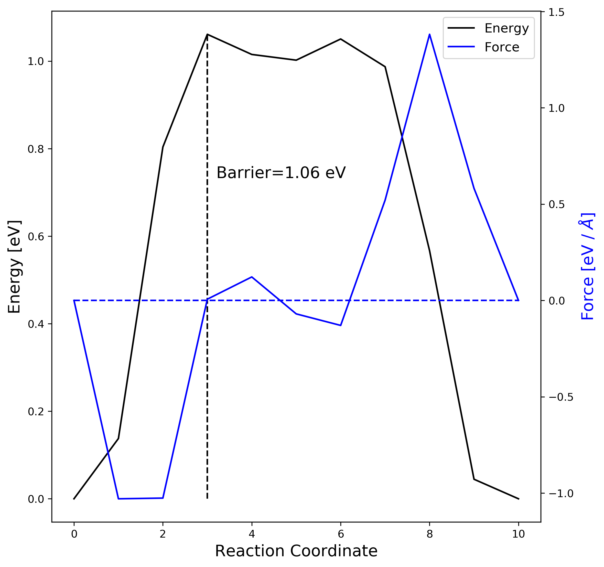
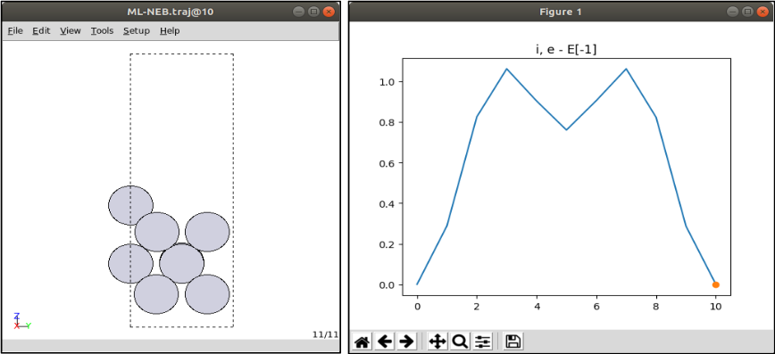
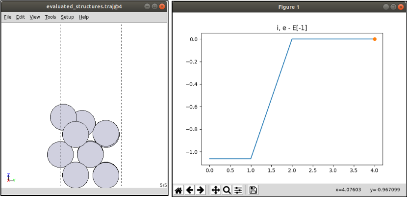
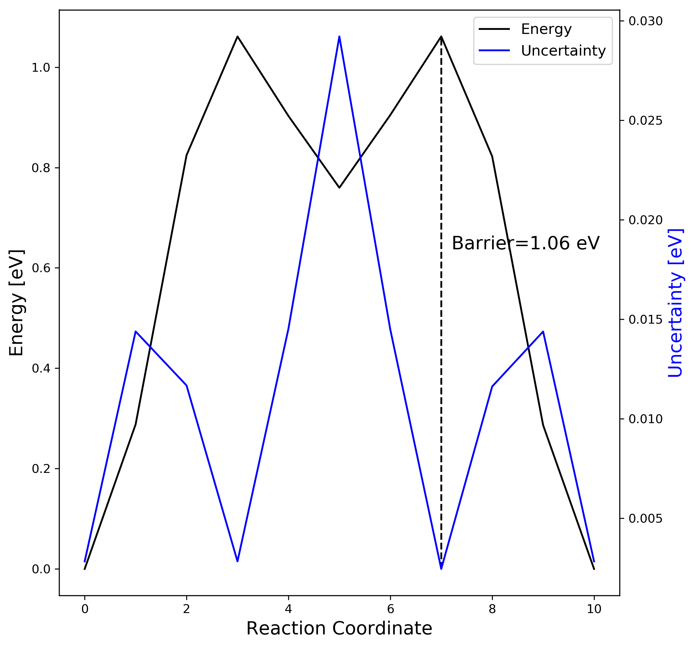

# Workshop Tutorial : ML-NEB       

This is a tutorial on "Nudged Elastic Band" calculations accerelerated by machine learning model (NEB-ML).

---
References:

> [1] *[Collective jumps of a Pt ad atom on fcc-Pt (001)](https://www.vasp.at/wiki/index.php/Collective_jumps_of_a_Pt_adatom_on_fcc-Pt_(001):_Nudged_Elastic_Band_Calculation)*

> [2] *[Low-Scaling Algorithm for Nudge Elastic Band Calculations Using a Surrogate Machine Learning Model](https://journals.aps.org/prl/abstract/10.1103/PhysRevLett.122.156001)*

--- 

NEB-ML tutorial consists of the following contents:

> ** 1. Installation **

> ** 2. Classical NEB calculation **

> ** 3. ML based NEB calculation **

> ** 4. Comparison ** 

---

### **1. Installation**

Requirements

* [Python](https://www.python.org/downloads/) 3.6 or newer
* [Atomic Simulation Environement](https://wiki.fysik.dtu.dk/ase/) (ASE) 3.17 or newer
* [CatLearn](https://catlearn.readthedocs.io/en/latest/) 0.6.1 or newer
* [ASE supproted DFT calculator](https://wiki.fysik.dtu.dk/ase/ase/calculators/calculators.html#module-ase.calculators) (ex: VASP, SIESTA, GPAW)
* [Transition State Tools for VASP](https://theory.cm.utexas.edu/vtsttools/scripts.html) (VTST-tools)

Optional

* [Matplotlib](https://matplotlib.org/) 3.0.0 or newer (plotting)


The easiest way to install requirement is with:
```yaml
$ pip install --user catlearn, ase, matplotlib 
```
If your `pip` doesn't work, you can also get the source from a tar-file or from Git. In this case, you have to go to the homepages and follow their instruction.

#### 1-1. ASE with VASP code

The following instruction makes it possible to use VASP as a calculator in ASE.

(See also [VASP ASE interface instruction](https://wiki.fysik.dtu.dk/ase/ase/calculators/vasp.html?highlight=vasp#module-ase.calculators.vasp))

Set environment variable in your shell(`$HOME/.bashrc`) configuration file:
```yaml
$ export VASP_PP_PATH=(VASP pseudopotential PATH)
```
Note that `VASP_PP_PATH` **must include** directories named `potpaw`(LDA XC), `potpaw_GGA`(PW91 XC) and `potpaw_PBE`(PBE XC).

#### 1-2. Test calculation

The simple ASE with VASP example as below. (`test_VaspASE.py`)

```Python
from ase import Atoms, Atom
from ase.calculators.vasp import Vasp

a = [6.5, 6.5, 7.7]
d = 2.3608
NaCl = Atoms([Atom('Na', [0, 0, 0], magmom=1.928),
              Atom('Cl', [0, 0, d], magmom=0.75)],
                           cell=a)

calc = Vasp(prec='Accurate',
            xc='PBE',
            lreal=False)
NaCl.set_calculator(calc)

print(NaCl.get_magnetic_moment())
```
Example script of jobscheduler for MPI calculation (`slurm`).

```yaml
#!/bin/bash
#SBATCH -J TEST            # job name
#SBATCH -o stdout.txt      # output and error file name (%j expands to 
#SBATCH -p X2              # name of cluster group 
#SBATCH -N 1               # total number of nodesmpi tasks requested
#SBATCH -n 12              # total number of mpi tasks requested

export VASP_COMMAND="mpirun -np $SLURM_NTASKS $HOME/bin/vasp_5.4.1_GRP7_NORMAL_p13082016_VTST.x"
python test_VaspASE.py
```

#### 1-3. Check the result
The `OUTCAR` and `vasp.out` display the normal VASP output and `stdout.txt` shows the output from the `Python` command.
```yaml
print(NaCl.get_magnetic_moment())
```
Corresponding result in `stdout.txt` is
```yaml
0.1325833
```

---
### **2. Classical NEB calculation**

The following NEB example [[1]](https://www.vasp.at/wiki/index.php/Collective_jumps_of_a_Pt_adatom_on_fcc-Pt_(001):_Nudged_Elastic_Band_Calculation) is about calculation of the energy barrier for the self-diffusion of a Pt-adatom on Pt(001). The most stable adsorption site of the adatom Pt@Pt(001) is the hollow(*h*) position.

{style="height:200px;width:320px"}

Simple models of the diffusion of the adatom from *h* to the neighboring *h* site are provided below,
#### 2-1. Set up VASP calculation 

* POSCAR of the initial state (in directory *00*)
```yaml
Pt 
 1.0
  5.620240    0.000000    0.000000
  0.000000    5.620240    0.000000
  0.000000    0.000000   16.860720
  Pt
  13
Cartesian
  1.405060  1.405060  1.987035
  4.215180  1.405060  1.987035
  1.405060  4.215180  1.987035
  4.215180  4.215180  1.987035
  0.000000  0.000000  3.889464
  0.000000  2.810120  3.894337
  2.810120  0.000000  3.958172
  2.810120  2.810120  3.889464
  1.440922  1.369197  5.853553
  4.179317  1.369197  5.853553
  1.440922  4.251042  5.853553
  4.179317  4.251042  5.853553
  0.000000  2.810120  7.491487
```
* POSCAR of the final state (in directory *# of images+1*)
```yaml
Pt 
 1.0
  5.620240    0.000000    0.000000
  0.000000    5.620240    0.000000
  0.000000    0.000000   16.860720
  Pt
  13
Cartesian
  1.405060  1.405060  1.987035
  4.215180  1.405060  1.987035
  1.405060  4.215180  1.987035
  4.215180  4.215180  1.987035
  0.000000  0.000000  3.889464
  0.000000  2.810120  3.894337
  2.810120  0.000000  3.958172
  2.810120  2.810120  3.889464
  2.810120  0.000000  7.491487
  4.251042  1.440922  5.853553
  1.369197  4.179317  5.853553
  4.251042  4.179317  5.853553
  1.369197  1.440922  5.853553
```
In the present exercise, the required precision is reduced to a minimum.

* KPOINTS
```yaml
K-Points
 0
Gamma
 3  3  1
 0  0  0
```

* INCAR
```yaml
System: fcc Pt (001), 3layers
ISTART = 0
EDIFF = 1e-6              # electronic convergence
PREC = Normal
IBRION = 1                # DIIS algorithm
NSW = 20 
EDIFFG = -0.01            # max forces: 0.1eV/AA
ELMIN = 5                 # at least 5 el. scf steps  for each ionic st
```

Run a DFT calculation in order to get optimized structures in initial and final state.


#### 2-2. Generate transition images
To generate intermediate geometries from the optimized structures (`CONTCAR`), the most easiest way is to use `nebmake.pl` in VTST-tools.
```
$ (vtstscript PATH)/nebmake.pl CONTCAR_initial CONTCAR_final 9
```
It takes initial and fianl CONTCAR files, and linearly interpolates the specific number of images between them.
The thrid value must correspond to the value of `IMAGES` in `INCAR`.

Now, add extra commands for NEB calculation in `INCAR`.
```yaml
IMAGES = 9                # 9 intermediate geometries for  the NEB
SPRING = -5               # spring constant
```
Note that `slurm`, `INCAR`, `KPOINTS`, `POTCAR` must be in the upper folder after running the `nebmake.pl`. Run a NEB calculation in order to get energy barrier of transition state.

#### 2-3. NEB result visualization
When the job is finished, you can use `nebbarrier.pl` with the VTST-tools to collect energy barriers in a brevity.
```yaml
$ (vtstscript PATH)/nebbarrier.pl
```
Check the NEB results in `neb.dat` such as,
```yaml
  0     0.000000     0.000000     0.000000   0
  1     0.519335     0.137702    -1.029721   1
  2     1.037408     0.803577    -1.026118   2
  3     1.554210     1.061091     0.006324   3
  4     1.931107     1.015088     0.121788   4
  5     2.312942     1.002032    -0.069935   5
  6     2.706219     1.050405    -0.129819   6
  7     3.115095     0.987022     0.520759   7
  8     3.541559     0.566806     1.381246   8
  9     3.985326     0.044625     0.581455   9
 10     4.442108    -0.000021     0.000000  10
```
The output: `# image`, `distance`, `energy`, `force along the NEB` (VASP-vtst ver. works), `# image`. The following python script (`plot_neb.py`) displays `neb.dat`  using `matplotlib`.
```python
import matplotlib.pyplot as plt
import matplotlib
from matplotlib.ticker import MaxNLocator

def file_len(filename):
    with open(filename) as f:
        for i, l in enumerate(f):
            pass
    return i+1

name = 'neb.dat'
Tlines = file_len('%s' % name)

data_all = []
f = open('%s' % name, 'r')
for i in range(Tlines):
    line = f.readline()
    words = line.split()
    data_all.append(words)
f.close()

image  = []; dist  = []
energy = []; force = []

# Data gathering
for i in range(len(data_all)):
    image.append(int(data_all[i][0]))
    dist.append(float(data_all[i][1]))
    energy.append(float(data_all[i][2]))
    force.append(float(data_all[i][3]))

maxindex = energy.index(max(energy))
minindex = energy.index(min(energy))

# Visualization
fig, ax1 = plt.subplots(figsize=(8,7.5))
ax2 = ax1.twinx()

lines1 = ax1.plot(image, energy, color='black', label='Energy')
lines2 = ax2.plot(image, force, color='blue', label='Force')

ax1.xaxis.set_major_locator(MaxNLocator(integer=True))
ax1.set_xlabel('Reaction Coordinate', fontsize=15)
ax1.set_ylabel('Energy [eV]', fontsize=15)
ax2.set_ylabel('Force [eV / $\AA$]', fontsize=15, color='blue')

lines = lines1+lines2
labels = [l.get_label() for l in lines]
ax1.legend(lines, labels, loc=0, fontsize=12)
ax1.text(image[maxindex]+0.2, 0.6*energy[maxindex], "Barrier=%4.2f eV" % energy[maxindex], fontsize=15)
ax1.vlines(image[maxindex],energy[minindex],energy[maxindex],color='black',linestyles='--')
ax2.hlines(0,image[0], image[-1],color='blue',linestyles='--')
plt.tight_layout()
plt.savefig('neb_result.png', dpi=300, bbox_inches ="tight")
plt.show()
```
The results are shown as



---

### **3. ML based NEB calculation**

A surrogate Gaussian process regression (`GPR`) [[2]](https://journals.aps.org/prl/abstract/10.1103/PhysRevLett.122.156001) atomistic model to greatly acclerate the rate of convergence of classical NEB calculations. The algorithm presented here eliminates **any need for manipulating the number of images to obtain a converged result**.

#### 3-1. Set up ML-NEB calculation
To execute ML-NEB, `catlearn` and `ASE` are needed which we mentioned above. The following python script(`neb-catlearn.py`) gives a basic concept of how it works.

```yaml
import sys, shutil, copy
from ase.io import read
from ase.optimize import BFGS
from ase.calculators.vasp import Vasp
from catlearn.optimize.mlneb import MLNEB
from ase.neb import NEBTools
from catlearn.optimize.tools import plotneb

### Read input files
struct_init = read('CONTCAR_initial')
struct_fin  = read('CONTCAR_final')

### Set calculator
ase_calculator = Vasp(encut=400,
                      xc='PBE',
                      gga='PE',
                      istart = 0,
                      lwave=False,
                      lcharg=False,
                      kpts = (3, 3, 1),
                      ediffg=-0.01,
                      ediff=1e-6,
                      ibrion=1,
                      nsw=20,
                      ismear=1,
                      sigma=0.20,
                      algo='Normal',
                      prec='Normal'
                      )

# Optimize initial state:
struct_init.set_calculator(copy.deepcopy(ase_calculator))
qn = BFGS(struct_init, trajectory='initial.traj')
qn.run(fmax=0.01)

# Optimize final state:
struct_fin.set_calculator(copy.deepcopy(ase_calculator))
qn = BFGS(struct_fin, trajectory='final.traj')
qn.run(fmax=0.01)

# CatLearn NEB:

neb_catlearn = MLNEB(start='initial.traj', end='final.traj',
                    ase_calc=copy.deepcopy(ase_calculator),
                    n_images=11,
                    )

neb_catlearn.run(fmax=0.05, trajectory='ML-NEB.traj')
```
#### 3-2. Check the ML-NEB results
After the job is finished, you need to check the output: 

* `stdout.txt` : CatLearn process standard output

* `results_neb.csv` & `interpolation.csv' : NEB original & interpolated results along to distance

* `ML-NEB.traj` : NEB original results along to number of images

* `evaluated_structures.traj` : predicted structures which VASP calculates in real

The `.traj` file can be read with `ase gui`
```yaml
ase gui ML-NEB.traj
```



```yaml
ase gui evaluated_structures.traj
```




#### 3-3. ML-NEB result visualization

You can save the figure results in `ase gui` or use the following python script (`plot_mlneb.py`).
``` Python
import matplotlib.pyplot as plt
import matplotlib
from matplotlib.ticker import MaxNLocator

def file_len(filename):
    with open(filename) as f:
        for i, l in enumerate(f):
            pass
    return i+1

name = 'results_neb.csv'
Tlines = file_len('%s' % name)

data_all = []
f = open('%s' % name, 'r')
for i in range(Tlines):
    line = f.readline()
    words = line.split()
    data_all.append(words)
f.close()

data_all.pop(0)
image = [] ; dist  = []
energy = []; uncert = []

for i in range(len(data_all)):
    image.append(i)

# Data gathering
for i in range(len(data_all)):
    dist.append(float(data_all[i][0]))
    energy.append(float(data_all[i][1]))
    uncert.append(float(data_all[i][2]))

maxindex = energy.index(max(energy))
minindex = energy.index(min(energy))

# Visualization
fig, ax1 = plt.subplots(figsize=(8,7.5))
ax2 = ax1.twinx()

lines1 = ax1.plot(image, energy, color='black', label='Energy')
lines2 = ax2.plot(image, uncert, color='blue', label='Uncertainty')

ax1.xaxis.set_major_locator(MaxNLocator(integer=True))
ax1.set_xlabel('Reaction Coordinate', fontsize=15)
ax1.set_ylabel('Energy [eV]', fontsize=15)
ax2.set_ylabel('Uncertainty [eV]', fontsize=15, color='blue')

lines = lines1+lines2
labels = [l.get_label() for l in lines]
ax1.legend(lines, labels, loc=0, fontsize=12)
ax1.text(image[maxindex]+0.2, 0.6*energy[maxindex], "Barrier=%4.2f eV" % energy[maxindex], fontsize=15)
ax1.vlines(image[maxindex],energy[minindex],energy[maxindex],color='black',linestyles='--')
plt.tight_layout()
plt.savefig('mlneb_result.png', dpi=300, bbox_inches ="tight")
plt.show()
```
The results are shown as



---

### 4. Comparison
A great advantage of ML-NEB method comparing classical NEB is **independent of the number of moving images composing the path**.

Increase transition state images (from `11` to `38`) on the previous example:


|||    **Classical NEB**    || **ML based NEB**  
|||    -------------    ||  ------------
Number of images || 11 / 38  || 11 / 38
Number of evaluation || 11 / 38  ||  5 / 5 

