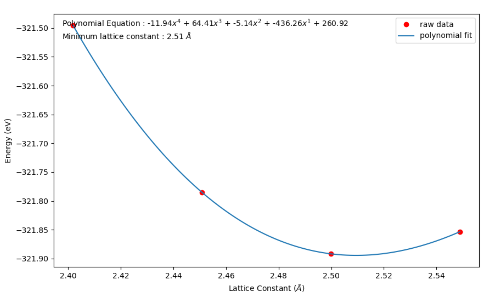

### 상태방정식 (Equation of state)을 통한 격자상수 찾기

지금까지 `NanoCore`를 이용해 그래핀 모델을 생성하고, **k-point sampling** 과정을 통해 전체 에너지가 수렴하는 k-point 임계점을 구했다. DFT 계산을 통해 얻은 전체 에너지는 압력, 격자상수, 부피 탄성계수 등에 영향을 받으며, 에너지가 최소가 되는 지점에서 안정화된 구조를 가진다. 이번 장에서는 이차원 물질인 그래핀의 격자상수에 변화를 주며 전체 에너지가 최소가 되는 지점을 구할 것이다.

우선 저번 장과 동일한 그래핀 모델과 **k-point sampling**을 통해 얻은 k-point 값을 이용한다.

```python
from NanoCore import *
import numpy as np

# Modeling
atoms = carbonlab.grp(0,0)
sim = s2.Siesta(atoms)

# Previous options
sim.set_option('kshift', [0.5,0.5,0.0]) # set k shift from gamma
sim.set_option('MixingWt', 0.10)        # adjust mixing weight (density)
sim.set_option('BasisSize', 'SZ')       # adjust basis size

# Import Kpt from k-sampling
converged_kpt = 10          # From k-sampling
sim.set_option('kgrid', [converged_kpt, converged_kpt, 1])
```

`atoms`는 `carbonlab` 모듈에 종속된 `Atom` 클래스이다. `Atom` 클래스에 `_cell` 함수를 이용하면 `Atom`의 격자벡터 (lattice vector)에 대한 배열을 얻을 수 있다. 이 격자벡터를 여러 비율로 바꿔가며 전체 에너지를 계산한다.

```python
import copy
import os
import numpy as np

# Initial values for lattice vectors
init_latticevectors = copy.copy(atoms._cell)
init_latticeconst = sqrt(sum(init_latticevectors[0]*init_latticevectors[0]))

# Lattice variations
ratios = [0.98, 1.00, 1.02, 1.04]

# Simulations
Etot = []
Latticeconsts = []

for ratio in ratios:
    atoms._cell[0] = ratio * init_latticevectors[0]     # modifies lattice vectors
    atoms._cell[1] = ratio * init_latticevectors[1]

    latticeconsts = sqrt(sum(atoms._cell[0]*atoms._cell[0]))

    os.system('mkdir EOS_%5.3f' %latticeconsts)         # make directions for each lattice constants
    os.chdir('EOS_%5.3f' %latticeconsts)

    print('Calculating for lattice constant = %5.3f A \n' %latticeconsts)
    sim = s2.Siesta(atoms)            # set simulation
    sim.run()                         # run simulation
    energy =s2.get_total_energy()

    os.chdir('..')

    Latticeconsts.append(latticeconsts)
    Etot.append(energy)
    print('Lattice constant : %9.5f [A], Total energy : %4.2f [eV]' %(latticeconsts , energy))
    print('\n')

# Convert array to np.array
Etot = np.array(Etot)
Latticeconsts = np.array(Latticeconsts)
```

### 다항식 곡선 피팅 (Polynomial fitting)

계산을 통해 `Latticeconsts` (격자상수)와 `Etot` (전체 에너지) 배열을 얻었다. 이 값을 `matplotlib`과 `scipy` 라이브러리를 이용해, **다항식 곡선 피팅**을 하여 극소값을 찾을 것이다.

```python
import matplotlib.pylab as plb
from scipy.optimize import fminbound

# Get polynomial equations
para_init = plb.polyfit(Latticeconsts, Etot, 4)

def Polynomial(parameters, x):
    A = parameters[0]
    B = parameters[1]
    C = parameters[2]
    D = parameters[3]
    E = parameters[4]
    Y = A*x**4 + B*x**3 + C*x**2 + D*x + E
    return Y

Polynomial_function = lambda x : Polynomial(para_init,x)


# Find local minima
optimized_latticeconst = fminbound(Polynomial_function,min(Latticeconsts),max(Latticeconsts))
print('We found local minimum of total energy : %5.3f' %optimized_latticeconst)
print('\n')
```

전체 에너지가 최소가 되는 지점 `optimized_latticeconst`을 얻었다.

### 결과 정리

다음 계산을 위해 최적화된 격자상수에 대한 정보를 저장한다.

```python
# Save optimized lattice vectors
ratio_of_optimization =  optimized_latticeconst/init_latticeconst
atoms._cell[0] = ratio_of_optimization * init_latticevectors[0]
atoms._cell[1] = ratio_of_optimization * init_latticevectors[1]

optimized_lattice_vector = copy.copy(atoms._cell)
# Visualizations
vfit = np.linspace(min(Latticeconsts),max(Latticeconsts),100)

plb.figure(figsize=(10,6))
plb.plot(Latticeconsts,Etot,'ro',label='raw data')
plb.plot(vfit, Polynomial(para_init,vfit),label='polynomial fit')

plb.xlabel('Lattice Constant ($\AA$)')
plb.ylabel('Energy (eV)')
plb.legend(loc='best')

# Add some text to the figure in figure coordinates
ax = plb.gca()
plb.text(0.02,0.95,'Polynomial Equation : %1.2f$x^4$ + %1.2f$x^3$ + %1.2f$x^2$ + %1.2f$x^1$ + %1.2f' \
    %( para_init[0],para_init[1],para_init[2],para_init[3],para_init[4]), transform = ax.transAxes)
plb.text(0.02,0.90,'Minimum lattice constant : %1.2f $\AA$' % optimized_latticeconst, transform = ax.transAxes)

plb.savefig('EOS.png')
plb.show()
```



> Appendix : [Murnaghan 상태방정식](Nano02_3dEOS.md)
