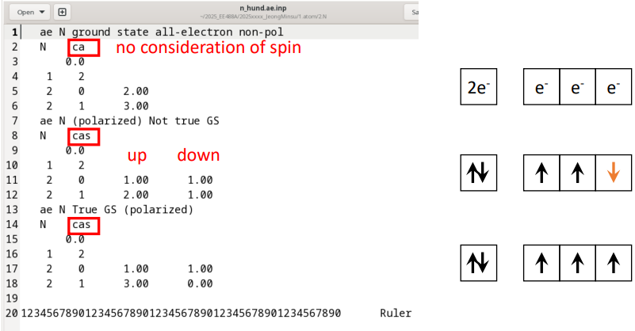
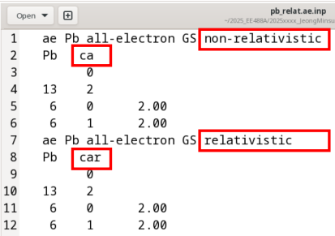

전(全)전자 (All electron) 계산
===============================
## Contents
1. 전(全)전자 계산 실행
2. 전하 밀도 및 파동함수 분석
3. 전자 배치에 따른 물리적 특성 비교      
• Ionization    
• Hund's rule        
• Relativistic effect  
---

## 1. 전(全)전자 계산 실행

이번 장에서는 원자에 대해 밀도범함수론(density functional theory, DFT) 기반의 전(全)전자(all-electron) 계산을 수행하고, 얻어진 결과를 이용하여 전자 배치 변화에 따른 에너지 차이를 비교한다.
이를 통해 이온화 효과, Hund’s rule, spin polarization이 실제 계산에서 어떻게 나타나는지를 확인한다. 
 
  

우선, `ATOM`이 설치된 위치에서 `/Tutorial/1.atom`에 위치한 다음 파일을 살펴보자:
```bash
cd Tutorial/1.atom/1.Si
vi Si.ae.inp
```
`Si.ae.inp`:  

```bash
ae Si Ground state all-electron	# 계산 종류 (ae : All-electron) / 시스템 이름
   Si   ca			            # 원소기호 / Exchange correlation 종류 (ca : non-realistic)
       0.0
    3    2			            # 핵(core) 오비탈 수 (1s, 2s, 2p) / 원자가(valence) 오비탈 수 (3s, 3p)
    3    0      2.00		    # 주 양자수(n) / 방위 양자수(l) / 전자 수
    3    1      2.00

12345678901234567890123456789012345678901234567890      Ruler
```


전체-전자 계산을 수행하기 위해서는 `/Tutorial/1.atom/bin/` 위치에 있는 `ATOM` 프로그램에 대한 쉘 스크립트를 사용해야한다. 다음과 같은 명령어로 계산을 수행한다.  

```bash
$ sh ../bin/ae.sh si.ae.inp
=> si.ae 폴더 생성
```
계산이 정상적으로 수행되면 "si.ae/" 디렉토리가 생성된다.

생성된 `si.ae` 위치에 가면 다음과 같은 결과 파일들이 생성되어 있다:  

• `INP`: 계산에 사용된 입력 파일 사본  
• `OUT`: 계산 결과 정보를 담은 출력 파일  
• `AECHARGE`: 전자 밀도(multiplied by 4πr²)  
• `CHARGE`: AECHARGE와 동일  
• `RHO`: 전자 밀도             
• `AEWFNR0` ~ `AEWFNR3`: 원자가 전자에 대한 온전자 파동함수(s, p, d, f 오비탈 순)
  


`OUT` 파일을 살펴보면 다음과 같은 계산 결과 정보를 알수 있다:  


**오비탈 고유값**:  
```
Si output data for orbitals
 ----------------------------

 nl    s      occ         eigenvalue    kinetic energy      pot energy

 1s   0.0    2.0000    -130.36911240     183.01377616    -378.73491463
 2s   0.0    2.0000     -10.14892694      25.89954259     -71.62102169
 2p   0.0    6.0000      -7.02876268      24.42537874     -68.74331203
 3s   0.0    2.0000      -0.79662742       3.23745215     -17.68692611  &v
 3p   0.0    2.0000      -0.30705179       2.06135782     -13.62572515  &v
 ---------------------------- &v
```

**전체 에너지**:  
```
 total energies
 --------------

 sum of eigenvalues        =     -325.41601319
 kinetic energy from ek    =      574.97652987
 el-ion interaction energy =    -1375.79704736
 el-el  interaction energy =      263.53000478
 vxc    correction         =      -51.65548902
 virial correction         =        1.40722950
 exchange + corr energy    =      -39.09342414
 kinetic energy from ev    =      574.97651364
 potential energy          =    -1151.36046672
 ---------------------------------------------
 total energy              =     -576.38395308
```
## 2. 전하 밀도 및 파동 함수 분석
전전자 계산이 완료되면 생성된 결과 파일을 이용하여 전하 밀도와 파동함수를 시각화하고 각 오비탈의 물리적 특성을 확인한다.   

### 2-1. 전하 밀도 (Charge density)

계산이 정상적으로 수행되면 다음과 같은 전하 밀도 파일이 생성된다.  

`RHO`: 전자 밀도 $𝜌(𝑟)$     
`AECHARGE`: $4πr^{2}ρ(r)$
 
AECHARGE는 구대칭 좌표계에서 전자 수 정규화를 확인하기 위해 사용된다.
```bash
$ gnuplot -persist charge.gplot
```
그래프에는 다음이 함께 표시된다.

• `core charge`   
• `valence charge`   
   


그래프를 통해 다음과 같은 특징을 확인할 수 있다.

`Core charge`     
• 작은 r 영역에서 매우 큰 값을 가짐  
• 핵 근처에 강하게 국소화  
• 바깥쪽에서는 거의 0   
즉, core 전자는 핵에 강하게 묶여 있으며 화학 결합에 거의 참여하지 않는다.

`Valence charge`  
• 넓은 r 영역에 분포  
• 원자 바깥쪽까지 퍼짐  
즉, 실제 결합과 고체 내 전자 구조는 valence 전자가 결정한다.

### 2-2. 파동 함수 (Wave functions)

점유된 오비탈의 radial wavefunction은 `AEWFNR*`에 저장된다.  
다음 명령어로 각 오비탈의 radial wavefunction을 확인한다.
```bash
$ gnuplot -persist ae.gplot
```
radial wavefunction에서 node의 개수는 다음 조건을 만족해야 한다.

$node = 𝑛−𝑙−1$    

예 :
| 오비탈 | n   | l   | node |
| ------ | --- | --- | ---- |
| 1s     | 1   | 0   | 0    |
| 2s     | 2   | 0   | 1    |
| 2p     | 2   | 1   | 0    |
| 3s     | 3   | 0   | 2    |
| 3p     | 3   | 1   | 1    |


| Radial wavefunction | Appllied Quantum Physices ch 11.3.2 |
| ------------------------------------------- | ---------------------------------------------------------------------------- |


## 3. 전자 배치에 따른 물리적 특성 비교
### 3-1. 이온화 (Ionization) 효과
원자의 이온화는 valence 전자의 점유수를 줄여서 구현한다.  
예를 들어 Si 원자의 경우 3p 전자의 점유수를 감소시키면 양이온 상태가 된다.  

입력 파일 수정 예 (`si+3.ae.inp`)
```
ae Si ionized state
   Si   ca
       0.0
    3    2
    3    0      2.00
    3    1      1.00
```

계산 실행
```bash
$ sh ../Utils/ae.sh si+3.ae.inp
```

확인할 항목

• `1. 전전자 계산 실행`을 참고해 OUT 파일에서 `total energy`와 각 오비탈의 `eigenvalue`를 바닥상태(Si 원자)와 비교한다.  
• `2-1. 전하 밀도 (Charge density)`를 참고해 이온과 원자의 전하 밀도를 그래프로 비교한다.

```bash
$grep "total energy" OUT ../si.ae/OUT
$grep "&v" OUT ../si.ae/OUT
$vi OUT
```
위 두 명령어를 통해 total energy와 eigenvalue를 확인할 수 있다.  
혹은, vi 편집기로 OUT 파일을 직접 열어 확인하여도 된다.  
```
OUT: total energy              =     -572.11808700
../si.ae/OUT: total energy              =     -576.38395308
```
```
OUT: ATM4.2.7  24-FEB-26   Si+3 all-electron                                 &v&d
OUT: 3s   0.0    1.0000      -2.91134151       4.70531310     -20.88742446  &v
OUT: 3p   0.0    0.0000      -2.28096611       3.96140218     -18.58406372  &v
OUT: 3d   0.0    0.0000      -1.46351913       2.20057174     -13.78098842  &v
OUT:---------------------------- &v
../si.ae/OUT: ATM4.2.7  29-OCT-25   Si Ground state all-electron                      &v&d
../si.ae/OUT: 3s   0.0    2.0000      -0.79662742       3.23745215     -17.68692611  &v
../si.ae/OUT: 3p   0.0    2.0000      -0.30705179       2.06135782     -13.62572515  &v
../si.ae/OUT: 3d   0.0    0.0000       0.00000000       0.00140505      -0.27465437  &v
../si.ae/OUT:---------------------------- &v
```

• 전자를 제거하면 total energy는 증가한다.  
• 남아 있는 오비탈의 eigenvalue는 더 낮아진다.  

이는 전자 간 반발이 감소하여 각 전자가 더 강하게 핵에 묶이기 때문이다.

다음은 전하 밀도 비교를 위한 명령어들이다.
```bash
$mv AECHARGE AECHARGE+3
$cp ../si.ae/AECHARGE .
$cp ../../bin/*charge+3.gplot .
$gnuplot --persist charge+3.gplot
$gnuplot --persist vcharge+3.gplot
```

   
Left : Core charge / Right : Valence charge

charge density를 비교하면 core charge에서는 큰 차이가 없으나, valence charge가 감소하고,   
전자 분포가 더 안쪽으로 수축하는 경향을 확인할 수 있다.

### 3-2. 훈트 규칙 (Hund's rule) 검증
같은 전자 수를 가지면서 서로 다른 전자 배치를 갖도록 입력 파일을 구성한다.  
이번엔 gedit 편집기를 통해 input 파일을 확인해본다.
```bash
$cd ../../2.N/
$gedit n_hund.ae.inp
```
  
• ca : 비편극(non-pol) 계산 (스핀 분리 없이 점유수 1개만 입력)  
• cas : spin-polarized 계산 (각 오비탈 점유수를 up down 두 개로 입력)
1. 비편극(non-polarized)
스핀을 구분하지 않고 평균 점유로 계산

2. 편극(polarized), 하지만 Hund’s rule을 만족하지 않는 배치 (Not true GS)
2p 전자 중 일부를 반대 스핀으로 배치

3. 편극(polarized), Hund’s rule을 만족하는 배치 (True GS)
2p 전자 3개를 가능한 한 평행 스핀으로 배치

이제 atom 계산을 완료한 OUT 파일을 확인해보자.
```bash
$sh ../bin/ae.sh n_hund.ae.inp
$cd n_hund.ae/
$grep '&v' OUT
```
```
 ATM4.2.7  24-FEB-26   N ground state all-electron non-pol               &v&d
 2s   0.0    2.0000      -1.35223895       4.72576386     -15.36854475  &v
 2p   0.0    3.0000      -0.53262229       3.67454481     -13.16757601  &v
---------------------------- &v
 ATM4.2.7  24-FEB-26   N (polarized) Not true GS                         &v&d
 2s  -0.5    1.0000      -1.39519629       4.79286024     -15.47151390  &v
 2s   0.5    1.0000      -1.29556323       4.63342348     -15.22530682  &v
 2p  -0.5    2.0000      -0.57343615       3.76365854     -13.34619495  &v
 2p   0.5    1.0000      -0.47939843       3.54746816     -12.90953771  &v
---------------------------- &v
 ATM4.2.7  24-FEB-26   N True GS (polarized)                             &v&d
 2s  -0.5    1.0000      -1.43729738       4.84605758     -15.55178094  &v
 2s   0.5    1.0000      -1.13020569       4.37114549     -14.80898890  &v
 2p  -0.5    3.0000      -0.61368139       3.83046414     -13.48291553  &v
 2p   0.5    0.0000      -0.32817063       3.15640727     -12.07989931  &v
---------------------------- &v
*----- End of series ----* spdfg &d&v
```
편극 계산에서는 2p 오비탈이 스핀에 따라 분리(splitting) 되는 것을 확인할 수 있다.  
비편극에서는 하나의 2p `eigenvalue`로 나타나지만, 편극 계산에서는 2p (s=-0.5)와 2p (s=+0.5)가 서로 다른 에너지로 나타난다. 


이것이 훈트룰 논의에서 중요한 이유는 스핀 정렬(평행 스핀)이 허용되면 전자 간 교환 상호작용(exchange interaction) 때문에 에너지가 분리되고, 특정 점유배치가 더 안정해지기 때문이다.
```bash
$grep 'total energy' OUT
```
```
total energy              =     -108.04500744
total energy              =     -108.06850136
total energy              =     -108.25762866
```
에너지는 더 작을수록(더 음수일수록) 안정하므로,  
case 3 (True GS, polarized)가 가장 안정  
case 2 (polarized, Not true GS)는 그보다 덜 안정  
case 1 (non-pol)가 가장 덜 안정 임을 알 수 있다.

이를 통해 DFT 전전자 계산을 통해 훈트 규칙(Hund’s rule)을 확인할 수 있다.

### 3-3. 상대론적 효과 (Relativistic effect)
무거운 원소에서는 핵 전하가 커서 핵 근처 전자(특히 s 전자)의 속도가 커지고,
상대론적 효과가 에너지에 유의미한 영향을 준다.  

이 파트에서는 Pb(납) 원자에 대해

• 상대론적 효과 포함(relativistic) 전전자 계산

• 비상대론적(non-relativistic) 전전자 계산

을 각각 수행하고, `eigenvalue` 및 `total energy`를 비교하여 상대론적 효과의 크기를 확인한다.
```bash
cd ../../3.pb
ls
gedit pb_relat.ae.inp pb_non_relat.ae.inp
```
   
• ca : 상대론적 효과 고려하지 않는 옵션  
• car : 상대론적 효과 고려하는 옵션
```bash
sh ../bin/ae.sh pb_relat.ae.inp
sh ../bin/ae.sh pb_non_relat.ae.inp
```
`2-1`, `2-2`를 활용해 두 전전자 계산 결과를 확인해보고 상대론적 효과를 고려하는 것과 안 한 계산의 차이를 확인해본다.