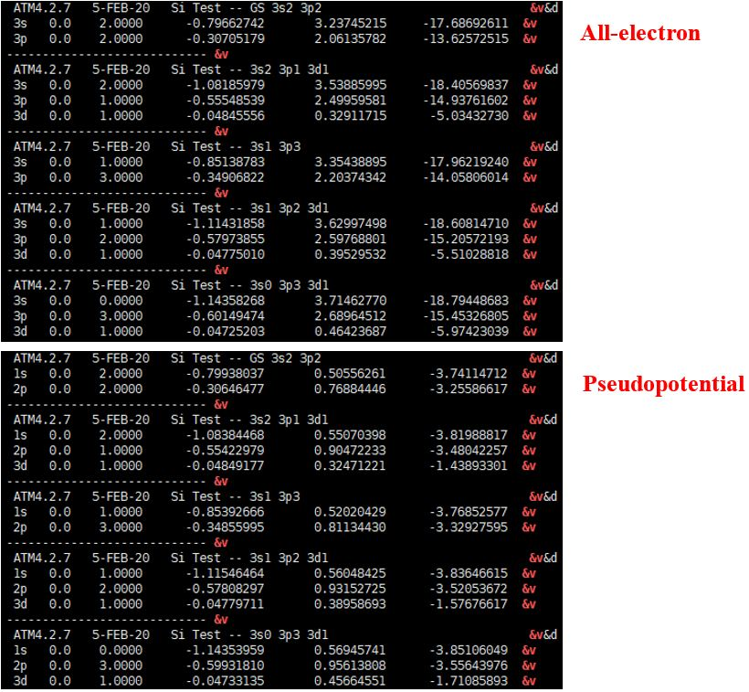
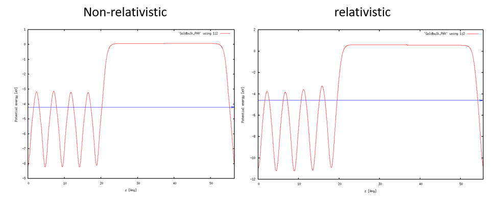

슈도포텐셜 생성
===============================
## Contents
1. 슈도포텐셜 생성
2. 슈도포텐셜 테스트
3. (심화) 상대론적 효과

이번 장에서는 **모든-전자(all-electron) 계산** 강의에 이어 **슈도포텐셜(pseudopotential) 생성** 방법을 다룬다. 해당 강의에 대한 자세한 설명 및 메뉴얼은 다음 링크를 참조한다.

- `ATOM` user manual: <https://siesta-project.org/SIESTA_MATERIAL/Pseudos/Code/atom-4.2.0.pdf>
- Wiki webpage: <https://docs.siesta-project.org/projects/atom/en/latest/tutorial/index.html>

## 1. 슈도포텐셜 생성

우리는 Si 원자를 예시로 살펴볼 것이다. 우선, `/Tutorial` 위치로 돌아가서 `/PS_Generation`에 들어가본다. Pseudopotential를 만들기 위한 예시 파일들이 있다. 이중에서 `Si` 폴더로 들어가서 `Si.tm2.inp` 파일을 살펴본다.  

`Si.tm2.inp`:  

```bash
#
#  Pseudopotential generation for Silicon
#  pg: simple generation
#
   pg      Silicon
        tm2      3.0             # PS flavor, logder R
 n=Si c=car                      # Symbol, XC flavor,{ |r|s}
       0.0       0.0       0.0       0.0       0.0       0.0
    3    4                       # norbs_core, norbs_valence
    3    0      2.00      0.00   # 3s2
    3    1      2.00      0.00   # 3p2
    3    2      0.00      0.00   # 3d0
    4    3      0.00      0.00   # 4f0
      1.90      1.90      1.90      1.90      0.00      0.00
#
# Last line (above): 
#    rc(s)     rc(p)     rc(d)     rc(f)   rcore_flag  rcore
#
#2345678901234567890123456789012345678901234567890123456789
```  

---

#### 입력값 설명:

**첫번째 줄**:
- 계산 모드:
   - `ae`: All-electron calculation
   - `pg`: Pseudopotential generation
   - `pe`: Pseudopotential generation (core correction)

**두번째 줄**:
- Pseudopotential 생성 방법(1열)
   - `tm2`: Improved Troullier-Martins
   - `ker`: Kerker
- 로그도함수 테스트(2열)

**세번째 줄**:
- 원소 기호(1열)
- 교환-상관(exchange-correlation) 범함수 종류(2열)
  - `ca`: Ceperley-Alder(LDA)
  - `pb`: Perdew, Burke, and Ernzerhof(GGA)
  - (참고) `xc` 옵션 뒤에 `s`를 붙여주면 `spin-polarized`, `non-relativistic` 계산을 수행할 수 있고, `r`를 붙여주면 `spin-polarized`, `relativistic` 계산을 수행할 수 있다.

**네번째 줄**:
- 대부분의 계산에서 사용되지 않는 옵션이다

**다섯번째 줄**:
- 코어 오비탈 수(1열)
- 원자가 오비탈 수(2열)

**여섯번째~아홉번째 줄**:
- 원자가 오비탈 정보(다섯번째 줄에서 지정한 수만큼)
- `n` 양자수 (1열)
- `l` 양자수 (2열)
- 전자 점유도 (3,4열)

**마지막 줄의 구성 요소**:
- s 오비탈의 cutoff 반지름 (1열)
- p 오비탈의 cutoff 반지름 (2열)
- d 오비탈의 cutoff 반지름 (3열)
- f 오비탈의 cutoff 반지름 (4열)
- Core correction 사용 여부 (0 또는 1) (5열)
- Core correction에 사용될 반지름 값 (6열)

---


`All_electron` 입력 파일과 다른 점은 우선 상단 왼쪽에 위치한 계산 모드가 `ae`가 아닌 `pg`로 되어있다는 것이다. **이를 꼭 `pg`로 수정해야 pseudopotential을 위한 계산을 할 수 있다.** All-electron과 마찬가지로 쉘 스크립트로 계산을 수행할 수 있는데, Pseudopotential을 만들기 위한 쉘 스크립트는 `ae.sh`가 아닌 `pg.sh`이다.  

``` bash
$ sh ../../Utils/pg.sh Si.tm2.inp
```
`SIESTA` 프로그램이 입력 파일로 이용할 수 있는 `Si.psf` 파일이 생성되었다. 
<br>여기서 주의할 점은 `SIESTA`에서는 basis가 되는 오비탈이 (l =3)까지 있어야한다. 
<br>따라서 실제 원자의 원자가 오비탈이 l = 3 까지 차 있지 않더라도 전자가 차 있지 않은 가상의 오비탈을 넣고 계산을 돌려야 한다. (위의 경우 3d, 4f)

### Core correction

`ATOM` 프로그램은 **non-linear exchange-correlation correction** [1](https://journals.aps.org/prb/abstract/10.1103/PhysRevB.26.1738) 계산을 수행할 수 있다.  
*Pseudo core의 전하밀도가 특정한 pseudo radius 밖에서 전하밀도도가 일치하고 경계부에서 매끈한 형태를 가지게 맞추어 주는 일련의 과정*이 `core correction`이다. Pseudopotential를 만드는 계산에서 *이 계산*을 포함시키기 위해서 앞서 실행한 입력 파일에서 `pg` 옵션을 `pe`로 바꾸어 주면 된다. 또한 마지막 줄에서 6번째 해당하는 값인 pseudo radius을 넣어준다. 
<br>만약 이 값이 음수이거나 0이면 5번째 값인 valence charge density를 통해 이 반경을 직접 계산하게 되는데, 이 값 역시 음수이면 전체 핵 전하를 기준으로, 0이면 1 값을 기준으로 계산하도록 되어있다. 따라서 pseudo radius을 실험적으로 얻은 외부 참조 값을 이용하여 넣어주는 것을 강력히 추천한다.

## 2. 슈도포텐셜 테스트

**Norm-Conserving Pseudopotentials, D. R. Hamann, M. Schlüter, and C. Chiang PRL (1979) ** [2](https://journals.aps.org/prl/abstract/10.1103/PhysRevLett.43.1494) 논문에서 제시한 pseudopotential의 조건은 다음과 같다.  
> 조건 1. Pseudo와 real의 원자가 고유함수 (valence eigenvalue)가 일치한다
> 조건 2. Pseudo와 real의 파동함수 (wavefunction)가 rc (core radius) 이후로 일치한다
> 조건 3. Pseudo와 real의 전하 밀도 (charge density)를 0에서 r까지 적분한 값이, r이 rc보다 클 때 일치한다 (norm conserving)
> 조건 4. Pseudo와 real의 파동함수에 대한 로그도함수 (logarithmic derivatives)가 rc 이후로 일치한다
`ATOM`을 통해 위 조건들을 확인하는 방법을 소개한다.

### 조건 1. 원자가 고유함수 (valence eigenvalue)

Pseudo와 real의 원자가 고유값이 일치하는지 확인하기 위해 all-electron과 pseudopotenial generations에 대한 계산 결과를 비교하면 된다. `pg` 계산에서는 `OUT` 파일에 이 두가지 정보를 모두 담고 있다. 따라서 두 고유값을 비교하기 위해서 `pg` 계산 결과가 나온 `OUT` 파일이 포함된 폴더에서 다음과 같은 명령어를 수행한다.

```bash
(Pseudopotential generation 결과 폴더에서)
$ grep ‘&v’ OUT
```


명령어를 통해 보여지는 결과, all-electron과 pseudopotential generations에 대한 오비탈 정보가 두 영역으로 나타난다. 이에 해당하는 영역은 `vi` 명령어를 통해 직접 `OUT` 파일을 직접 열어본 위 사진을 통해 확인할 수 있다. 오른쪽 `&v` 라벨이 valenace 오비탈을 지칭하고, 4번째 행이 그 고유값이다. 이를 통해 pseudo와 real의 원자가 고유값이 일치하는 것을 확인할 수 있다.

### 조건 2. 파동함수 (Wavefunctions)

`pg` 계산에서 `AEWFNR0` `R1` `R2` `R3` 파일은 s, p, d, f 오비탈에 대한 all-electron 원자가 파동함수 결과이다. `PSFNR0` `R1` `R2` `R3` 파일은 s, p, d, f 오비탈에 대한 pseudo 원자가 파동함수 결과이다. `gnuplot`을 이용하여 두 결과가 rc 이후에서 일치하는 것을 확인할 수 있다. 아래는 바닥 상태의 `Si` 원자에 대한 예시이다.

```bash
$ gnuplot
gnuplot > plot 'AEWFNR1' w l, 'PSWFNR1' w l
(R1 : 3p 오비탈)
```


### 조건 3. 전하 밀도 (Charge density)

`pg` 계산에서 `AECHARGE`는 `all-electron`의 전자밀도이다. 첫번째 열은 반경 (r), 두번째, 세번째 열은 각각 스핀에 해당하는 전체 전자밀도, 마지막 열은 핵 (core) 전자밀도이다. `PSCHARGE`는 ‘pseudopotential’에 대한 원자가 (valence) 전자밀도이다. 마찬가지로 첫번째 열은 반경 (r), 두번째, 세번째 열은 각각 스핀에 해당하는 전자밀도이다. 따라서 두 계산의 원자가 전자밀도를 비교하기 위해서는 다음과 같은 과정을 따른다.

```bash
$ gnuplot
gnuplot >plot 'PSCHARGE' u 1:($2+$3) w l		($2+$3 : 전체 원자가 전자밀도)
gnuplot > set xrange [0:20]
gnuplot >replot 'AECHARGE' u 1:($2+$3-$4) w l    ($4 : 핵 전자밀도)
```


### 조건 4: 로그도함수 (Logarithmic derivatives of wavefunctions)

위 `pg` 모드 계산 코드를 보면 두번째 줄에 `tm2`와 `3.0` 옵션을 볼 수 있다. 이에 해당하는 옵션이 로그도함수 계산을 위한 종류와 반경이다. 메뉴얼을 참고하여 다른 옵션을 줄 수 있다.
`pg` 계산에서 `AELOGD0` `D1` `D2` `D3` 파일이 s, p, d, f 오비탈에 대한 all-electron 파동함수의 로그도함수이다. 또한 `PSLOGD0` `D1` `D2` `D3` 파일이 s, p, d, f 오비탈에 대한 pseuodopotential 파동함수의 로그도함수이다. 위 과정들과 마찬가지로 `gnuplot`을 통해 비교한다.

```bash
$ gnuplot
gnuplot >plot ' AELOGD1' w l
gnuplot >replot ' PSLOGD1' w l
```


### Delta-SCF 방법: Transferability test

여기서 (3), (4) 조건은 transferability와 관련한 조건이다. Transferability는 외부 화학반응에 있어 중요한 부분인 만큼 pseudopotential generations에 핵심 조건 중 하나가 된다. 이를 `ATOM` 프로그램을 통해 직접 확인하는 방법은 전자의 구성을 바꾸어 계산을 수행하여 전체-전자 계산과 슈도포텐셜 계산의 결과를 비교하는 것이다. 이를 위한 과정은 다음 절차를 따른다. `Tutorial/Si` 위치에 있는 `Si.test.inp` 파일을 확인해본다.

`Si.test.inp` :
```bash
#
# All-electron calculations for a series of Si configurations
#
   ae Si Test -- GS 3s2 3p2
   Si   ca
       0.0
    3    2
    3    0      2.00
    3    1      2.00
   ae Si Test -- 3s2 3p1 3d1
   Si   ca
       0.0
    3    3
    3    0      2.00
    3    1      1.00
    3    2      1.00
   ae Si Test -- 3s1 3p3
   Si   ca
       0.0
    3    2
    3    0      1.00
    3    1      3.00
   ae Si Test -- 3s1 3p2 3d1
   Si   ca
       0.0
    3    3
    3    0      1.00
    3    1      2.00
    3    2      1.00
   ae Si Test -- 3s0 3p3 3d1
   Si   ca
       0.0
    3    3
    3    0      0.00
    3    1      3.00
    3    2      1.00

#
# Pseudopotential test calculations
#
   pt Si Test -- GS 3s2 3p2
   Si   ca
       0.0
    3    2
    3    0      2.00
    3    1      2.00
   pt Si Test -- 3s2 3p1 3d1
   Si   ca
       0.0
    3    3
    3    0      2.00
    3    1      1.00
    3    2      1.00
   pt Si Test -- 3s1 3p3
   Si   ca
       0.0
    3    2
    3    0      1.00
    3    1      3.00
   pt Si Test -- 3s1 3p2 3d1
   Si   ca
       0.0
    3    3
    3    0      1.00
    3    1      2.00
    3    2      1.00
   pt Si Test -- 3s0 3p3 3d1
   Si   ca
       0.0
    3    3
    3    0      0.00
    3    1      3.00
    3    2      1.00

12345678901234567890123456789012345678901234567890      Ruler
```

위와 같이 `Si.test.inp` 파일에는 `Si` 원자에 대한 다양한 전자배치 정보가 들어있다. 코드를 확인하면 동일한 전자배치로 구성된 `ae`와 `pt` 계산에 대한 두 영역으로 나눠져 있다. 여기서 `pt`는 **transferability test**를 위한 계산 모드이다. `pt` 계산을 수행하기 위해서는 `pt.sh` 쉘 스크립트를 이용해야 한다. 여기서 중요한 점은 `pt` 계산은 `Si` 원자의 바닥 상태에 대한 `pg` 계산 결과로 나온 `vps` 파일을 입력 파일로 받는다는 점이다. 이전 과정에서 이미 `pg` 계산을 수행했다면, `Si.tm2.vps` 파일이 같은 위치에 남아있을 것이다 (없다면 `pg` 계산을 먼저 수행해서 `vps` 파일을 얻는다).

```bash
$ sh ../../Utils/pt.sh Si.test.inp Si.tm2.vps
```
Total energy 비교 :  
```
$ grep ‘&d’ OUT
```

 


Eigenstate 비교 :  
```
$ grep ‘&v’ OUT
```


 

위 과정을 통해 `Si` 원자의 all-electron과 pseudopotential에 대한 여러 전자배치의 `total energy`와 `eigenvalue`를 비교하여, transferability를 시험할 수 있다.

### 예제: Fe 원자

이제 실제 `SIESTA` 프로그램을 위한 pseudopotential 입력파일을 만들어보자. 위에서 언급했듯 `SIESTA`는 basis가 되는 오비탈이 (l =3)까지 있어야한다. 이런 점을 만족시키는 pseudopotential generations의 입력파일은 다음 사이트에서 얻을 수 있다. [pseudo](https://departments.icmab.es/leem/SIESTA_MATERIAL/Databases/Pseudopotentials/periodictable-intro.html) (현재는 사용불가).

위 사이트에 가면 pseudopotential을 만드는 방법으로 `LDA` (localized density approximation)과 ‘GGA’ (generalized gradient approximation)을 선택할 수 있다. `LDA` 방법은 `Au` 원자와 같은 전위금속의 구조를 정확히 예측하지 못한다[3](https://iopscience.iop.org/article/10.1088/0953-8984/13/42/307/meta). 따라서 `GGA` 방법을 선택하여 `Fe`의 `ATOM` 입력파일 (input file for ATOM program)을 설치한다.

`Fe.inp` :
```bash
pe                 -- file generated from Fe ps file
        tm2
   Fe   pb
     0.000     0.000     0.000     0.000     0.000     0.000
    5    4
    4    0     2.000     0.000    #4s
    4    1     0.000     0.000    #4p
    3    2     6.000     0.000    #3d
    4    3     0.000     0.000    #4f
   2.41000   2.53000   2.29000   2.29000   0.01000  -1.00000 small core charge

#23456789012345678901234567890123456789012345678901234567890      Ruler
```

앞서 입력 옵션을 설명했듯이, 첫번째 줄에 `pe`는 **core correction**을 위한 옵션이다. 원자의 코어 전자와 최외각 전자의 파동함수가 상당부분 겹칠 경우에, core correction를 통해 더욱 안정적으로 pseudopotential을 만들 수 있다. 두번째 줄의 `tm2`은 이전에 설명한 transferability를 위해 로그도함수를 시험하기 위한 옵션이다. 또한 세번째 줄에 `pb` 옵션을 볼 수 있는데, 이는 `GGA` 방법의 종류로 ` PBE` ((Perdew, Burke, and Ernzerhof) 방법을 의미한다. <br>다른 방법들은 메뉴얼을 통해서 확인하도록 한다.
<br>`Au`와 같이 원자번호가 큰 금속은 상대론적 효과가 나타난다 (원자핵 주변으로 핵 전자들이 더욱 구속되면서 가림 효과 (shielding effect)가 커지고, d나 f 오비탈의 전자들의 구속력이 약해진다)[4]( https://link.springer.com/article/10.1007/BF03215471). 따라서 계산에서도 상대론적 효과를 고려하는 것이 좋다. 
<br>`pb` 옵션 뒤에 `s`를 붙여주면 `spin-polarized`, `non-relativistic` 계산을 수행할 수 있고, `r`를 붙여주면 `spin-polarized`, `relativistic` 계산을 수행할 수 있다. `pb`를 `pbr`로 바꾸어 주어 상대론적 효과를 고려한 pseudopotential을 만들어보자.

```bash
$ <ATOM 프로그램 위치>/Tutorial/Utils/pg.sh Fe.inp
```

`SIESTA` 계산을 위한 `Fe.psf` 파일이 생성되었다.

## 3. (심화) 상대론적 효과

> 해당 강의를 수행하기 앞서 기본적인 [SIESTA 사용법]<https://yhkimlab.github.io/YHKimLabWiki/site/siesta/siesta_basic/>에 대해서 숙지한다.

Pseudopotential을 만든 이유는 보통 계산에 사용하기 위에서이다. 일반적으로는 pseudopotential의 4가지 조건을 확인한 것 만으로 정확한 계산을 할 수 있다. 그러나, Au와 같이 전자수가 많은 경우 그렇지 않다. 이번에는 두가지 Au pseudopotential을 만들어 보고, 만든 pseudopotential이 계산에 적합한지 확인해보겠다.

### 슈도포텐셜 생성

위에서 언급했듯이 원자번호가 큰 원자는 상대론적 효과가 나타난다. 원자의 무게가 크면 클수록 상대론적 효과는 더 크게 나타나고, 상대론적 효과가 커질수록 상대론적 효과를 고려한 pseudopotential과 고려하지 않은 pseudopotential의 결과의 차이가 커진다. 이번에는 79번 Au 원소를 사용해 상대론적 효과를 고려한 pseudopotential과 고려하지 않은 pseudopotential을 만들고 계산을 수행한 후 그 결과를 비교해보겠다.  

우선 atom코드에서 사용할 input 코드를 가져와야 한다. atom에서 사용할 reference 코드는 [pseudo](https://departments.icmab.es/leem/SIESTA_MATERIAL/Databases/Pseudopotentials/periodictable-intro.html)에서 가져올 수 있다. 페이지에서 LDA를 선택한 후, Au를 선택하고, "input file for the ATOM program"을 선택한다. 그러면 Au.inp파일을 받을 수 있다.

`Au.inp`:

```bash
   pg                 -- file generated from Au ps file
        tm2
   Au   ca 
     0.000     0.000     0.000     0.000     0.000     0.000
   12    4
    6    0     1.000     0.000    #6s
    6    1     0.000     0.000    #6p
    5    2    10.000     0.000    #5d
    5    3     0.000     0.000    #5f
   2.63000   2.77000   2.63000   2.63000   0.00000   0.00000

#23456789012345678901234567890123456789012345678901234567890      Ruler
```

Au pseudopotential에 상대론적 효과 옵션을 넣기 위해서는 r옵션을 넣어주어야 한다. 이 옵션은 ca오른쪽에 넣어주면 된다. 주의할 점은 위치이다. r옵션은 Ruler의 첫번째 0 위에 반드시 위치해야한다. 만약 이 위치가 다르다면 atom으로 pseudopotential을 생성할 때 에러 메세지가 생길 것이다.
*(tm2의 시작 위치에 맞추어 입력해주면 된다.)*

`Au.inp` (잘못된 예시):  

```bash
   pg                 -- file generated from Au ps file
        tm2    2.63
   Au    car  # <---위치가 잘못됨
     0.000     0.000     0.000     0.000     0.000     0.000
   12    4
    6    0     1.000     0.000    #6s
    6    1     0.000     0.000    #6p
    5    2    10.000     0.000    #5d
    5    3     0.000     0.000    #5f
   2.63000   2.77000   2.63000   2.63000   0.00000   0.00000

#23456789012345678901234567890123456789012345678901234567890      Ruler
```

상대론적 효과 이외에도 계산 과정에서 xc를 바꾸거나 rc를 바꾸거나 해야할 수 있다. 이런 옵션들을 알아보려면 [atom manual](https://siesta-project.org/SIESTA_MATERIAL/Pseudos/Code/atom-4.2.0.pdf)을 찾아보면 된다.

### SIESTA 계산

#### 1. Lattice constant

우선적으로 두가지 Au pseudopotential로 만든 fcc 구조 bulk cell의 lattice constant를 각각 구해볼 것이다. bulk model은 Tutorial 1에서 사용한 fcc모델을 사용할 것이다. Tutorial 1에서 k-point test를 이미 거쳤기 때문에 tutorial 1에서 사용한 k인 k=35를 사용해서 lattice constant를 계산했다.

|     Basis size     |      DZP       |
| :----------------: | :------------: |
| Basis energy shift |   100 [meV]    |
|         XC         |      LDA       |
|       DM.tol       | $10^{-3}$ [eV] |

lattice constant는 Tutorial 1에서와 마찬가지로 일정한 간격으로 lattice constant를 변화시키면서 
에너지가 가장 낮은 lattice constant를 찾으면 된다.
계산의 효율을 위해 처음에는 sparse하게 계산한 후 에너지가 가장 낮은 값 근처에서 dense하게 계산하면 좋다. 
이후 3d 물질에서 lattice constant를 찾기에 적합한 murnaghan fitting을 통해 에너지가 가장 낮은 lattice constant를 찾았다


relativistic 효과를 킨 경우 최적화된 volume은 69.28785 Å 이고, 
relativistic 효과를 끈 경우 최적화된 volume은 79.22283 Å이다. 
이를 통해 lattice constant를 구하려면 부피의 세제곱근을 하면 된다. 
relativistic 효과를 킨 경우 lattice constant는 4.107 Å이고, 
relativistic 효과를 끈 경우 lattice constant는 4.295 Å이다. 
[reference](https://www.sciencedirect.com/science/article/pii/S0927025614007940#t0015)에서 구한 
실험의 lattice constant는 4.080 Å이므로 relativistic 효과를 킨 경우가 더 정확함을 알 수 있다.


#### 2. Band structure

이번에는 Au bulk의 band를 그려서 두 pseudopotential에 어떤 차이가 있는지 알아보자. 
band structure를 그릴 때 사용할 [reference](https://www.sciencedirect.com/science/article/pii/S0927025614007940#t0015)는 
Tutorial 1에서도 사용한 이 band 그래프이다. 
band path는 모두 $\Gamma-X-W-L-\Gamma-K$ 로 설정해준다. 보고싶은 에너지 범위는 $Fermi energy ±10 eV$이다. 
이 조건들을 만족시키면서 band 그래프를 그려보면 결과는 다음과 같다.


페르미 에너지 위 5eV부분을 보면 relativistic의 band structure은 reference와 비슷하지만, 
non-relativistic의 band structure은 reference와 상이함을 알 수 있다. 
따라서 Au pseudopotential은 relativistic 옵션을 켜야하고, 이를 키지 않을시 문제가 생길 수 있다는 것을 확인할 수 있다.

#### 3. Work function

마지막으로 두 경우의 work function을 확인해보자. Work function을 구하기 위해서는 slab 모델을 만들어주어야 한다. 
<br><br>

**(1) Slab 모델은 위에서 구한 최적화된 bulk model을 이용**해서 [1, 1, 1]면을 표면으로 설정해줄 것이다. 
work function의 차이만 비교해보기 위해서 다른 변수들은 전부 고정해주었다.

<br>

**(2) 혹은 ase를 통해 직접 생성** 한다.

우선

```bash
$ase gui
```

를 입력하면 xcryden 창이 뜨게 된다.


`setup-Surface slab`을 선택하면 원하는 구조의 slab의 .xyz 파일을 생성할 수 있다.

{: style="display:block; height:400px; margin-left:auto; margin-right:auto;" }
{: style="display:block; height:300px; margin-left:auto; margin-right:auto;" }

원하는 `Element, Lattice Structure and Constant, Vacuum length`를 입력한 뒤 Apply

{: style="display:block; height:300px; margin-left:auto; margin-right:auto;" }


`File-Save`를 눌러 원하는 directory에 `STRUCT.xyz` 로 저장하면 파일이 생성된다.

{: style="display:block; height:350px; margin-left:auto; margin-right:auto;" }

생성된 `STRUCT.xyz`에는 Cell 정보가 vector 좌표로 표현되어 있으므로,
이를 

```bash
CELL   <size0>   <size1>   <size2>   <angle0>   <angle1>   <angle2>
```
과 같은 형식으로 바꾸어준다.  여기서 `size`는 각 벡터의 크기이고, `angle`은 각 벡터 사이의 각이다.


<br>

**(3) Tutorial-SIESTA 계산-A. 기초과정-(2) Au 벌크/슬랩 구조 에서 사용하는 make_bulk.py 파일을 이용**한다.
<br> ase 방법에서와 동일한 parameter들을 파일 안에서 수정할 수 있으니 확인하기 바란다.


<br>

{: style="display:block; height:300px; margin-left:auto; margin-right:auto;" }

<br><br><br>

Slab 모델을 만든 후에는 basis를 설정해준다. work function을 구할 때는 100meV를 사용하면 reference와의 차이가 매우 크기 때문에 PAO.EnergyShift 항목을 50meV로 바꾸고 계산을 해야 한다.

|     Basis size     |      DZP       |
| :----------------: | :------------: |
| Basis energy shift |    50 [meV]    |
|         XC         |      LDA       |
|       DM.tol       | $10^{-3}$ [eV] |

slab model을 만들면 bulk model에서 했던 것과 마찬가지로 k-point test를 해야한다. slab model의 경우 z축의 k-point는 1로 고정하고 x, y값만 변화시켜가며 측정하면 된다. tutorial 1에서 slab model에 대한 k-point를 구했기 때문에 구했던 [31,31,1]의 k-point를 그대로 사용하겠다. relativistic 효과를 준 경우와 주지 않은 경우 work function을 측정해보면 결과는 다음과 같다.

|                  | Fermi [eV] | Vacuum [eV] | Work Function [eV] |
| :--------------: | :--------: | :---------: | :----------------: |
|   relativistic   | -4.506018  |  0.750869   |      5.256887      |
| non-relativistic | -4.201008  |  0.074519   |      4.275527      |

Metal work function의 [reference](https://public.wsu.edu/~pchemlab/documents/Work-functionvalues.pdf)에서 Au의 111면에서 work function은 5.31eV임을 알 수 있다. Relativistic의 경우 0.06 eV정도 차이가 나지만, non-relativistic의 경우 1.04 eV로 차이가 매우 심하게 나게 됨을 알 수 있다.

Au Tutorial에서 했던 것처럼 macroave.in을 통해 Wave function을 시각화 해보면 다음과 같은 결과를 얻을 수 있다.
Marcoave.in 은 /home/(username)/bin에 있다


{: style="display:block; height:400px; margin-left:auto; margin-right:auto;" }

Vacuum level의 경우 그래프에서, 위치를 고정하지 않았던 쪽의 원자들에 가까운 쪽 level을 직접 그래프에서 측정하는 것이 더 정확하다.

<br>
이와 같은 일련의 과정들을 통해 Pseudopotential을 테스트할 수 있다. 테스트 결과 Au같은 원자번호가 큰 원자의 경우 Relativistic 효과를 고려하는 경우 reference와 거의 일치하지만 Relativistic 효과를 고려하지않는 경우는 reference와 큰 차이가 난다. 따라서 Au의 경우 relativistic 효과를 고려해줘야 한다는 것을 알 수 있다.

## 참고문헌
[1](https://journals.aps.org/prb/abstract/10.1103/PhysRevB.26.1738): S. G. Louie, S. Froyen, and M. L. Cohen, Phys. Rev. B 26, 1738 (1982)  
[2](https://journals.aps.org/prl/abstract/10.1103/PhysRevLett.43.1494): Norm-Conserving Pseudopotentials, D. R. Hamann, M. Schlüter, and C. Chiang PRL (1970)  
[3](https://iopscience.iop.org/article/10.1088/0953-8984/13/42/307/meta): J. Phys.: Condens. Matter13 (2001) 9463–9470  
[4](https://link.springer.com/article/10.1007/BF03215471): Relativistic effects and the chemistry of gold (1998)  
[5](https://www.sciencedirect.com/science/article/pii/S0927025614007940#t0015): P Rivero et al. Comput. Mater. Sci. (2015), 98, 372
