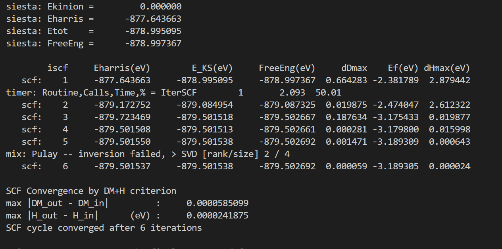

SISETA 빌드하기
===============================
## Contents
1. SIESTA 설치
2. 유틸리티 설치
3. 테스트 계산

## 1. SIESTA 설치

이번 강의에서는 SIESTA를 설치하는 법에 대해 소개한다. SIESTA 환경 구축에 대한 더 자세한 내용은 [SIESTA Documentation](https://docs.siesta-project.org/projects/siesta/tutorials/01-installation.html) 위키 홈페이지나 [메뉴얼](https://siesta-project.org/SIESTA_MATERIAL/Docs/Manuals/manuals.html)에서 참고하길 바란다.


### Step 1. 소스 다운로드

SIESTA를 설치하기 위해서는 우선 SIESTA 소스 코드를 다운로드 받아야 한다. SIESTA의 공식 릴리즈판은 [SIESTA Gitlab](https://gitlab.com/siesta-project/siesta/-/releases)에 공개되어있다. 가장 최신 릴리즈인 `4.1.5` 버전의 소스 코드를 받으려면 다음 명령어를 사용하면 된다.

```bash
wget https://gitlab.com/siesta-project/siesta/-/releases/v4.1.5/downloads/siesta-4.1.5.tar.gz
```

소스코드를 받았다면, 다음 명령어로 압축을 풀어준다. 그리고, 압축을 푼 폴더로 이동해준다.

```bash
tar xvzf siesta-4.1.5.tar.gz
cd siesta-4.1.5
```

### Step 2. 빌드 설정하기

SIESTA를 빌드하기 전에 몇가지 설정이 필요하다.

1. `Obj/` 폴더로 이동하거나 빌드할 폴더를 만든다.
2. `arch.make` 파일을 만든다.
3. `obj_setup.sh` 스크립트를 실행시킨다.
4. 빌드 설정이 잘되어있는지 확인한다.

`arch.make` 파일은 다른 프로그램 빌드시의 configure에 해당하는 파일로, 컴파일시 환경설정을 해주는 파일이다. `Obj` 폴더 내에 `gfortran.make`, `intel.make` 예시 파일이 있다. Fortran compiler 환경에 따라서 gfortran을 이용하는 경우 `gfortran.make` 파일을, ifort를 사용하는 경우 `intel.make` 파일을 arch.make 파일로 바꾸어준다.

- GNU 컴파일러(gcc)
```bash
mv gfortran.make arch.make # gcc
```
```
CC = gcc
FPP = $(FC) -E -P -x c
FC = gfortran
FC_SERIAL = gfortran
```

- Intel 컴파일러(icc)
```bash
mv intel.make arch.make # icc
```
```
CC = icc
FPP = $(FC) -E -P
FC = ifort
FC_SERIAL = ifort
```

추가적으로 **병렬화** 버전의 SIESTA를 설치하고 싶다면 다음과 같은 형태로 `arch.make` 파일을 수정해준다.

- **MPI**을 사용하는 경우
```
MPIROOT=/opt/intel/oneapi/mpi/2021.6.0 # (예시) 본인의 MPI 경로 지정
CC = mpicc
FC = mpifort # or mpif90
MPI_INTERFACE = libmpi_f90.a
MPI_INCLUDE = $(MPIROOT)/include
FPPFLAGS += -DMPI
LDFLAGS += -L$(MPIROOT)/lib
```

!!! note
    참고로 **MPI**가 없는 경우 무료로 사용 가능한 **OpenMPI**을 대신 이용할 수 있다. 이에 대한 설치는 [SIESTA Documentation - Preparing the environment](https://docs.siesta-project.org/projects/siesta/how-to/build-prep-env.html#on-linux)을 참고하길 바란다(컴파일에 대한 내용은 메뉴얼 참고).


이후 `Obj` 폴더에서 `obj_setup.sh` 스크립트를 실행한다. 이를 통해 모든 소스는 `Src` 폴더에 있는 상태로 빌드만 `Obj` 폴더에서 진행된다. `Obj` 폴더에서 다음과 같은 명령어를 넣어주면 된다.

```bash
    sh ../Src/obj_setup.sh
```

### Step 3. SIESTA 컴파일

마지막으로 SIESTA 컴파일해준다. 터미널에서 `Obj` 폴더에서 make라고 쳐주면 된다. 그러면 SIESTA 프로그램이 빌드되어 나오고, 이를 이용해 SIESTA 계산을 진행할 수 있다.

```bash
make
```

make도 병렬화가 되기 때문에 코어 수에 맞춰 -j옵션을 넣어 N개의 코어로 빌드를 더 빠르게 할 수 있다. 예를 들어 ==make -j 4== 라는 명령어를 사용하면 cpu에서 4개의 코어로 빌드가 되어 더 빠르게 빌드를 할 수 있다.

```bash
make -j N (N은 코어의 수)
```

!!! note
    TranSIESTA를 이용하기 위한 경우에는 `make transiesta` 명령어를 대신 이용하여 다른 실행 파일을 얻을 수 있다. 그러나 원칙적으로는 `4.1` 버전 이후로는 SIESTA와 TranSIESTA는 통합되어 SIESTA만 컴파일하더라도 모든 계산을 진행할 수 있다.

컴파일이 완료되었으면 실행 파일에 대한 링크를 생성해 터미널의 어느 경로에서도 `siesta` 명령어를 쳤을 때 실행 파일이 동작하게 만들면 편하다. 이를 위해 /usr/bin에 링크를 만들어 줄 것이다. siesta의 절대경로를 pwd 명령어를 통해 안 후, 다음 명령어를 통해 SIESTA 실행파일에 대한 링크를 생성한다.

```bash
ln -s $SIESTA /usr/bin/siesta
```

이때 $SIESTA는 SIESTA 프로그램의 절대경로를 뜻한다. 추가적으로 SIESTA 링크에 실행권한을 부여해야 터미널에서 명령어로 사용할 수 있다.

```bash
sudo chmod +x /usr/bin/siesta
```

이제 터미널에서 `siesta` 명령어를 쳐보자. 결과가 아래 사진과 같이 나온다면 SIESTA를 성공적으로 빌드한 것이다.


## 2. 유틸리티 빌드하기

SIESTA 계산을 분석하기 위해서는 많은 유틸리티 코드가 필요하다. 유틸리티 코드은 `/Util` 디렉토리에 있고, 그 안에 있는 build_all.sh 스크립트를 실행시키면 모든 유틸리티 코드들이 컴파일된다.

```bash
./build_all.sh
```

빌드가 완료되면 다음과 같이 빌드가 안된 폴더들이 나온다.


이에 대해서는 개별적으로 디텍토리에 접근하여 컴파일을 다시 시도하기를 바란다.

## 3. 라이브러리 추가

지금까지는 기본적인 SIESTA 프로그램에 대한 설치에 대해서 다루었다. 그러나 보다 빠른 SIESTA 계산을 위해서는 다음과 같은 라이브러리를 SIESTA 컴파일 시에 추가하기를 권장한다.

- BLAS
- LAPACK
- ScaLAPACK (MPI로 컴파일한 경우)
- NetCDF

이에 해당하는 라이브러리를 가지고 있다면 이들을 SIESTA `arch.make` 파일의 라이브러리에 포함시켜 컴파일해주면 된다.


BLAS, LAPACK, ScaLAPACK과 같은 라이브러리들은 **MKL** 라이브러리를 만약 이용한다면 다음과 같이 쉽게 해당 라이브러리들을 `arch.make` 파일에 추가할 수 있다.

```
MKLROOT=/opt/intel/oneapi/mkl/2022.1.0 # (예시) 본인의 MKL 경로 지정

INCFLAGS+= -I$(MKLROOT)/include -I$(MPIROOT)/include
LDFLAGS += -L$(MKLROOT)/lib/intel64

BLAS_LIBS= -lmkl_core -lpthread -lm -ldl
LAPACK_LIBS= -lmkl_lapack95_lp64
BLACS_LIBS= -lmkl_blacs_intelmpi_lp64
SCALAPACK_LIBS= -lmkl_intel_lp64 -lmkl_sequential -lmkl_blas95_lp64 -lmkl_scalapack_lp64
LIBS = $(SCALAPACK_LIBS) $(BLACS_LIBS) $(LAPACK_LIBS) $(BLAS_LIBS)
```

NetCDF4의 경우 SIESTA 소스 파일 내에 직접 설치를 할 수 있는 bash 스크립트가 제공되어있다. 이에 대한 스크립트는 `/siesta-4.1.5/Docs` 경로의 `install_netcdf4.bash` 파일이다. 이를 이용하기 위해서는 다음과 같은 정보를 `install_netcdf4.bash`에 추가해준다.

- install_flook.bash
```
# If you want to change your compiler version you should define the
# global variables that are used for the configure scripts to grab the
# compiler, they should be CC and FC. Also if you want to compile with
# different flags you should export those variables; CFLAGS, FFLAGS.
export CC=icc
export CXX=icpc
export FC=mpiifort
export F77=mpiifort
export F90=mpiifort
export FFLAGS='-fPIC -O3 -xSSE4.2 -ip'
export CFLAGS='-fPIC -O3 -xSSE4.2 -ip'
```
위에서 새로 추가된 것은 `CC`와 `FC`에 대한 정보이다. **본인의 컴파일러**에 맞게 이 부분을 수정하면 된다. 또한 기본 `install_netcdf4.bash` 기술된 각 라이브러의 버전에 대한 정보 및 다운로드 경로는 실시간으로 수정이 되는 경우가 있어 꼭 확인이 필요하다.

- 수정이 필요한 내용 (2023.01.18)
```
z_v=1.2.13
h_v=1.14.0
nc_v=4.9.0
nf_v=4.5.4

download_file zlib-${z_v}.tar.gz https://zlib.net/zlib-${z_v}.tar.gz
download_file hdf5-${h_v}.tar.bz2 https://support.hdfgroup.org/ftp/HDF5/releases/hdf5-${h_v%.*}/hdf5-${h_v}/src/hdf5-${h_v}.tar.bz2
download_file netcdf-c-${nc_v}.tar.gz https://downloads.unidata.ucar.edu/netcdf-c/${nc_v}/netcdf-c-${nc_v}.tar.gz
download_file netcdf-fortran-${nf_v}.tar.gz https://downloads.unidata.ucar.edu/netcdf-fortran/${nf_v}/netcdf-fortran-${nf_v}.tar.gz
```

위 정보를 수정했다면 다음과 같은 명령어로 NetCDF4와 이에 필요한 라이브러리들을 설치할 수 있다.

```bash
bash install_netcdf4.bash
```

설치 진행이 완료되면 SIESTA `arch.make`에 추가해야할 정보가 다음과 같이 제공된다.

```
##########################
# Completed installation #
#   of NetCDF package    #
#  and its dependencies  #
##########################


Please add the following to the BOTTOM of your arch.make file
...

...
LIBS += -lnetcdff -lnetcdf -lhdf5_hl -lhdf5 -lz
COMP_LIBS += libncdf.a libfdict.a
FPPFLAGS += -DCDF -DNCDF -DNCDF_4
```

위 정보를 `arch.make`에 추가하여 SIESTA 컴파일 하면 NetCDF4 버전의 SIESTA를 설치할 수 있다.


## 4. 테스트 계산

빌드가 다 되었으면 테스트 계산을 해보아 실제로 SIESTA가 잘 동작하는지 확인해보자. Tutorial 예제 중 하나인 gold bulk 계산을 한 경우에 대해 해볼 것이다. 테스트 계산은 아래에서 다운로드 받을 수 있다. 적당한 곳에 이 파일을 복사한 후 다음 명령어로 압축을 풀어준다. [[예제 파일]](img/build/test.tar.gz)

```bash
    tar -xvzf test.tar.gz
```

파일의 압축을 풀면 bulk라는 폴더가 나오고, 그 안에 input이라는 폴더가 있을 것이다. input 폴더 안까지 들어간 다음에 다음 명령어를 치면 계산이 진행된다.

```bash
    siesta RUN.fdf
```

- **MPI** 경우 (20개 코어 사용)
```bash
    mpirun -np 20 siesta RUN.fdf
```

위 명령어를 실행시키면 터미널에서 계산이 진행되며, 다음 그림과 같이 scf loop가 돌면서 제 1원리 계산이 수행되는 모습을 볼 수 있다.



