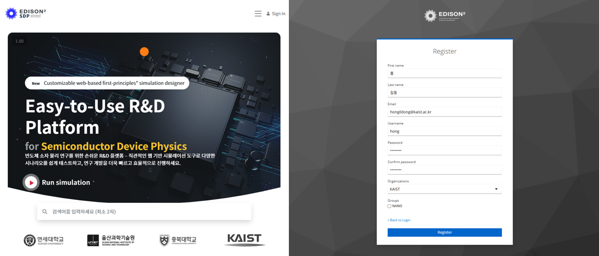
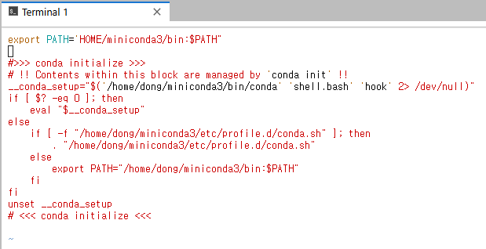
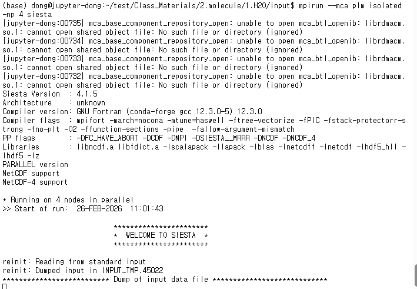

Edison에서 SIESTA 설치
====================================
## Contents
1. `Edison` 계정 만들기
2. `Miniconda`, `openmpi`, `SIESTA` setup

---
## 1. Edison 계정 만들기
NanoR&D EDISON 포털에서 Jupyter Notebook 기반 실습(ATOM, SIESTA)을 진행하려면 먼저 EDISON 계정이 필요하다.   
`https://nanornd.edison.re.kr/` 에 접속하여 상단에 있는 **Sign In** 버튼을 눌러 회원가입을 진행하자.  

  

회원가입이 완료되었다면 회원가입 시 입력했던 아이디와 비밀번호를 통해 로그인한다.  
상단의 메뉴바에서 `Tool` - `Jupyter Notebook` 을 눌러 들어간다.  

Jupyter 페이지에서 다음 순서로 터미널을 연다. (UI 문구는 포털 업데이트에 따라 조금 다를 수 있음)

1. 화면 가운데의 `Sign in with Keycloak` 버튼 클릭  
2. 환경 선택에서 `CPU Only` 선택  
3. `Start` 클릭하여 Jupyter 실행  
4. 실행된 JupyterLab(또는 Notebook)에서 `Other` → `Terminal` 로 터미널 창 열기


## 2. Miniconda, Openmpi Setup
### 2.1 Miniconda 설치
```bash
$ wget https://repo.anaconda.com/miniconda/Miniconda3-latest-Linux-x86_64.sh
$ sh Miniconda3-latest-Linux-x86_64.sh        <<Min까지 입력 후 탭을 누르면 자동 완성된다
```
모든 물음에 yes와 enter키를 입력 후 다운을 완료하면 아래의 문구가 뜰 것이다.
```
Thank you for installing Miniconda3!
```
그리곤 bashrc 파일에서 conda PATH를 방금 다운로드한 conda로 지정해줘야한다.
```
$ vi ~/.bashrc 
```
제일 상단에 하단의 텍스트 내용을 추가한 뒤 저장한다. 
```bash
export PATH='HOME/miniconda3/bin:$PATH'
(insert버튼 후 위의 내용을 입력한 뒤 esc버튼 후 :wq 입력하면 저장된다)
```  



```bash
$ cat > ~/.bash_profile <<'EOF'
if [ -f ~/.bashrc ]; then
    . ~/.bashrc
fi
EOF
```
```
$ source ~/.bashrc
```
이후 터미널을 새로 열어서 터미널에 `which conda` 를 입력하면 miniconda가 경로로 잡히는 것을 볼 수 있다.   
이렇게 해당 환경에서의 conda 및 파이썬 설치가 완료된다. 

다음은 가상환경 셋업을 위한 명령어이다.
```bash
$ conda create -n (환경이름 ex: EE5xx) conda-forge python==3.11.5
$ conda activate EE5xx
```
## 수정
해당 환경에 필요한 파이썬 패키지들을 다운 받아보자.
```bash
$ pip install -U pip setuptools wheel
$ pip install -U numpy scipy matplotlib pandas ipython ipywidgets plotly jupyter ipykernel
```
jupyter notebook kernel 실행을 현재 파이썬 위치에서 실행하기 위해 노트북 커널로 등록한다.
```bash
$ ipykernel install --user --name miniconda --display-name "Python (miniconda3)"
$ jupyter kernelspec list
```
커널 목록에 해당 파이썬 위치로 연결되는 커널이 뜬다면 된다.
## 수정

다음은 `SIESTA` 다운로드를 위한 명령어이다.
```bash
conda install openmpi
conda install -c conda-forge "siesta=4.1.5=*openmpi*"
```
openmpi는 SIESTA 계산을 병렬화해서 신속하게 계산할 수 있는 패키지이다.

아래 명령어를 통해 `SIESTA` 설치가 잘 완료되었는지 확인해보자.
```bash
mpirun --mca plm isolated -np 4 siesta
```   
아래 그림과 같이 나온다면 설치가 잘 완료된 것이다.



