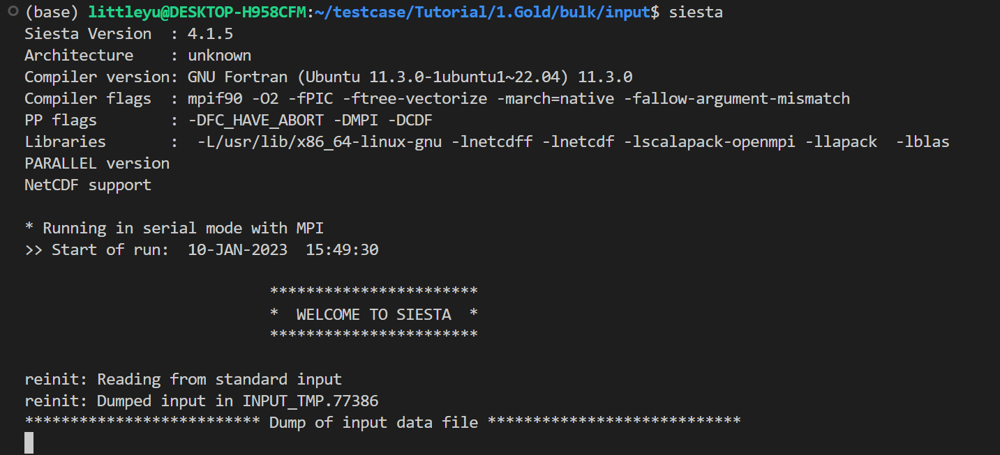

SISETA 빌드하기
===============================
## Contents
1. SIESTA 빌드하기
2. Utilities 빌드하기
3. 테스트 계산 해보기

## 1. SIESTA 빌드하기

### Step 1. 소스 다운로드

SIESTA를 빌드하기 위해서는 우선 SIESTA 프로그램들을 다운로드 받아야 한다. SIESTA의 공식 릴리즈판은 [SIESTA Gitlab](https://gitlab.com/siesta-project/siesta/-/releases)에서 받을 수 있다. 가장 최신 릴리즈인 4.1.5버전의 소스코드를 받으려면 다음 명령어를 사용하면 된다.

```bash
    wget https://gitlab.com/siesta-project/siesta/-/releases/v4.1.5/downloads/siesta-4.1.5.tar.gz
```

소스코드를 받았다면, 다음 명령어로 압축을 풀어준다. 그리고, 압축을 푼 폴더로 이동해준다.

```bash
    tar xvzf siesta-4.1.5.tar.gz
    cd siesta-4.1.5
```

### Step 2. 빌드 설정하기

SIESTA를 빌드하기 전에 몇가지 설정이 필요하다.

1. `Obj/` 폴더로 이동하거나 빌드할 폴더를 만든다.
2. `arch.make` 파일을 만든다.
3. `obj_setup.sh` 스크립트를 실행시킨다.
4. 빌드 설정이 잘되어있는지 확인한다.

`arch.make` 파일은 다른 프로그램 빌드시의 configure에 해당하는 파일로, 컴파일시 환경설정을 해주는 파일이다. `Obj` 폴더 내에 `gfortran.make`, `intel.make` 예시 파일이 있다. Fortran compiler 환경에 따라서 gfortran을 이용하는 경우 `gfortran.make` 파일을, ifort를 사용하는 경우 `intel.make` 파일을 arch.make 파일로 바꾸어준다.

```bash
    mv gfortran.make arch.make # gcc
    mv intel.make arch.make # icc
```

이후 `Obj` 폴더에서 `obj_setup.sh` 스크립트를 실행한다. 이를 통해 모든 소스는 `Src` 폴더에 있는 상태로 빌드만 `Obj` 폴더에서 진행된다. `Obj` 폴더에서 다음과 같은 명령어를 넣어주면 된다.

```bash
    sh ../Src/obj_setup.sh
```

### Step 3. SIESTA 빌드

마지막으로 SIESTA 빌드해준다. 터미널에서 `Obj` 폴더에서 make라고 쳐주면 된다. 그러면 SIESTA 프로그램이 빌드되어 나오고, 이를 이용해 SIESTA 계산을 진행할 수 있다.

```bash
    make
```
make도 병렬화가 되기 때문에 코어 수에 맞춰 -j옵션을 넣어 N개의 코어로 빌드를 더 빠르게 할 수 있다. 예를 들어 ==make -j 4== 라는 명령어를 사용하면 cpu에서 4개의 코어로 빌드가 되어 더 빠르게 빌드를 할 수 있다.

```bash
    make -j N (N은 코어의 수)
```

빌드가 되었으면 링크를 생성해 터미널에서도 siesta 명령어를 쳤을 때 동작하게 만들면 편하다. 이를 위해 /usr/bin에 링크를 만들어 줄 것이다. siesta의 절대경로를 pwd 명령어를 통해 안 후, 다음 명령어를 통해 siesta의 링크를 생성한다.

```bash
    ln -s $SIESTA /usr/bin/siesta
```

이때 $SIESTA는 siesta 프로그램의 절대경로를 뜻한다. 추가적으로 siesta 링크에 실행권한을 부여해야 터미널에서 명령어로 사용할 수 있다.

```bash
    sudo chmod +x /usr/bin/siesta
```

이제 터미널에서 siesta 명령어를 쳐보자. 결과가 아래 사진과 같이 나온다면 SIESTA를 성공적으로 빌드한 것이다.




## 2. Utilities 빌드하기

추가적으로 TRANSIESTA 계산의 후처리 과정을 위한 TBTRANS 유틸을 빌드해야한다. 유틸은 Util 폴더에 있고, Util 폴더 안에 있는 build_all.sh 스크립트를 실행시키면 된다.

```bash
    ./build_all.sh
```

빌드가 완료되면 다음과 같이 빌드가 안된 폴더들이 나온다. 이때 TS와 관련된 폴더가 없다면 빌드가 잘 된 것이다.


마찬가지로 Tbtrans도 /usr/bin/폴더에 링크를 만들어 터미널에서 명령어로 사용하면 좋다. tbtrans는 Utils/TS/TBtrans/tbtrans에 위치해 있고, siesta에서 했던 것과 동일하게 링크를 만들어주면 된다.

## 3. 테스트 계산 해보기

빌드가 다 되었으면 테스트 계산을 해보아 실제로 SIESTA가 잘 동작하는지 확인해보자. Tutorial 예제 중 하나인 gold bulk 계산을 한 경우에 대해 해볼 것이다. 테스트 계산은 아래에서 다운로드 받을 수 있다. 적당한 곳에 이 파일을 복사한 후 다음 명령어로 압축을 풀어준다. [[예제 파일]](img/build/test.tar.gz)

```bash
    tar -xvzf test.tar.gz
```

파일의 압축을 풀면 bulk라는 폴더가 나오고, 그 안에 input이라는 폴더가 있을 것이다. input 폴더 안까지 들어간 다음에 다음 명령어를 치면 계산이 진행된다.

```bash
    siesta RUN.fdf
```

위 명령어를 실행시키면 터미널에서 계산이 진행되며, 다음 그림과 같이 scf loop가 돌면서 제 1원리 계산이 수행되는 모습을 볼 수 있다.


