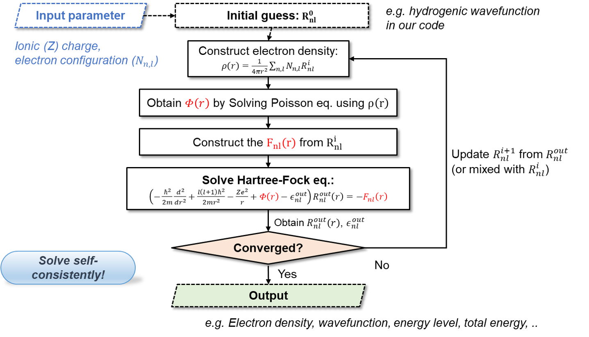
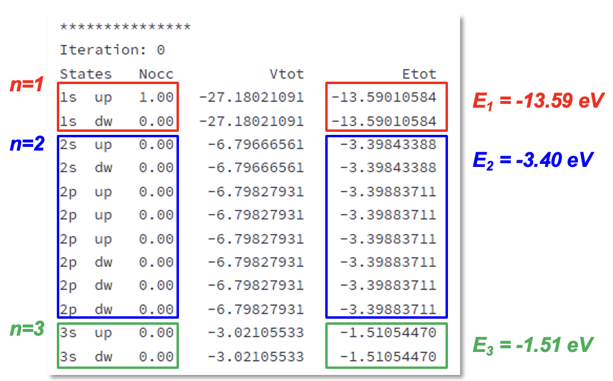
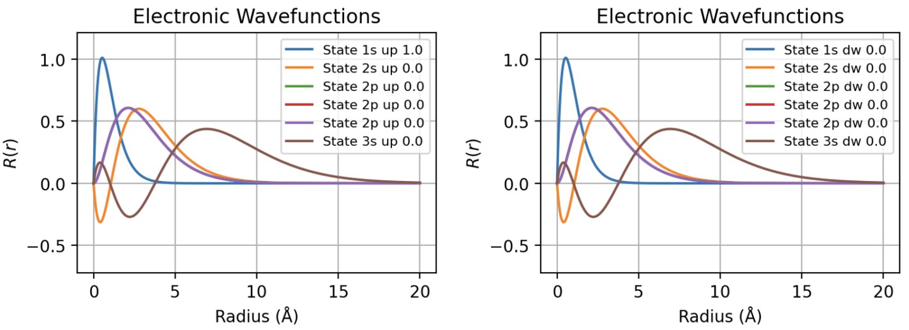
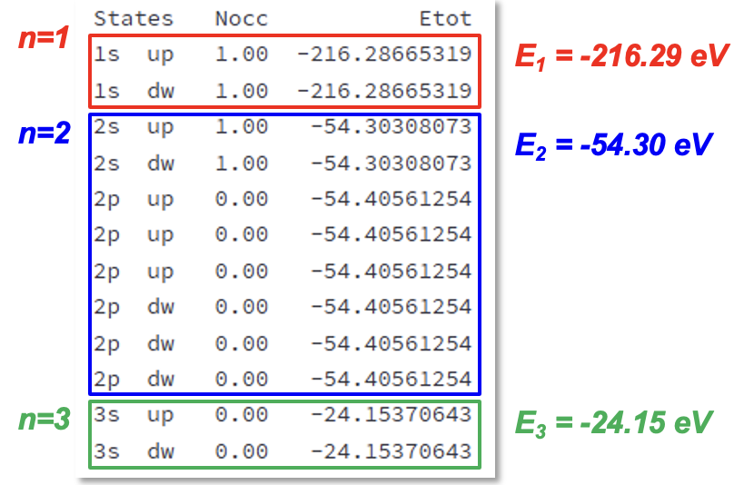
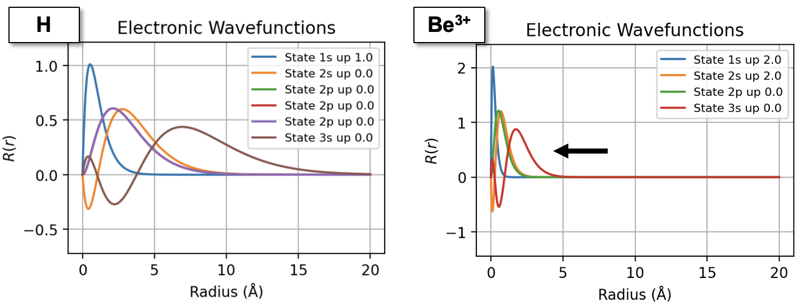
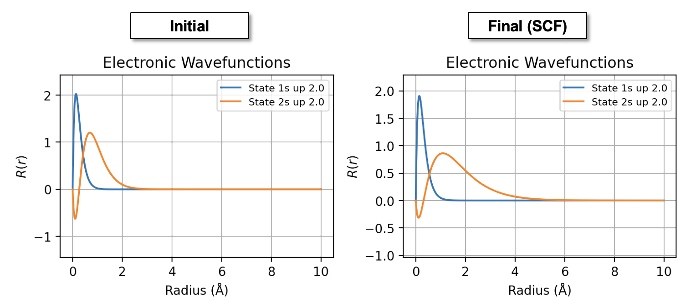

하트리-폭(Hartree-Fock) 계산
===============================
## Contents
1. 준비하기
2. 프로그램 설명
3. 실습예제
---


## 1. 준비하기 

이번 장에서는 **하트리-폭(Hartree-Fock)** 방법을 통해 다양한 원자의 전자구조를 계산하는 방법에 대해서 설명한다. 이를 위해서 사용자는 다음의 코드를 자유롭게 활용할 수 있다:

- **Edison Platform**: <https://nanornd.edison.re.kr/> [*Curriculum/MSDP/Hartree-Fock Solutions of Small Atomic Systems (Central-Field Approximation)*]
- **Google Colab**: <https://colab.research.google.com/github/yhkimlab/Class-NanoPhysics/blob/master/2025-Spring/HartreeFock.ipynb>


> **Edison Platform**을 사용하기 위해서는 해당 사이트에 로그인이 필요하다.


## 2. 프로그램 설명 

해당 프로그램은 **Steven E. Koonin & Dawn C. Meredith, Computational Physics: Fortran Version (Addison-Wesley, 1990)** 책의 *Project III: Atomic structure in the Hartree-Fock* 장의 **Fortran** 코드를 기반으로 작성되어있다. 하트리-폭 방법은 다전자계의 파동함수를 단일 슬레이터(Slater) 행렬식으로 근사하고, 전자 간 상호작용을 평균장(mean-field) 방식으로 다루는 ab-initio 계산 방법이다. 해당 코드는 다음과 같은 원자 반경 r에 대한 1차원 방사(radial) 상에서의 **하트리-폭 방정식**을 다룬다:  

$$\left(-\frac{\hbar^2}{2 m} \frac{d^2}{d r^2}+\frac{l(l+1) \hbar^2}{2 m r^2}-\frac{Z e^2}{r}+\Phi(r)-\epsilon_{n l}\right) R_{n l}(r)=-F_{n l}(r)$$  

해당 방정식을 자기일관장(self-consistent field, SCF) 알고리즘을 통해 반복적으로 풀이하여 수렴된 해를 얻을 수 있다. 이에 대한 대략적인 알고리즘 과정은 다음과 같다: 
  



## 3. 실습예제

### 3-1. 단전자(Single-electron) 시스템: 수소 원자

수소 원자는 하트리-폭 등 수치적인 방법의 도입 없이 이론적으로 해를 정확히 풀수 있는 쉬운 시스템의 예이다. 이번 실습에서는 (1) 전자간 상호작용(하트리 및 교환항)을 고려하지 않는 경우와, (2) 하트리-폭을 통해 고려한 두 경우에 있어서 수소원자의 전자구조를 계산해본다.  


#### (1) 전자간 상호작용을 고려하지 않는 경우

전자간 상호작용을 고려하지 않는 경우에는 다음과 같은 방정식을 따른다:

$\left(-\frac{\hbar^2}{2 m} \frac{d^2}{d r^2}+\frac{l(l+1) \hbar^2}{2 m r^2}-\frac{e^2}{r}-\epsilon_{n l}\right) R_{n l}(r)=0$  

수소 원자에 대해 해당 방정식을 풀이하기 위해서 프로그램에 다음과 같은 입력값을 사용해본다:

**입력값:**   
- `Element = H`  
- `Spin Polarized = True`  
- `Coulomb = None`  
- `Num Band = 12`  
- `SCF Iter = 0`  
- `Rmax = 20.0 Å`  

`Coulomb = None`을 통해서 전자간 상호작용이 없는 상황을 기술할 수 있다. 이 상황에서는 자기일관장 방법의 반복적인 계산이 필요하지 않으므로 `SCF Iter`은 `0`으로 설정하였다. Unoccupied 준위의 고유값을 확인하기 위해서 `Num Band`를 `12`로 설정하였다. 이제 결과를 살펴보자.


**결과:**

**수소 원자의 에너지 준위:**  
  


> 수소 원자의 에너지 준위가 이론값과 일치하는지 확인해본다 $E_n = -\frac{m_e e^4}{2 (4\pi \varepsilon_0)^2 \hbar^2} \cdot \frac{1}{n^2} = 13.6\ \text{eV} \cdot \frac{1}{n^2}$

**수소 원자의 파동 함수:**    




> 수소 원자의 방사(radial) 파동함수의 노드 수가 다음 관계를 만족하는지 확인해본다. $nodes = n - l - 1$  

#### (2) 전자간 상호작용을 고려하는 경우(하트리폭 계산)

엄밀히 말해서 단전자의 경우 전자 간 상호작용은 존재하지 않지만, 임의의 단전자의 시스템에 대해서도 하트리-폭 계산을 수행 할 수 있다. 이를 위해서 다음과 같이 입력값을 설정해본다.

**입력값:**   
- `Element = H`  
- `Spin Polarized = True`  
- `Coulomb = Poisson`  
- `Exchange = HF`  
- `Num Band = 1`  

그 결과로 나온 에너지 중에서 전자간 반발에 의한 하트리 에너지 `VEETOT`와 교환 효과에 의한 교환 에너지 `VXCTOT`를 비교해본다. 


```
TOTALS
NE : 1.0
KTOT : 13.560381028126724 eV
VENTOT : -27.150347845570842 eV
VEETOT : 8.491855443685635 eV
VXCTOT : -8.492660406217787 eV
VENTOT + VEETOT + VEXTOT : -27.151152808102992 eV
Total Energy : -13.590771779976269 eV
```

> 하트리-폭 방법은 단전자에서 두 에너지가 정확히 상쇄되어 보통 single-electron self-interaction free하다고 한다.


## 3-2 다전자 시스템: 베릴륨

### (1) 베릴륨 이온(Be+3)

우선, 수소 원자와 마찬가지로 전자간 상호작용을 고려하지 않았을때의 결과를 살펴보자:

> Repeat *Exercise 3-1* for Be atom, using same input


**결과:**  

**베릴륨(+3) 원자의 에너지 준위:** 



> 수소 원자와 마찬가지로 베릴륨 이온(+3)은 전자가 없으므로 에너지 준의는 다음과 같은 분석적 해를 통해 구할 수 있다:  
> $E_n = -\frac{m_e e^4}{2(4\pi \varepsilon_0)^2 \hbar^2} \cdot \frac{Z^2}{n^2}= 217.6\ \text{eV} \cdot \frac{1}{n^2}$


**베릴륨(+3) 원자의 파동 함수:**    


> 수소 원자와 비교했을때 파동 함수의 모양이 어떻게 바뀌었는지 확인해보자


### (2) 베릴륨 중성 원자

이제 전자 효과를 포함한 베릴륨 중성 원자에 대해서 계산을 수행해보자.  

**입력값:**   
- `Element = Be`  
- `Spin Polarized = True`  
- `Coulomb = Poisson`  
- `Exchange = HF`    
- `Rmax = 10A`

**결과:**  

**베릴륨 원자의 파동함수:**    


> 베릴륨 이온과 비교했을때 파동함수가 어떻게 변화했는지 확인해보자


## 3-3. 교환-상관 에너지 범함수

하트리-폭과 비슷한 대표적인 제1원리 전자구조 계산 방법론으로 밀도범함수론(density functional theory, DFT)가 있다. 밀도범함수론은 핵심적으로 전자의 교환과 (하트리-폭에서 고려되지 않았던) 상관 효과를 밀도에 대한 범함수로 근사하여 더욱 적은 계산량으로 계산을 수행 할 수 있다. 


### (1) 단전자 시스템: LDA vs Hartree-Fock


이전 하트리-폭에서 계산하였던 수소 원자에 대해서 다음 입력값으로 밀도범함수론 계산을 수행해보자:  

**입력값:**   
- `Exchange = LDA`  
- `Correlation = None`  

> 이번 강의에서는 상관 효과는 고려하지 않는다.

**결과:**  

**전체 에너지:**    
```
TOTALS
NE : 1.0
KTOT : 12.390759695635145 eV
VENTOT : -25.937189833082538 eV
VEETOT : 8.004617751605624 eV
VXCTOT : -6.886537202933416 eV
VENTOT + VEETOT + VEXTOT : -24.81910928441033 eV
Total Energy : -12.428349588775186 eV
```
> 해당 결과를 하트리-폭 계산 결과와 비교해보자. 보통 밀도범함수론의 교환-상관 에너지 범함수는 두 에너지가 정확히 상쇄되는 조건을 만족하지 않는데, 이를 만족하게 보정하는 self-interaction correction (SIC) 방법이 있다.  

### (2) 두-전자(two-electron) 시스템: 수소원자 이온(H-)

다전자 효과를 확인하기 위한 대표적인 시스템이 두-전자 시스템이다. 우리는 이를 계산하기 위해서 수소 음이온(-) 고려할 것이다. 우선, 비교를 위한 하트리-폭 계산을 수행한다. 이를 위한 입력값은 다음과 같다:

**입력값:**  
- `Element = H`  
- `Exchange = Hartree–Fock`  
- `Num Elec = 2.0`  
- `Rmax = 20`  

**결과:**  

**전체 에너지:**  

```
TOTALS
NE : 2.0
KTOT : 13.231036809428883 eV
VENTOT : -37.239430446769695 eV
VEETOT : 21.49449040071572 eV
VXCTOT : -10.747770295510863 eV
VENTOT + VEETOT + VEXTOT : -26.492710341564838 eV
Total Energy : -13.261673532135955 eV
Results Plot
```

> 단전자 경우와 마찬 가지로 `VEETOT`과 `VXCTOT`의 관계를 살펴본다.  


그 다음으로 LDA를 통한 밀도범함수론 계산을 수행해본다:


**입력값:**  
- `Element = H`  
- `Exchange = LDA`  
- `Correlation = None`  
- `Num Elec = 2.0`  
- `Rmax = 20`  


결과를 살펴보면, 교환 에너지가 충분히 크지 않아서 계산이 제대로 이뤄지지 않는 것을 확인할 수 있다. 이는 근본적으로 LDA 교환 포텐셜이 진공상에서 하트리-폭에 비해 급격히(exponential) 감소하는 효과 때문이다. 이에 대한 정확한 조건은 r이 증가할 수록 포텐셜이 1/r의 점근적인 개형(asymptotic behavior)을 따라가는 것이다. 이러한 조건은 밀도범함수론 교환 포텐셜을 설계하는데 토대가 되는 중요한 지표가 된다.  

두-전자 시스템에 대해서 하트리-폭 방법과 LDA 밀도범함수론을 비교하기 위해서 LDA에서 수렴이 되지 않는 H- 이온 경우 대신, 중성 He 원자를 계산할 수 있다.  

**입력값:**  
- `Element = He`  
- `Exchange = LDA`   
- `Correlation = None`  
- `Num Elec = 2.0`  
- `Rmax = 20`  
