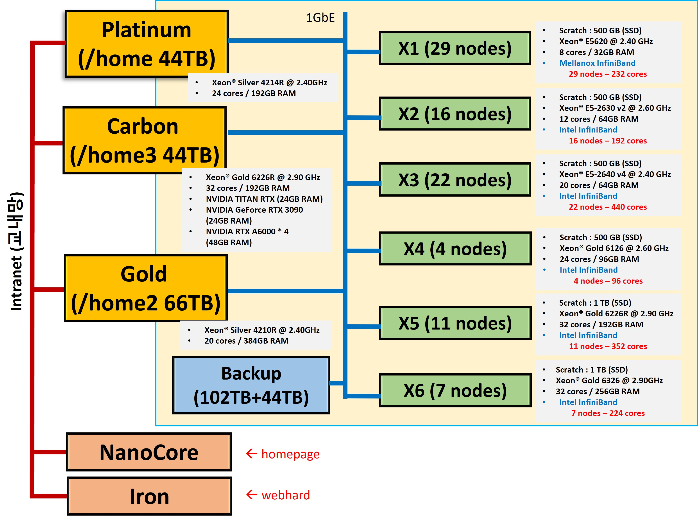
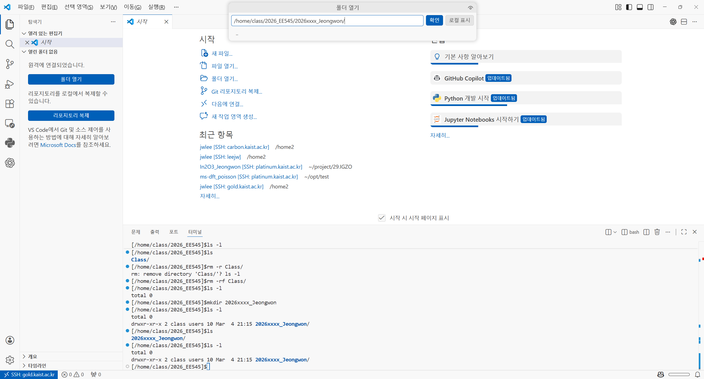
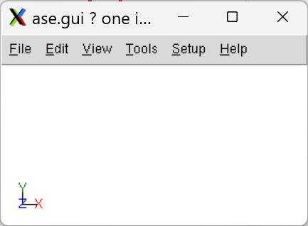

HPC 클러스터 (YHKlab) 사용하기
---

이 문서는 Linux HPC 서버를 처음 사용하는 학생을 위한 입문 가이드이다.

HPC 실습에 필요한 수준에서 다음을 익히는 데 초점을 둔다.

- 원격 Linux 서버에 접속하기
- 원격 파일을 다루기
- 셸 스크립트를 실행하기
- 기본 명령어를 사용해 현재 위치와 파일 상태를 확인하기
- 필요할 때 GUI 프로그램을 띄우기


---
# 1. 개요
## 1-1. 왜 HPC를 쓰는가: HPC vs PC

연구실 실습이나 계산 과제에서는 개인 PC만으로는 불편하거나 비효율적인 경우가 많다. 특히 계산 시간이 길거나, 메모리를 많이 쓰거나, 여러 학생이 같은 환경에서 실습해야 할 때 차이가 크게 드러난다.

### 개인 PC의 장점과 한계

- 개인 PC는 바로 켜서 쓸 수 있고, 익숙한 환경에서 가볍게 실습하기 좋다.
- 하지만 CPU 코어 수, 메모리, 저장 공간, 장시간 계산 안정성에는 한계가 있다.
- 소프트웨어 설치 상태가 사람마다 달라 실습 환경이 쉽게 어긋난다.

### HPC의 장점

- 더 큰 계산 자원을 쓸 수 있다. CPU, 메모리, 저장 공간이 개인 노트북보다 일반적으로 크다.
- 공용 연구 환경을 쓸 수 있다. 실습 참가자가 비슷한 패키지와 설정을 공유하기 쉽다.
- 계산을 서버에 맡길 수 있다. 내 PC는 문서 작성이나 브라우징을 하면서도 계산은 서버에서 계속 돌릴 수 있다.
- 연구용 소프트웨어가 Linux 중심으로 배포되는 경우가 많아 실습 자료와 실제 연구 환경의 차이가 줄어든다.

정리하면, HPC는 단순히 "더 좋은 컴퓨터"가 아니라 연구용 계산과 공용 실습 환경을 안정적으로 제공하는 작업 기반이다.

### ASDSLab (YHKlab) 클러스터 구성 (26.03.07)


## 1-2. 왜 Linux를 배우는가: Linux 소개

HPC를 쓴다는 것은 대부분 Linux 서버를 사용한다는 뜻이기도 하다. Linux는 서버와 연구 계산 환경에서 매우 널리 쓰이며, 많은 과학 계산 도구가 Linux를 기준으로 설명된다.

### Linux의 특징

- 명령줄 인터페이스(CLI)를 사용하여 가볍고 빠르다. 반복 작업, 자동화, 배치(batch) 실행에 유리하다.
- 원격 접속과 서버 운영에 적합하다. SSH를 통한 접속이 표준처럼 쓰인다.
- Python, 컴파일러, 수치 계산 도구, 시각화 도구가 Linux 환경에서 자연스럽게 연결된다.


## 1-3. 전체 구조 한눈에 보기

로컬 PC와 원격 Linux HPC 서버의 관계를 먼저 머릿속에 넣어두면 이후 설정이 훨씬 쉬워진다.

```text
+---------------------------+                     +---------------------------+
| 내 PC                     |                     | Linux HPC 서버            |
|                           |                     |                           |
| VS Code                   | -- SSH -----------> | shell, compiler, Python   |
| Explorer / Editor         | <------------------ | VS Code Server            |
| Terminal                  |                     |                           |
|                           | -- 파일 전송 ------> | home directory, project   |
| local file drag & drop    | <------------------ | remote files              |
|                           |                     |                           |
| X server                  | <- X11 forwarding - | GUI app                   |
| (Xming / XQuartz)         | ------------------> | ase gui 등                |
+---------------------------+                     +---------------------------+
```

핵심은 다음과 같다.

- `SSH`는 원격 Linux 서버에 접속하고 명령을 실행하는 통로이다.
- `파일 전송`은 별도 FTP 프로그램을 쓸 수도 있지만, 이번 문서에서는 VS Code로 원격 폴더를 열고 로컬 파일을 드래그-드롭하는 흐름까지 포함해 설명한다.
- `X11 forwarding`은 서버에서 실행한 GUI 프로그램의 창을 내 PC에 표시하는 통로이다.

## 1-4. 환경설정 순서

0. **(Windows 운영체제인 경우)** 시스템 환경 변수 `Path`에 X11 forwarding을 위한 변수를 추가한다.
1. VS Code를 설치한다.
2. VS Code에서 `Remote - SSH` 확장을 설치한다.
3. GUI 프로그램까지 쓸 계획이면 `Xming (Windows)` 또는 `XQuartz (Mac)`를 설치하고 실행한다.
4. 서버 주소, 계정, 비밀번호 또는 SSH 키를 입력한다.

---
# 2. 클러스터 연결
## 2-1. VS Code

Visual Studio Code는 단순한 텍스트 편집기라기보다, 코드 편집, 파일 탐색, 터미널, 확장 기능, 원격 접속을 하나의 창에 모아 주는 종합 작업 플랫폼에 가깝다. HPC 실습에서는 이 점이 특히 중요하다.

### VS Code의 특징

- 파일 탐색기에서 원격 폴더 구조를 바로 볼 수 있다.
- 편집기에서 셸 스크립트, Python 코드, 입력 파일을 바로 수정할 수 있다.
- 터미널을 같은 화면 안에서 열어 명령을 실행할 수 있다.
- `Remote - SSH` 같은 확장을 붙이면 로컬 UI 그대로 원격 Linux 서버 작업이 가능하다.

VS Code는 "문서를 여는 프로그램"이 아니라, 원격 서버 접속과 파일 편집과 실행을 이어 주는 통합 작업 창이다.


## 2-2. VS Code Remote - SSH로 접속하기
### (Windows) 0. 환경변수 추가
Windows 운영체제의 경우 `Remote - SSH` 확장이 X11 forwarding 된 로컬 디스플레이를 자동으로 찾지 못하기 때문에 환경 변수 설정이 필요하다.

1. `Windows + R` 키 입력 이후 `cmd` 입력
2. 환경변수 설정 커맨드 입력
```cmd
> setx DISPLAY "127.0.0.1:0.0"
```

이후 `시스템 환경 변수 편집 - 환경변수 - 사용자 환경변수` 에서 추가된 것을 확인할 수 있다.


### 1. 확장 설치

VS Code 왼쪽의 Extensions 뷰에서 `Remote - SSH`를 검색해 설치한다.

### 2. 원격 호스트 정보 등록

명령 팔레트 또는 Remote Explorer에서 SSH 호스트를 등록한다. 일반적으로 다음 형태로 접속한다.

```bash
ssh gold@kaist.ac.kr
```


등록이 끝나면 SSH 설정 파일에는 대체로 다음과 비슷한 정보가 들어간다.

```ssh-config
Host gold.kaist.ac.kr
    HostName gold.kaist.ac.kr
    User class
```


비밀번호를 저장하려면 SSH key를 직접 발급받아야 한다.

### 3. 서버에 접속하기

호스트를 선택하면 VS Code가 새 창을 열고 원격 서버에 접속한다. 처음 접속할 때는 다음 일이 일어날 수 있다.

- 호스트 운영체제 선택 >> `Linux` 선택
- 호스트 신뢰 여부 >> `yes`
- 계정 비밀번호 입력
- 원격 서버 쪽에 VS Code Server가 설치

접속이 성공하면 좌측 하단 상태 표시줄에 현재 연결된 호스트 이름이 표시된다.

## 2-3. VS Code의 원격 파일 탐색기

전통적인 FTP 클라이언트를 따로 쓰는 방법도 있지만, 이 문서에서는 VS Code 중심의 더 단순한 흐름을 사용한다.

Remote - SSH로 원격 폴더를 열면 VS Code 안에서 이미 서버의 파일 시스템을 보고 있는 상태가 된다. 즉, 파일을 만들고 저장하는 행위 자체가 원격 파일 작업이다.

```text
로컬 키보드로 편집
        |
        v
VS Code 창에서 저장
        |
        v
원격 서버의 파일이 바로 갱신됨
```

또한 로컬 PC에 있는 파일을 원격 Explorer로 드래그-드롭하면, 파일 업로드처럼 이해할 수 있다.

```text
내 PC의 파일
        |
        v
VS Code Explorer로 드래그-드롭
        |
        v
원격 폴더에 업로드됨
```

이 방식은 사용자가 느끼기에는 FTP와 비슷하지만, 실제로는 VS Code와 SSH 기반 원격 파일 작업이다.

반대로, 원격 서버의 파일을 다운받으려면 원하는 파일에 `우클릭-다운로드`를 클릭한다.

### 원격 폴더 열기
원격 서버에 연결된 뒤에는 `File > Open Folder`로 서버의 작업 디렉터리를 열 수 있고, 명령 팔레트로도 같은 작업을 할 수 있다.

명령 팔레트 기준 순서는 다음과 같다.

1. `Ctrl + Shift + P` (`macOS`는 `Cmd + Shift + P`)로 명령 팔레트를 연다.
2. `Remote-SSH: Open Folder in Current Window...`를 입력해 선택한다.
3. 폴더 경로 입력창이 뜨면 개인 작업 폴더 경로를 넣는다.
4. 예를 들어 `/home/class/...`, `/home2/class/...`, `/home/class/2026_EE545/2026xxxx_jeongwon/` 같은 경로를 입력한 뒤 `확인`을 누른다.
5. Explorer가 해당 폴더 기준으로 다시 열리면, 그 안에서 파일을 만들고 편집하고 실행한다.




예를 들면 `/home/class/...` 아래의 개인 실습 폴더를 열 수 있다. 이렇게 ***폴더를 열어 작업 공간을 한정해야 클러스터 호스트 서버의 부하를 줄일 수 있다.*** 

탐색기에서 파일을 만들고, 내용을 수정하고, 저장하는 모든 동작이 원격 서버 쪽에 반영된다.


## 2-4. Hello Linux 예제

이번 예제는 "로컬에 있는 파일을 원격 서버로 가져와 실행하고, VS Code에서 편집한 뒤 다시 실행"하는 방법을 익히기 위한 것이다.


```text
로컬 hello.sh 준비
        |
        v
VS Code 원격 폴더로 드래그-드롭
        |
        v
서버에서 ./hello.sh 실행
        |
        v
VS Code를 통해 내용 수정
```

### 1. 로컬 PC에 `hello.sh` 준비하기

먼저 내 PC의 적당한 폴더에 메모장으로 `hello.sh` 파일을 하나 만든다.

파일 내용은 아래와 같다

```bash
#!/bin/bash
echo "Hello Linux"
```

### 2. 원격 작업 폴더 열기

원격 서버의 개인 작업 폴더를 연다. 예시는 다음과 같은 형태라고 가정한다.

```bash
/home/class/2026_EE545/2026xxxx_name/
```

### 3. 로컬 `hello.sh`를 원격 Explorer로 드래그-드롭하기

파일 탐색기에서 로컬 `hello.sh`를 VS Code의 원격 파일 탐색기(Explorer)로 끌어다 놓는다. 

드래그-드롭이 끝나면 `hello.sh`가 원격 폴더에 나타난다.

### 4. 원격 터미널에서 위치와 파일 확인하기

VS Code에서 터미널을 열면, 원격 서버의  `bash` 셸이 열린다.

다음 명령으로 현재 위치 (`pwd`)와 파일 존재 여부(`ls`)를 확인한다.

```bash
$ pwd
$ ls
```

### 5. 실행 권한 부여 후 실행하기

```bash
$ chmod +x hello.sh
$ ./hello.sh
```

정상적으로 동작하면 아래와 같이 출력된다.

```text
Hello Linux
```

### 6. VS Code에서 내용을 수정한 뒤 다시 실행하기

이제 VS Code 편집기에서 `hello.sh`를 열고 다음처럼 한 줄을 더 추가한다.

```bash
#!/bin/bash
echo "Hello Linux"
echo "Hello World"      # 추가된 부분
```

저장한 뒤 다시 실행한다.

```bash
$ ./hello.sh
```

예상 출력은 다음과 같다.

```text
Hello Linux
Hello World
```


## 2-5. 기초 Linux 명령어

처음에는 명령어를 따로 외우기보다, 직접 한 번씩 써 보는 편이 더 좋다.

### 예제 1: 현재 위치와 파일 확인

```bash
$ pwd
$ ls
$ ls -l
```

- `pwd`: 현재 작업 디렉터리를 보여 준다.
- `ls`: 현재 폴더의 파일과 디렉터리를 보여 준다.
- `ls -l`: 파일 권한과 크기까지 조금 더 자세히 보여 준다.

### 예제 2: 실습 폴더 만들고 이동하기

```bash
$ mkdir practice
$ cd practice
$ pwd
```

이 예제는 새 폴더를 만들고 그 폴더로 이동하는 가장 기본적인 흐름이다.

### 예제 3: 파일 복사와 이름 바꾸기

원격 폴더에 `hello.sh`가 이미 있다고 가정하면 다음처럼 연습할 수 있다.

```bash
$ cp hello.sh hello_copy.sh
$ ls
hello.sh hello_copy.sh

$ mv hello_copy.sh hello_linux.sh
$ ls
hello.sh hello_linux.sh
```

- `cp`: 파일을 복사한다.
- `mv`: 파일 이름을 바꾸거나 위치를 옮긴다.

### 예제 4: 파일 내용 확인과 실행

```bash
$ cat hello.sh
$ chmod +x hello.sh
$ ./hello.sh
```

- `cat`: 파일 내용을 터미널에서 보여 준다.
- `chmod +x`: 실행 권한을 부여한다.
- `./hello.sh`: 현재 폴더의 스크립트를 실행한다.

### 예제 5: Tab 자동완성

긴 경로나 파일 이름은 일부만 입력한 뒤 `Tab` 키를 눌러 자동완성할 수 있다. Linux 서버 작업에서 매우 자주 쓰이는 기본 습관이다.

```bash
$ ls ./h   # 이후 Tab 두 번 누르면 자동완성 가능한 파일 목록이 프린트된다.
```

## 2-6. X11 forwarding으로 GUI 프로그램 실행하기

CLI만으로 충분한 작업도 많지만, 어떤 도구는 GUI 창이 있으면 훨씬 편하다. 예를 들어 구조 시각화나 간단한 인터랙티브 확인 작업은 GUI 기반 프로그램이 더 직관적이다.

### X11 forwarding이 필요한 이유

원격 서버에서 `ase gui` 같은 명령을 실행하면 프로그램은 서버에서 시작된다. 하지만 사용자는 자신의 PC 화면에서 창을 봐야 한다. X11 forwarding은 바로 이 창 전달 역할을 한다.

```text
원격 서버에서 GUI 앱 실행
        |
        v
X11 forwarding으로 화면 정보 전달
        |
        v
내 PC의 X server(Xming/XQuartz)가 창 표시
```

### SSH 설정 예시

X11 forwarding을 쓰려면 SSH 설정에 관련 옵션이 들어갈 수 있다.

```bash
Host my-hpc
    HostName gold.kaist.ac.kr
    User class
    ForwardX11 yes
    ForwardAgent yes
    ForwardX11Trusted yes
```


### 실행 예시

X server를 실행한 상태에서 원격 터미널에 접속해 다음처럼 GUI 프로그램을 띄운다.

```bash
ase gui
```

정상적으로 연결되면 다음과 같이 로컬 화면에 창이 뜬다.



---
# 3. 자주 생기는 문제

### VS Code가 서버에 연결되지 않는다

- 호스트 이름과 사용자 이름이 맞는지 확인한다.
- 터미널에서 `ssh username@hostname` 접속이 되는지 먼저 확인한다.
- 학교 VPN (KVPN) 이나 내부망 접속이 필요한 환경인지 확인한다.
- Windows에서는 필요한 경로가 `Path`에 들어갔는지 확인한다.
- `Could not establish connection to "ip"` 오류: 
1. C:/Users/User Name/.ssh/ 경로에서 known_hosts 파일을 메모장으로 열기

2. 연결된 여러 원격 서버 중 연결이 되지 않는 IP 주소의 행을 지우고 저장

### 원격 폴더는 열렸는데 명령 실행이 이상하다

- 현재 열린 터미널이 원격 터미널인지 확인한다.
- `pwd`, `hostname`으로 실제 위치를 확인한다.
- `conda env list`로 현재 가상환경을 확인한다.

### 드래그-드롭한 파일이 보이지 않는다

- 정말 원격 폴더를 연 상태인지 확인한다.
- 내 로컬 컴퓨터의 파일 탐색기가 아니라 VS code의 원격 파일 탐색기 창인지  확인한다.
- `ls`로 서버 쪽 파일 목록을 확인한다.

### GUI 창이 뜨지 않는다

- X server를 먼저 실행했는지 확인한다.
- SSH 설정 (config 파일) 의 X11 옵션을 다시 본다.


---
# 4. 참고 자료
- VS Code on Linux: <https://code.visualstudio.com/docs/remote/linux>
