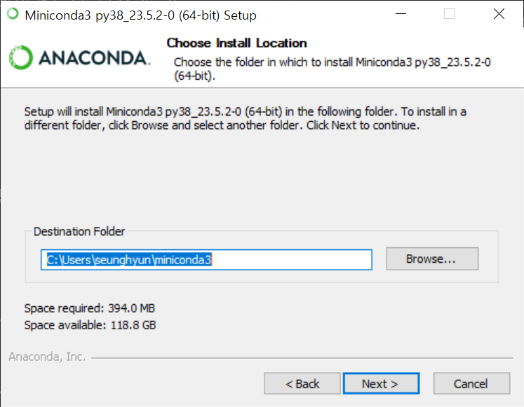

Python으로 시작하기
====================================
## Contents
1. Python 작업 환경 4가지
2. Jupyter Notebook 설치 및 사용법

개요: 이 단원의 목적은 Python을 사용할 수 있는 환경에 대해서 이해하고 Windows에서 Python Notebook을 이용하여 Python을 사용하는데 있습니다.

## Python 작업 환경 4 가지

Python 작업 환경은 크게 4 가지로 분류할 수 있습니다. 
### 1. Command line interface (CLI)
Python과 같은 프로그래밍 언어들은 Linux 환경에서 개발되어 왔으므로 Linux에서 제공하는 terminal 창을 통해 작업이 이루어집니다. Terminal 창에서는 text (keyboard typing) 로만 작업이 이루어지기 때문에 Python 언어로 된 파일을 만들기 위해서는 vi와 같은 Linux용 editor를 사용해야 합니다. Python 언어로 만들어진 파일을 terminal의 command line에서 python interpreter (python)로 실행할 수 있습니다. python은 linux 환경에서 root에 설치되어 있으며 사용자들이 이용할 수 있습니다.

장점: 실행이 간단하고, 빠르며, 모든 Linux 환경의 server가 기본적으로 python interpreter를 제공 

단점: script가 실행이 되면 user-interaction이 불가능하며, debug, inspection 등이 어려움


N.B.: Python 파일들은 .py 확장자를 가져야 합니다. 

### 2. Interactive python
Linux 환경에서 interactive python (python or ipython)을 제공합니다. ipython을 실행하면 줄 단위로 입력이 가능하며 입력이 끝날 때 마다 (enter key) 그 결과를 출력해 줍니다. 이 전 명령줄을 편집할 수 없으며, 방향키로 이 전 명령을 불러올 수 있고, 새로운 명령을 항상 입력하게 됩니다. 간단한 코딩으로 Python syntax를 실험하기 좋습니다.

장점: 빠른고 편리한 테스터, history와 auto-completion 기능을 제공

단점: exit (ctrl^D)하면 기록이 없어짐. 저장하여 사용하기가 불편함. visualization도 불편함


### 3. [Python notebook ](#2-miniconda에서-jupyter-notebook-실행-및-사용하기)
Jupyter notebook과 같은 Python notebook은 Windows의 한글이나 MSword와 같은 마우스를 이용한 편집이 가능하며, text를 별도로 처리할 수 있는 markdown을 제공하여 사용자가 편리하게 사용할 수 있는 환경을 제공합니다. 편집, 저장, 실행 등이 notebook 안에서 다 이루어집니다. 다양한 노트북 중에서 (Google Colab, VSCode Notebook 등) Jupyter notebook이 가장 보편적으로 사용되고 있으며 이를 포함한 다양한 패키지를 함께 가지고 있는 Anaconda (가벼운 버전의 Miniconda)를 설치하면 그 안에 있는 Jupyter notebook을 사용할 수 있습니다. Anaconda는 다양한 운영체제에 맞는 버전을 제공하고 있기 때문에, Linux, Windows, MacOS 등에서 OS에 맞는 패키지를 다운로드 받을 수 있으며, 1. Download, 2. Installation, 3. Running 등의 공통된 과정을 진행해야 합니다. 여기서는 Windows에서 Anaconda를 설치하여 Jupyter notebook을 실행하여 사용하는 방법에 대해서 설명합니다. 노트북에서 보이는 내용들은 Python file (.py)와 동일하지만, 실제 파일은 text 파일이지만 Json format으로 복잡하게 쓰여져 있으며, .ipynb (interactived python notebook) 형태로 저장됩니다.

장점: 다른 Windows 프로그램처럼 마우스를 사용할 수 있어 편집이 용이하고, 여러 셀로 분리시켜 각 셀만을 실행할 수 있고, code 뿐만 아니라, text (markdown)을 사용할 수 있고, input, output이 편리하다

단점: 거대한 프러젝터의 경우 관리하기가 어렵고, 각 cell의 실행 순서에 영향을 받는다.

### 4. Python IDE
그 밖에도 다양한 Python 개발용 복합 패키지들이 있습니다. PyCharm, IntelliJ IDEA, IDLE, Visual Studio Code (VSCode), Spyder 등은 다양한 Python IDE (Integrated Developing Environment)로서 각 용도에 맞는 기능들을 제공합니다.

장점: 큰 프러젝터를 관리하기가 용이하고, debugger, 가상환경 등을 지원하고, notebook과 terminal의 기능을 동시에 제공한다

단점: 용량이 크고, 별도의 setup을 위한 노력이 필요하고, 짧은 script를 사용하기에 적합하지 않다.

## Jupyter Notebook 설치 및 사용법
### 1. Windows에 Miniconda 설치
출처: [https://pythonnumericalmethods.berkeley.edu/notebooks/Appendix01-Getting-Started-with-Python-Windows.html](https://pythonnumericalmethods.berkeley.edu/notebooks/Appendix01-Getting-Started-with-Python-Windows.html)

여기서는 Anaconda (Miniconda)를 이용한 Jupyter notebook 설치를 안내합니다. Anaconda (Miniconda)는 과학 계산과 데이터 사이언스에 적합한 Python 작업 환경 설정 방법을 제공해주는데 초점이 맞춰져 있습니다. Anaconda와 Miniconda의 차이점들은 다음과 같습니다.

* **Anaconda**는 Python 인터프리터, 패키지 매니저, 그리고 과학 계산에 일반적으로 사용되는 패키지들이 포함된 완전한 배포 프레임워크입니다.
* **Miniconda**는 Anaconda의 가벼운 버전으로 일반적인 패키지들을 제공하지 않습니다. 따라서, 필요에 따라 필요한 패키지들을 직접 설치해야 합니다.

**Step 1: Download Miniconda**

Googling을 통해서 쉽게 [Miniconda Download](https://www.anaconda.com/download) site 로 접근할 수 있습니다.
여기에 메일 주소를 입력하면, e-mail을 통해서 [download 사이트](https://www.anaconda.com/download/success) 를 받을 수 있습니다. 여기에서, 자신이 사용하는 OS (Windows [32|64 bit], Mac OS X, 또는 Linux)에 맞는 installer를 선택할 수 있습니다. 현재 최신 버전으로 windows/Python 3.13을 선택하여 다운로드 받습니다.


아래 그림에서 왼쪽은 Anaconda, 오른쪽은 Miniconda 입니다.


**Step 2: Install Miniconda**

다운로드 받은 installer를 실행시키면 (double click), Graphic guide를 따라서 설치하면 됩니다.


* 설치경로 변경

여기서는 설치 경로를 변경할 수 있습니다. 기본 경로는 C:\Users\username\miniconda3 입니다. 

주의 : 그 다음 설치 option에서 check 했을 때 설명글이 빨간색으로 바뀌며 경고를 하는 것은 check 하지 마십시오. PATH 설정 등은 같은 Windows 시스템의 다른 패키지가 python을 설치했거나 사용하면 충돌이 발생할 수 있습니다. conda는 자기만의 환경에서 python을 설치할 수 있기 때문에 다른 패키지에 영향을 주지 않게 할 수 있습니다.



**Step 3: Run Miniconda**

설치 후에는 시작 메뉴에서 "anaconda prompt"가 설치된 것을 확인할 수 있습니다. 이것을 실행하면 anaconda prompt가 terminal로 열립니다. 


anaconda prompt는 linux 혹은 MacOS의 terminal과 같으며 terminal은 command line에서 text로만 명령을 내릴 수 있습니다. 그리고 이 terminal은 (base)라는 가상환경 이름을 보여주며 현재 anaconda가 "base"라는 이름의 가상환경으로 실행중임을 나타냅니다. conda는 다양한 버전의 python이 서로 독립적인 공간에서 돌아가도록 여러 가상환경을 만들어 줄 수 있습니다. "where (linux의 which)" 라는 명령어를 통해서 conda, pip 등이 검색이 되는 것을 확인할 수 있습니다. 이것은 conda, pip 등의 명령어를 사용할 수 있다는 것을 나타냅니다. 

* conda 사용법: miniconda 설치가 완료되었을 때 띄워주는 [사이트](https://docs.conda.io/projects/conda/en/latest/user-guide/getting-started.html) 를 참조
    - conda create -n tf: tensorflow를 위한 새로운 Python 환경을 tf 이름으로 만듦.
    - conda activate tf: 가상환경이 "base"에서 "tf"로 전환, prompt 가 (tf)로 변경
    - conda deactivate: 현재 가상환경에서 탈출하여 "base"로 가거나, conda를 종료함  

  conda는 다양한 Python 가상환경을 만들 수 있으며 각 가상환경의 python, pip 등은 독립된 공간에서 존재하기 때문에 서로 영향을 주지 않습니다. 


**Step 4: Miniconda에 Python Package (Jupyter) 설치**

miniconda를 설치하였기 때문에 기본으로 conda, pip 등만 존재합니다. pip (package installer for Python 또는 Pip installs Package)은 표준 Python package manager로서 package를 설치하거나 (install), 지우거나 (uninstall), 현재 설치된 패키지를 검색하거나 (show) 등의 관리를 할 수 있습니다. 그러면 pip을 이용하여 자신이 주로 사용하는 Python package들을 설치해 보세요. 예를 들어 ipython, numpy, scipy, pandas, matplotlib 등을 설치하고 jupyter 를 설치하십시오. 


N.B.: Jupyter가 실행되는 가상환경은 같은 가상환경에서 설치된 pathon package만을 인식할 수 있습니다. 그러면 Python script에서 ***import packagename*** 을 통해서 불러올 수 있습니다.

위 그림과 같이 Python package들을 설치했다면 다음 명령어를 통해서 numpy가 제대로 설치되었는지 확인할 수 있습니다. *ModuleNotFoundError* 가 발생하지 않으면 Python이 설치된 패키지들을 제대로 인식하고 있는 것입니다.


### 2. Miniconda에서 Jupyter Notebook 실행 및 사용하기

**Step 1: Jupyter notebook 실행**

Jupyter notebook은 굉장히 강력한 웹브라우저 기반 Python 실행환경입니다. Jupyter Notebook을 사용하기 위해서는 terminal (anaconda prompt)을 열고 자신이 사용하는 가상환경 (기본 - base)에서 pip을 통해 jupyter가 설치되어 있어야 합니다. 그러면 terminal의 command line에서 아래와 같이 명령어를 실행시키면 jupyter notebook이 웹 브라우저를 통해서 열립니다. 

```bash
jupyter notebook
```

**Step 2: Jupyter Notebook 사용법**

Jupyter가 열리면 "Home" tag가 열리며 Jupyter가 실행된 폴더의 모든 파일들을 보여줍니다. Jupyter 안에는 두 개의 tab이 있으면 기본적으로 *Files* tab를 통해 파일들 목록을 보여주고, 파일을 선택하면 여러 가지 부가명령어 tab들이 생깁니다. 폴더에 있는 .ipynb 파일을 열어도 되고, 여기서는 처음 실행한 사용자를 위하여 파일을 열고 Python script를 작성 후 실행하는 것을 설명합니다.

 *N.B.*: Jupyter notebook이 열리면 현 디렉터리에서 상위 디렉터리로 옮겨갈 수가 없기 때문에, terminal에서 Jupyter notebook을 실행하기 전, 먼저 Windows내에 작업 디렉터리를 만들고 그 작업 디렉터리로 옮겨간 다음 실행하기를 권합니다. Windows terminal에서는 cd, dir, mkdir 등의 명령어를 쓸 수 있습니다.

> 파일 생성

*File* tab에서 우측의 New 버튼을 통해서 두 가지 Type의 파일을 열 수 있습니다. 

하나는 text 파일인데 이것은 text 그대로 저장됩니다. New/New file로 새 tab이 열리면 text (python script)를 작성할 수 있습니다. 그러면 Python code를 쓰고 .py로 저장하여 Python 모듈이 되게 하고 다른 파일에 의해 import 될 수 있습니다.  

두번째는 Notebook 파일인데 보기에는 Python 문법으로 쓰여지지만 저장은 .ipynb 포맷으로 저장됩니다. Jupyter notebook에서는 ipynb 확장자의 파일만 실행할 수 있습니다. New/Notebook 으로 새 tab을 열어 Jupyter notebook을 이용한 Python coding을 하고 실행, 저장 등을 할 수 있습니다. 

Jupyter notebook은 파일 생성 후 저장 (이름 변경), Python으로 파일 실행, 실행 중지, Kernel refresh, 파일 삭제 등의 필요한 모든 기능을 제공합니다. 

> Python coding 및 실행 예:

오른쪽 위의 New/Notebook을 눌러 새로운 Python3 notebook을 만드세요:


Jupyter notebook에서 코드를 실행시키는 것은 쉽습니다. cell에 코드를 적고, shift + enter를 누르시면 결과가 코드 밑에 나오게 됩니다.


```

