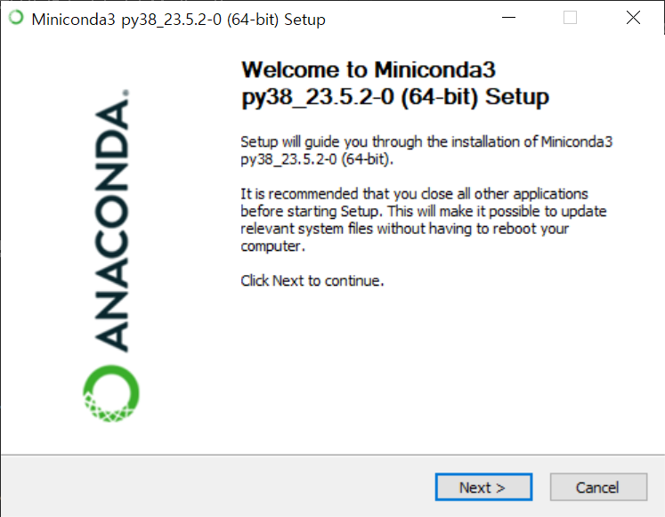
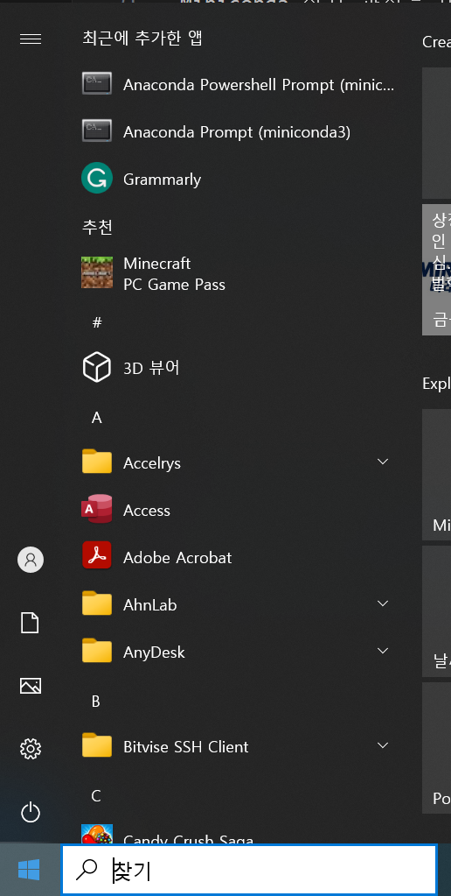
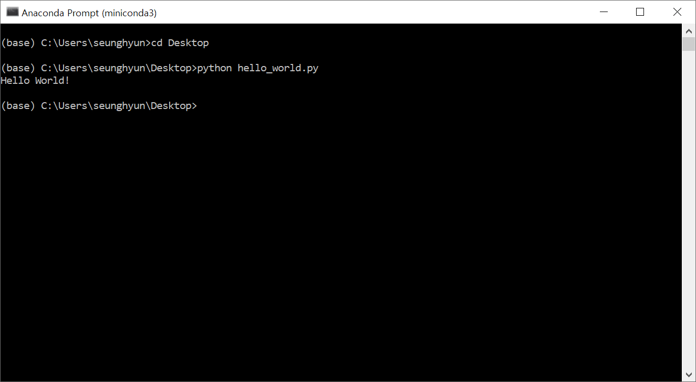

Python으로 시작하기
====================================
## Contents
1. 작업 환경 설정하기
2. Python을 실행하는 세가지 방법
3. The Zen of Python

## 작업 환경 설정하기

Python을 시작하기 전에, 우리는 컴퓨터에 python 작업환경을 설정해야 합니다. 이 항목에서는, Python을 시작하기 위한 과정을 소개할 것입니다.

Python을 설치하고 관련된 패키지를 설치하는 방법에는 여러가지가 있지만, 우리는 Anaconda나 Miniconda를 패키지 설치나 관리에 사용하길 추천드립니다. 당신의 운영체제(OS i.e. Windows, Mac OS X, 또는 Linux) 에 따라서 당신은 당신의 컴퓨터에 맞는 특정한 installer를 다운로드 받아야 합니다. Anaconda와 Miniconda 모두 과학 계산과 데이터 사이언스에 적합한 Python 작업 환경 설정 방법을 제공해주는데 초점이 맞춰져 있습니다.

여기에서는 우리는 설치 과정의 예제를 알려주는데에 Windows를 사용할 것입니다. Anaconda와 Miniconda의 차이점들은 다음과 같습니다.

* **Anaconda**는 Python 인터프리터, 패키지 매니저, 그리고 과학 계산에 일반적으로 사용되는 패키지들이 포함된 완전한 배포 프레임워크입니다.
* **Miniconda**는 Anaconda의 가벼운 버전으로 일반적인 패키지들을 제공하지 않습니다. 따라서, 당신이 직접 모든 패키지를 설치해야 합니다. 하지만, Python 인터프리터와 패키지 매니저는 제공해줍니다.

여기에서 우리가 선택할 패키지 설치를 관리할 옵션은 Miniconda입니다. 이 방법을 통해 우리가 필요한 부분만 설치할 수 있습니다.

Miniconda 설치 과정은 아래에 서술되어 있습니다.

**Step 1: [웹사이트](https://docs.conda.io/en/latest/miniconda-other-installer-links.html)에서 Miniconda를 다운로드 하세요.**

여기에서, 당신은 OS에 맞는 installer를 고를 수 있습니다. 우리는 예시로 windows installer와 Python 3.8을 고르겠습니다.


**Step 2: installer를 더블 클릭해서 installer를 실행시키세요**

installer를 실행시켰으면, 가이드를 따르면 당신은 성공적으로 설치할 수 있을 것입니다.



한가지 알면 좋은 것은 당신은 컴퓨터의 다른 경로를 지정함으로써 설치 경로를 바꿀 수 있다는 것입니다. 여기에서는, 기본 경로를 사용하겠습니다.


설치 후에는 anaconda prompt(Mac이나 Linux의 터미널에 해당하는)를 시작 메뉴에서 열 수 있습니다.



그 후엔 우리는 다음 명령어를 쳐서 설치가 성공적으로 이루어졌는지 아닌지 확인할 수 있습니다:


**Step 3: 기본적인 패키지들을 설치해보세요**

우리는 처음에 몇몇 패키지들을 설치할 것입니다. - ipython, numpy, scipy, pandas, matplotlib 그리고 jupyter notebook


## Python을 실행하는 세가지 방법

Python을 실행하는 방법에는 여러가지가 있고, 그들은 모두 다른 역할이 있습니다. 이 항목에서는, Python을 시작하는 세가지 방법을 빠르게 소개하겠습니다.

**Python shell이나 Ipython shell 사용하기**

Python 코드를 실행시키는 가장 쉬운 방법은 Python shell이나 Ipython shell (인터랙티브 Python에 해당)을 사용하는 것입니다. Ipython shell은 Python shell보다 더 다양한 기능을 제공하고, 그 예로는 탭 자동완성, 하이라이트된 에러 메세지, 기본적인 UNIX 쉘 통합 등등이 있습니다. 우리는 Ipython만 설치했기 때문에 "hello world" 예제를 이를 이용해서 실행시켜 보겠습니다. Python shell이나 Ipython shell을 실행시키는 방법은 터미널에 타이핑 하는 것입니다 (아래 그림을 보세요).그러면 우리는 Python 명령어를 shell에 타이핑하고 enter를 누르는 것으로 실행시킬 수 있고, 즉시 그 결과를 볼 수 있습니다. 예를 들어 print("Hello World")를 shell에 타이핑하면 "Hello World"가 출력되는 것을 볼 수 있습니다:


위의 명령어에서 print()는 Python의 함수이고, "Hello World"는 string 데이터 타입입니다.

**Command line에서 Python 스크립트/파일 실행시키기**

Python 코드를 실행시키는 두 번째 방법은 모든 명령어를 파일에 넣고 확장자 .py를 가지는 파일로 저장하는 것입니다(확장자는 아무거나 될 수 있지만 보통 .py를 사용합니다). 예를 들어 당신이 좋아하는 텍스트 편집기(여기서 사용된건 Visual Studio Code입니다)를 사용하여 명령어들을 *hello_world.py*라는 파일에 넣어보세요:


그 후에 터미널에서 실행시키세요:



**Jupyter Notebook 사용**

Python을 실행시키는 세 번째 방법은 Jupyter Notebook을 사용하는 것입니다. 이것은 굉장히 강력한 웹브라우저 기반 Python 실행환경입니다. 여기서 우리는 Jupyter Notebook을 통해 코드를 어떻게 실행시키는지 빠르게 확인해볼 것입니다. Command line에 jupyter notebook을 적고 실행시켜보세요.

```bash
jupyter notebook
```

그러면 로컬 웹페이지가 뜰 것입니다. 오른쪽 위의 버튼을 눌러 새로운 Python3 notebook을 만드세요:


Jupyter notebook에서 코드를 실행시키는 것은 쉽습니다. cell에 코드를 적고, shift + enter를 누르시면 결과가 코드 밑에 나오게 됩니다.


## The Zen of Python

이 전 항목에서는 어떻게 Python 환경을 구축하고, Python을 실행시키는 다양한 방법에 대해 배웠습니다. 이 튜토리얼을 유명한 'The Zen of Python'을 세가지 방법 중 하나를 통해 실행해서 보는 것으로 마무리 해봅시다. 아직까지 출력에 대해 이해하지 못할 수 있으나 시간이 지나면, 이것이 얼마나 유용한지 알 수 있을 것입니다.

```python
import this
```
```
    The Zen of Python, by Tim Peters

    Beautiful is better than ugly.
    Explicit is better than implicit.
    Simple is better than complex.
    Complex is better than complicated.
    Flat is better than nested.
    Sparse is better than dense.
    Readability counts.
    Special cases aren't special enough to break the rules.
    Although practicality beats purity.
    Errors should never pass silently.
    Unless explicitly silenced.
    In the face of ambiguity, refuse the temptation to guess.
    There should be one-- and preferably only one --obvious way to do it.
    Although that way may not be obvious at first unless you're Dutch.
    Now is better than never.
    Although never is often better than *right* now.
    If the implementation is hard to explain, it's a bad idea.
    If the implementation is easy to explain, it may be a good idea.
    Namespaces are one honking great idea -- let's do more of those!
```