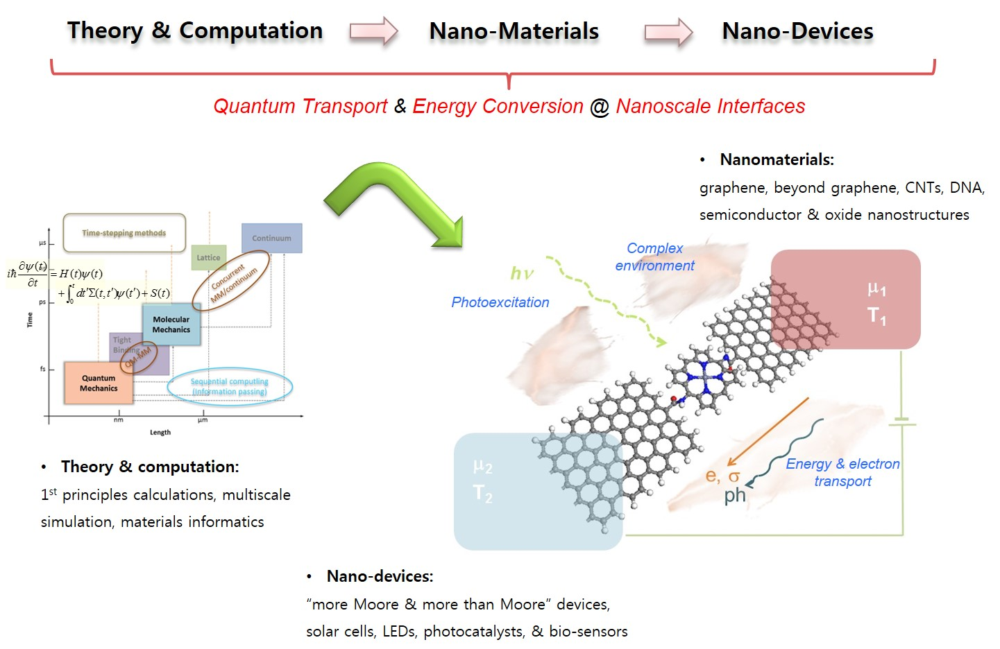

# Welcome to YHKLab

"1st-Principles Nano-Device Computing Lab" WIKI page

## Research Area

- 1st-principles theory for non-equilibrium quantum transport & optical exceptions: density functional theory, time-dependent DFT, nonequilibrium Green's function theory, etc.
- Beyond 1st-principles multi-scale simulation approaches: force-fields, effective mass approximation, etc.
- High-performance & artificial intelligence computing for nano-materials/devices simulations: simulation automation, materials/devices informatics, etc.

- “more Moore & more than Moore” devices: multi-value logic, mem-computing, carbon electronics, DNA sequencing, etc.
- Energy conversion & storage devices: solar cells, electrocatalysts, photocatalysts, supercapacitor, battery, etc.

- Carbon nanomaterials: graphene (2D), carbon nanotubes (1D), fullerenes (0D), & their hybrids 
- Beyond graphene 2D materials: hBN, transition metal dichalcogenides (e.g. MoS2, WSe2), etc.
- Low-D semiconductors (quantum dot, nanorod, & nanoplatelet): metal oxides, II-VI, halide perovskites, etc. 
- Bio- and bioinspired nanomaterials: DNA, porphyrin, etc.
- Self-assembly & 3D architectures 

