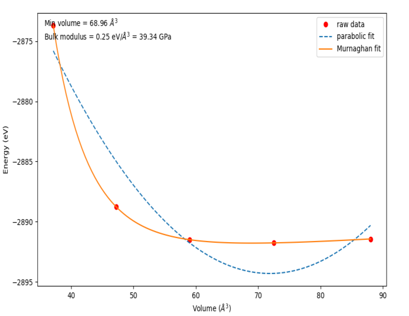

### Murnaghan fitting

본 장에서는 이차원 물질 (그래핀)을 다루었었다. 그러나 삼차원 물질은 **Murnaghan 상태방정식**을 통해 격자부피에 따른 최소에너지를 찾는 것이 더 정확하다  [1](https://www.sciencedirect.com/science/article/pii/0038109872902281?via%3Dihub). `NanoCore`의 `siesta2` 모듈에 포함된 `get_eos()` 함수에 이에 대한 기능이 있다. 다음 예시는 `get_eos()` 함수를 참조하여 만든 코드이다.


```python
from NanoCore import *
import numpy as np

# Modeling
atoms = surflab.fccsurfaces('Au','111',(1,1,3),vac=0)         # bulk Au
sim = s2.Siesta(atoms)

# Previous options
sim.set_option('kshift', [0.5,0.5,0.0]) # set k shift from gamma
sim.set_option('MixingWt', 0.10)        # adjust mixing weight (density)
sim.set_option('BasisSize', 'SZ')       # adjust basis size

# Import Kpt from k-sampling
converged_kpt = 12          # From k-sampling
sim.set_option('kgrid', [converged_kpt, converged_kpt, converged_kpt])


import copy
import os
import numpy as np

# Initial values
init_latticevectors = copy.copy(atoms._cell)
init_cell_volume = Vector(init_latticevectors[0]).dot( Vector(init_latticevectors[1]).cross(Vector(init_latticevectors[2])) )

# Cell volumes variations
ratios = np.linspace(0.90, 1.20, 5)

# Simulations
Etot = []
Cell_volume = []

for ratio in ratios:
    atoms._cell = ratio * init_latticevectors     # modifies lattice vectors]

    volume = Vector(atoms._cell[0]).dot( Vector(atoms._cell[1]).cross(Vector(atoms._cell[2])) )

    os.system('mkdir 3d_EOS_%5.3f' %volume)         # make directions for each cell volumes
    os.chdir('3d_EOS_%5.3f' %volume)

    print('Calculating for cell volume = %5.3f ang^3 \n' %volume)
    sim = s2.Siesta(atoms)            # set simulation
    sim.run()                         # run simulation
    energy =s2.get_total_energy()

    os.chdir('..')

    Cell_volume.append(volume)
    Etot.append(energy)
    print('Cell volume : %9.5f [ang^3], Total energy : %4.2f [eV]' %(volume , energy))
    print('\n')

# Convert array to np.array
Etot = np.array(Etot)
Cell_volume = np.array(Cell_volume)


import matplotlib.pylab as plb
from scipy.optimize import fminbound, leastsq


# Fit a parabola to the data
# y = ax^2 + bx + c
a,b,c = plb.polyfit(Cell_volume, Etot, 2)

# Initial guesses (same order used in the Murnaghan equation)
v0 = -b/(2*a)
e0 = a*v0**2 + b*v0 + c
b0 = 2*a*v0
bP = 4
x0 = [e0, b0, bP, v0]

# Define Murnaghan equation of state function
def Murnaghan(parameters,vol):
    E0 = parameters[0]
    B0 = parameters[1]
    BP = parameters[2]
    V0 = parameters[3]
    E = E0 + B0*vol/BP*(((V0/vol)**BP)/(BP-1)+1) - V0*B0/(BP-1.)
    return E

# Define an objective function that will be minimized
def objective(pars,y,x):
    err =  y - Murnaghan(pars,x)
    return err


# Murnaghan fitting by leastsq function
murnpars, ier = leastsq(objective, x0, args=(Etot, Cell_volume))

# Save optimized lattice vectors
ratio_of_optimization =  murnpars[3]/init_cell_volume
atoms._cell = ratio_of_optimization * init_latticevectors

# Visualizations
vfit = np.linspace(min(Cell_volume),max(Cell_volume),100)

plb.figure(figsize=(10,6))
plb.plot(Cell_volume, Etot,'ro', label= 'raw data')
plb.plot(vfit, a*vfit**2 + b*vfit + c,'--',label='parabolic fit')
plb.plot(vfit, Murnaghan(murnpars,vfit), label='Murnaghan fit')
plb.xlabel('Volume ($\AA^3$)')
plb.ylabel('Energy (eV)')
plb.legend(loc='best')

# add some text to the figure in figure coordinates
ax = plb.gca()
plb.text(0.02,0.95,'Min volume = %1.2f $\AA^3$' % murnpars[3], transform = ax.transAxes)
plb.text(0.02,0.90,'Bulk modulus = %1.2f eV/$\AA^3$ = %1.2f GPa' 
    % (murnpars[1], murnpars[1]*160.21773), transform = ax.transAxes)
plb.savefig('3d_eos.png')
plb.show()
```


---
> 참고문헌 :
> [1](https://www.sciencedirect.com/science/article/pii/0038109872902281?via%3Dihub) : Wedepohl, P.T. (1972), "Comparison of a simple two-parameter equation of state with the Murnaghan equation", Solid State Communications, 10 (10): 947–951, 
