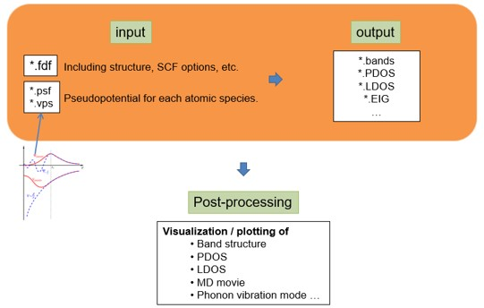

SIESTA 기초
=========================

이 **wiki는 siesta-4.1-b4** 버전을 기준으로 작성됨.

[ref - Introduction to Self-consistent field method, A. Y. Sokolov, Ohio state University (2017)](https://research.cbc.osu.edu/sokolov.8/wp-content/uploads/2023/05/intro_scf.pdf)

## 1. SIESTA 기초

### Kohn-Sham equation

`SIESTA`에서는 `Kohn-Sham equation`을 푸는 시뮬레이션을 진행한다. `Kohn-sham equation`은 아래와 같다.

{: style=“display:block; height:400px; margin-left:auto; margin-right:auto;” }

이 방정식에 대해 이해하기 위해서는 우선 **`Schrodinger equation`**에 대해 이해해야 한다. **`Schrodinger equation`**은 전자의 물리적 특성을 기술하는 방정식이다. 이 방정식의 eigenfunction인 wavefunction $\Psi$은 그 자체로는 물리적 의미를 해석하기 어렵고, 제곱인 $|\Psi^2|$가 전자가 위치에 대한 확률밀도함수라는 의미를 지닌다. eigenvalue인  $\varepsilon$은 해당 wavefunction (=state)의 에너지를 의미한다. 

단일 전자 시스템 (e.g. 수소 원자)의 경우 analytic soltion이 존재하지만 상호작용하는 다전자 시스템 (e.g. Si bulk)의 경우 해석적으로 풀기 힘들다. 따라서 Khon-Sham 방정식에서는 이를 상호작용하지 않는 단일 전자에 대한 방정식을 여러 번 풀어, 최종적으로 가장 안정한 상태의 electron density $\rho(r)$와 total energy $E_{tot}$을 찾는 문제로 대체한다. 

ref - [Hohenberg-Kohn theorem](https://www.sciencedirect.com/topics/engineering/hohenberg-kohn-theorem)

즉 다른 전자와 원자핵(ion)들에 의한 영향을 potential로 근사시켜 계산을 단순화시키는 것이다. 이때 전자간의 상호작용을 기술하는 **교환-상관(xc) 퍼텐셜 $V_{XC}[\rho(r)]$**은 정확히 알기 어렵기 때문에, 실제로는 근사법(e.g. Local density approximation, Generalized gradient approximation, HSE)을 도입하게 된다.

ref - single-particle problem

이러한 **`Kohn-Sham DFT (Density Functional Theory)`은 화학적 및 재료특성을 예측할 수 있는 가장 널리 사용되는 전자구조 이론**이며, 대표적인 프로그램으로는 **SIESTA**가 있다.

### Basis

Density functional theory (DFT)계산에서는 `basis`를 사용한다. `Basis`는 어떤 대상을 해석하는 수단을 정의하는 것이다. 예를 들어, Cartesian coordinate (xy-plane)에서 $<5,4>$로 표현되는 벡터  $z$는 $z=5 \times i + 4 \times j$로 이해할 수 있다. 여기서는 x축, y축 방향벡터인 $i, j$가 basis다. 이때 새로운 basis를 $i'=<2,1>, j'=<1,0>$으로 정의한다면 $z=2\times i'+ 1\times j'$가 된다.

양자 역학에서 전자는 파동 함수로 설명되며, 주어진 원자의 전자를 설명하기 위해 수학적으로 basis를 사용한다. 즉, 어떤 원자의 전자들의 거동을 파동함수 여러 개의 linear expansion $\Psi = \sum _{n} \psi_n$으로 표현하게 된다.  이때 basis $\psi$로는 atomic orbital (LCAO) 혹은 planewave (PW)을 사용할 수 있고 각각 SIESTA, QuantumEspresso 프로그램에 구현되어 있다.

SIESTA에서는 하나의 원자 orbital을 표현하기 위해 여러 개의 Slater-type orbital basis를 사용하며, 각각의 basis는 개별적인 zeta $\zeta$를 갖는다. 사용하는 basis의 개수에 따라서 SZ (single zeta), DZ (double), TZ (triple), … 의 옵션이 있으며, 결합을 형성할 경우 형성되는 polarization을 표현하기 위해 각양자수 (Azimuthal quantum number, $l$)이 하나 더 큰 basis를 추가로 사용하는 경우 SZP, DZP, DZDP (DZ + double polarization), TZP, … 등의 옵션이 있다. Basis를 어떻게 표현하느냐에 따라서 제일원리 계산의 결과가 달라지기 때문에 계산 별로 여러 번의 test를 통해 최적의 basis를 사용해야 한다.

ref - [basis](https://en.wikipedia.org/wiki/Basis_(linear_algebra)), [Slater-type orbital](https://en.wikipedia.org/wiki/Slater-type_orbital), [Slater determinent (Fermion)](https://en.wikipedia.org/wiki/Slater_determinant)

예제를 통해 계산을 진행하며 더 자세히 알아보도록 하자.

### Pseudo-potential

SIESTA 계산에서 도입하게 되는 근사로 **`Pseudopotential`**이 있다. Pseudopotential  은 계산의 편의를 위해 원자의 핵심부 전자(core electron)들을 하나의 포텐셜로 치환하는 것을 의미한다. 원자-원자 간의 상호작용은 주로 최외각전자들만이 관여하게 되고, 그 내부의 core electron들은 반응에 참여하지 않는다. 그러나 좁은 공간에 밀집되어, wavefunction이 상당히 높은 주파수 성분을 갖게 되고, 이는 주파수 공간에서 Fourier transform 계산의 bottleneck이 된다. 따라서 이러한 core electron에 의한 영향을 부드러운 가상의 potential로 치환하여 계산하는 것이 Pseudopotential이다.  원자핵-원자핵 상호작용과 원자핵-전자 상호작용을 기술한다.

아래 그림과 같이 pseudopotential은 원자와의 일정 거리(rc) 이상에서 실제 전자의 파동함수와 같도록 만들어 준다.

{: style=“display:block; height:300px; margin-left:auto; margin-right:auto;” }

예외적인 경우로 core로 분류되었음에도 실제 반응에 참여하는 orbital이 존재할 수 있다. 대표적으로 3d 오비탈을 갖는 물질이 있으며, 이러한 경우 correction이 필요하다.

### Self-consistent Field method

DFT 계산에서 사용되는 알고리즘은 `SCF(self-consistent-field)` 계산이다. 그림과 같은 **SCF loop의 iteration method**을 통해 변분법에 따른 *안정된 에너지를 가지는 역학적에너지와 포텐셜 에너지의 합*을 뜻하는 연산자 `Hamiltonian`을 구할 수 있다. 이를 통해 *band structure, DOS(Density Of States), PDOS(Projected Density Of States)* 등 다양한 물질특성을 분석할 수 있다.

{: style=“display:block; height:500px; margin-left:auto; margin-right:auto;” }

알고리즘에서 H(Hamiltonian)은 LCAO(linear combination of atomic orbitals)로 구성된다.

전체 알고리즘은 

1. Hamiltonain
2. (Charge) Density matrix
3. Potential

를 순서대로 반복적으로 풀면서 수렴하는 해를 찾게 된다. 

ref - [Newton method](https://en.wikipedia.org/wiki/Newton%27s_method), [Jacobian method](https://en.wikipedia.org/wiki/Jacobi_method), Self-consistent field method

### SIESTA개요

SIESTA 계산을 위해서는 **입력(input) 파일**과 **실행(executable) 파일**이 필요하다.
**Input 파일**은 `.fdf`( *RUN.fdf , STRUCT.fdf , KPT.fdf , BASIS.fdf* ) 와 `.psf` 가 필요하다.

- `.fdf`파일은 파일을 실행시키는데 필요한 정보들 (구조와 계산에 관련된 옵션)을 가지고 있는 파일이다.
기본적으로는 하나의 파일에 모든 정보를 작성해도 되나, 편의상 4가지 파일로 나누어 작성한다.
- `.psf` 파일은 pseudopotential 정보를 가지고 있는 파일을 뜻한다. 프로그램이나 버전에 따라 형식이 달라질 수 있다.

**Executable 파일**의 경우 앞선 `SIESTA 설치` 장에서 제대로 설치된 경우 `siesta 폴더/Obj`에 위치해있다.

{: style=“display:block; height:400px; margin-left:auto; margin-right:auto;” }

### 참고문헌

[ref - SIESTA homepage](http://www.icmab.es/siesta/)

[ref - SIESTA Docs](https://docs.siesta-project.org/projects/siesta/en/stable/index.html)

