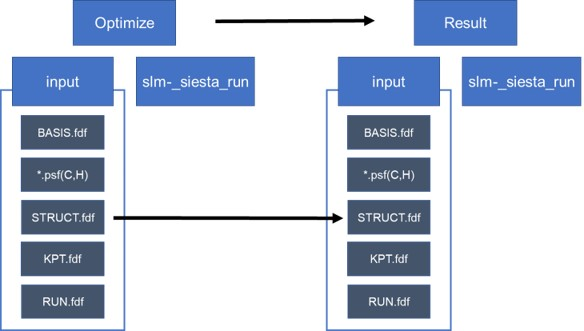

SIESTA 기초
=========================


이 **wiki는 siesta-4.1-b4** 버전을 기준으로 작성됨.

## 1. SIESTA 기초


### Kohn-Sham equation

`SIESTA`에서는 `Kohn-Sham equation`을 푸는 시뮬레이션을 진행한다. `Kohn-sham equation`은 아래와 같다.

{: style=“display:block; height:400px; margin-left:auto; margin-right:auto;” }

이 방정식에 대해 이해하기 위해서는 우선 **`Schrodinger equation`**에 대해 이해해야 한다. **`Schrodinger equation`**은 전자의 물리적 특성을 기술하는 방정식이다. 이 방정식의 eigenfunction인 wavefunction $\Psi$은 그 자체로는 물리적 의미를 해석하기 어렵고, 제곱인 $|\Psi^2|$가 전자가 위치에 대한 확률밀도함수라는 의미를 지닌다. eigenvalue인  $\varepsilon$은 해당 wavefunction (=state)의 에너지를 의미한다. 

단일 전자 시스템 (e.g. 수소 원자)의 경우 analytic soltion이 존재하지만 상호작용하는 다전자 시스템 (e.g. Si bulk)의 경우 해석적으로 풀기 힘들다. 따라서 Khon-Sham 방정식에서는 이를 상호작용하지 않는 단일 전자에 대한 방정식을 여러 번 풀어, 최종적으로 가장 안정한 상태의 electron density $\rho(r)$와 total energy $E_{tot}$을 찾는 문제로 대체한다. 

ref - [Hohenberg-Kohn theorem](https://www.sciencedirect.com/topics/engineering/hohenberg-kohn-theorem)

즉 다른 전자와 원자핵(ion)들에 의한 영향을 potential로 근사시켜 계산을 단순화시키는 것이다. 이때 전자간의 상호작용을 기술하는 **교환-상관(xc) 퍼텐셜 $V_{XC}[\rho(r)]$**은 정확히 알기 어렵기 때문에, 실제로는 근사법(e.g. Local density approximation, Generalized gradient approximation, HSE)을 도입하게 된다.

ref - single-particle problem

이러한 **`Kohn-Sham DFT (Density Functional Theory)`은 화학적 및 재료특성을 예측할 수 있는 가장 널리 사용되는 전자구조 이론**이며, 대표적인 프로그램으로는 **SIESTA**가 있다.

### Basis

Density functional theory (DFT)계산에서는 `basis`를 사용한다. `Basis`는 어떤 대상을 해석하는 수단을 정의하는 것이다. 예를 들어, Cartesian coordinate (xy-plane)에서 $<5,4>$로 표현되는 벡터  $z$는 $z=5 \times i + 4 \times j$로 이해할 수 있다. 여기서는 x축, y축 방향벡터인 $i, j$가 basis다. 이때 새로운 basis를 $i=<2,1>, j=<1,0>$으로 정의한다면 $z=2\times i'+ 1\times j'$가 된다.

양자 역학에서 전자는 파동 함수로 설명되며, 주어진 원자의 전자를 설명하기 위해 수학적으로 basis를 사용한다. 즉, 어떤 원자의 전자들의 거동을 파동함수 여러 개의 linear expansion $\Psi = \sum _{n} \psi_n$으로 표현하게 된다.  이때 basis $\psi$로는 atomic orbital (LCAO) 혹은 planewave (PW)을 사용할 수 있고 각각 SIESTA, QuantumEspresso 프로그램에 구현되어 있다.

SIESTA에서는 하나의 원자 orbital을 표현하기 위해 여러 개의 Slater-type orbital basis를 사용하며, 각각의 basis는 개별적인 zeta $\zeta$를 갖는다. 사용하는 basis의 개수에 따라서 SZ (single zeta), DZ (double), TZ (triple), … 의 옵션이 있으며, 결합을 형성할 경우 형성되는 polarization을 표현하기 위해 각양자수 (Azimuthal quantum number, $l$)이 하나 더 큰 basis를 추가로 사용하는 경우 SZP, DZP, DZDP (DZ + double polarization), TZP, … 등의 옵션이 있다. Basis를 어떻게 표현하느냐에 따라서 제일원리 계산의 결과가 달라지기 때문에 계산 별로 여러 번의 test를 통해 최적의 basis를 사용해야 한다.

ref - [Slater-type orbital](https://en.wikipedia.org/wiki/Slater-type_orbital), [Slater determinent (Fermion)](https://en.wikipedia.org/wiki/Slater_determinant)

예제를 통해 계산을 진행하며 더 자세히 알아보도록 하자.

### Pseudo-potential

SIESTA 계산에서 도입하게 되는 근사로 **`Pseudopotential`**이 있다. Pseudopotential  은 계산의 편의를 위해 원자의 핵심부 전자(core electron)들을 하나의 포텐셜로 치환하는 것을 의미한다. 원자-원자 간의 상호작용은 주로 최외각전자들만이 관여하게 되고, 그 내부의 core electron들은 반응에 참여하지 않는다. 그러나 좁은 공간에 밀집되어, wavefunction이 상당히 높은 주파수 성분을 갖게 되고, 이는 주파수 공간에서 Fourier transform 계산의 bottleneck이 된다. 따라서 이러한 core electron에 의한 영향을 부드러운 가상의 potential로 치환하여 계산하는 것이 Pseudopotential이다.  원자핵-원자핵 상호작용과 원자핵-전자 상호작용을 기술한다.

아래 그림과 같이 pseudopotential은 원자와의 일정 거리(rc) 이상에서 실제 전자의 파동함수와 같도록 만들어 준다.

{: style=“display:block; height:300px; margin-left:auto; margin-right:auto;” }

예외적인 경우로 core로 분류되었음에도 실제 반응에 참여하는 orbital이 존재할 수 있다. 대표적으로 3d 오비탈을 갖는 물질이 있으며, 이러한 경우 correction이 필요하다.

### Self-consistent Field method

DFT 계산에서 사용되는 알고리즘은 `SCF(self-consistent-field)` 계산이다. 그림과 같은 **SCF loop의 iteration method**을 통해 변분법에 따른 *안정된 에너지를 가지는 역학적에너지와 포텐셜 에너지의 합*을 뜻하는 연산자 `Hamiltonian`을 구할 수 있다. 이를 통해 *band structure, DOS(Density Of States), PDOS(Projected Density Of States)* 등 다양한 물질특성을 분석할 수 있다.

{: style=“display:block; height:500px; margin-left:auto; margin-right:auto;” }

알고리즘에서 H(Hamiltonian)은 LCAO(linear combination of atomic orbitals)로 구성된다.

전체 알고리즘은 

1. Hamiltonain
2. (Charge) Density matrix
3. Potential

를 순서대로 반복적으로 풀면서 수렴하는 해를 찾게 된다. 

ref - [Newton method](https://en.wikipedia.org/wiki/Newton%27s_method), [Jacobian method](https://en.wikipedia.org/wiki/Jacobi_method), Self-consistent field method

### SIESTA개요

SIESTA 계산을 위해서는 **입력(input) 파일**과 **실행(executable) 파일**이 필요하다.
**Input 파일**은 `.fdf`( *RUN.fdf , STRUCT.fdf , KPT.fdf , BASIS.fdf* ) 와 `.psf` 가 필요하다.

- `.fdf`파일은 파일을 실행시키는데 필요한 정보들 (구조와 계산에 관련된 옵션)을 가지고 있는 파일이다.
기본적으로는 하나의 파일에 모든 정보를 작성해도 되나, 편의상 4가지 파일로 나누어 작성한다.
- `.psf` 파일은 pseudopotential 정보를 가지고 있는 파일을 뜻한다. 프로그램이나 버전에 따라 형식이 달라질 수 있다.

**Executable 파일**의 경우 앞선 `SIESTA 설치` 장에서 제대로 설치된 경우 `siesta 폴더/Obj`에 위치해있다.

{: style=“display:block; height:400px; margin-left:auto; margin-right:auto;” }

## 2. Example: 분자 계산

### Exercise 1: CH4 분자 계산 준비

DFT 계산을 위해서는 먼저 계산하려는 구조의 최적화가 필요하다.

*A. 구조 최적화는 다음과 같은 방식으로 진행된다.*

{: style=“display:block; height:400px; margin-left:auto; margin-right:auto;” }

- Step 1. 분자 구조를 추측하여 구조최적화 계산을 한다.
- Step 2. 위의 계산결과를 바탕으로 구조최적화 조건 없이 구조 계산을 실행한다.

*B. STRUCT 파일 구성*

- 사이트(예시 - https://materialsproject.org)에서 원하는 원자 구조를 받는다.
 또한 python 라이브러리를 통한 다운로드가 가능하다. (2024-01-10)


{: style=“display:block; height:300px; margin-left:auto; margin-right:auto;” }

- `POSCAR` 파일로 다운 받은 경우(권장)

```bash
poscar2fdfd.py (fileName).poscar
```

- `CIF` 파일로 다운 받은 경우

계산을 하기위해 위에서 받은 cif파일을 fdf파일로 바꿔줘야한다.

```bash
$ vaspkit
1105struct.cif // cif 파일의 이름
```

위 순서대로 입력하고 enter를 치면 cif 파일에서 POSCAR 파일이 생성된다.

```bash
$ poscar2fdf.py POSCAR
```

위 명령어를 치면 POSCAR 파일을 fdf 파일로 변환해준다.

이로서 구조최적화를 하기 전 기본적인 STRUCT.fdf 파일을 만들 수 있다.

```bash
$ vi STRUCT.fdf
NumberOfAtoms    5           # Number of atomsNumberOfSpecies  2           # Number of species%block ChemicalSpeciesLabel
 1 6 C
 2 1 H
%endblock ChemicalSpeciesLabel
LatticeConstant      40.000000000 Ang
%block LatticeVectors
    1.000000000     0.000000000     0.000000000
    0.000000000     1.000000000     0.000000000
    0.000000000     0.000000000     1.000000000
%endblock LatticeVectors
AtomicCoordinatesFormat ScaledCartesian
%block AtomicCoordinatesAndAtomicSpecies
    -0.000196800    -0.000196800    -0.000178525    1    1
     0.025718150    -0.006302475    -0.007980825    2    2
    -0.006302475     0.025718150    -0.007980825    2    3
    -0.002297125    -0.002297125     0.027402550    2    4
    -0.017873200    -0.017873200    -0.012210550    2    5
%endblock AtomicCoordinatesAndAtomicSpecies
```

*C. `*.psf` (pseudopotential) 파일은
 [default pseudopotential (ChemicalSpeciesLabel.psf) for each atomic species.](https://departments.icmab.es/leem/SIESTA_MATERIAL/Databases/Pseudopotentials/periodictable-intro.html) 
에서 다운 받거나 직접 만들 수 있다.*

`LDA`는 Non relatively, `GGA`는 relatively 계산된 파일이다. 자세한 사항은 Tutorial의 `Siesta-1-A-(2) 슈도포텐셜 생성`을 참고하자.

계산에 필요한 pseudopotential 파일(`*.psf`)과 `BASIS.fdf`, `KPT.fdf`, `slm_siesta_run`파일은 폴더에 정리해 두었다.

`slm_siesta_run`파일은 `/(home)/(user)/bin/`에서도 찾을 수 있다.

*D. 계산을 위한 폴더 만들기*

```bash
├─CH4│  │  slm_siesta_run
│  └─input
│       BASIS.fdf
│       C.psf
│       H.psf
│       KPT.fdf
│       RUN.fdf
│       STRUCT.fdf
```

계산을 위해 다음과 같은 배치로 파일을 넣어주어야 한다. 이를 수행하기 위한 명령어는 아래와 같다.

```bash
$ mkdir ch4(폴더이름)
$ cd ch4
slm_siesta_run을 ch4 폴더에 복사
$ mkdir input(폴더이름)$ cd input
C.psf, H.psf, RUN.fdf, STRUCT.fdf, KPT.fdf, BASIS.fdf 파일을 input 폴더에 복사
$ cd ..
$ sbatch slm_siesta_run
```

### Exercise 2: CH4 분자 구조 최적화

Exercise 1에서 주어진 `STRUCT.fdf` 파일은 이미 최적화가 완료된 파일이다.

이번에는 CH4의 틀린 구조를 입력으로 넣고 계산을 통해 올바른 구조가 도출되게 됨을 확인해 볼 것이다.

CH4는 결합의 길이가 모두 같음이 알려져 있다. Exercise 1의 `STRUCT.fdf`파일도 결합 길이가 모두 같으므로 H 하나의 결합길이를 임의로 늘린 `STRUCT.fdf`파일을 입력으로 사용할 것이다.

```bash
NumberOfAtoms    5           # Number of atomsNumberOfSpecies  2           # Number of species%block ChemicalSpeciesLabel
 1 6 C
 2 1 H
%endblock ChemicalSpeciesLabel
LatticeConstant      40.000000000 Ang
%block LatticeVectors
    1.000000000     0.000000000     0.000000000
    0.000000000     1.000000000     0.000000000
    0.000000000     0.000000000     1.000000000
%endblock LatticeVectors
AtomicCoordinatesFormat ScaledCartesian
%block AtomicCoordinatesAndAtomicSpecies
    -0.000206800    -0.000206800    -0.000188525    1    1
     0.025718150    -0.006302475    -0.007980825    2    2
    -0.006302475     0.025718150    -0.007980825    2    3
    -0.002297125    -0.002297125     0.027402550    2    4
    -0.017873200    -0.017873200    -0.012210550    2    5
%endblock AtomicCoordinatesAndAtomicSpecies
```

우선적으로 부정확한 STRUCT.fdf의 구조를 보도록 하자.

1) fdf파일을 xcrysen을 통해 분자구조 확인

```bash
$ cd (input directory)$ fdf2xcrysden.py STRUCT.fdf
```

다음과 같은 에러가 발생하는 경우 STRUCT.fdf 파일에 LatticeVectors block이 없는 것이다.

```bash
    if cell.shape == (3,3):       ^^^^^^^^^^AttributeError: 'list' object has no attribute 'shape'
```

2) fdf파일을 xyz로 바꾸고 xcrysen을 통해 분자구조를 확인

```bash
$ cd (input directory)$ fdf2xyz.py STRUCT.fdf # STRUCT.fdf 파일을 xyz 파일로 변환                        # ./STRUCT.xyz 파일 생성$ xyz2xcrysden.py STRUCT.xyz
```

**Display-Unit of Repetition-Translational asymmetric unit 선택**

이를 반드시 해줘야 원자 구조를 알아볼 수 있다.

{: style=“display:block; height:400px; margin-left:auto; margin-right:auto;” }

Distance 선택 후 원자 두개를 선택한 후 Done을 선택하면 Distance를 알 수 있다.

{: style=“display:block; height:400px; margin-left:auto; margin-right:auto;” }

Angle 선택 후 원자 세개를 선택한 후 Done을 선택하면 Angle을 알 수 있다.

{: style=“display:block; height:400px; margin-left:auto; margin-right:auto;” }

이 방법을 통해 input에 들어가 있는 STRUCT.xyz의 결합 길이를 보도록 하자.

{: style=“display:block; height:600px; margin-left:auto; margin-right:auto;” }

그림에서 볼 수 있듯이 CH4 분자의 왼쪽 H가 다른 분자보다 0.001 Ang 더 짧음을 알 수 있다.

이 STRUCT.fdf파일을 input 폴더에 넣는다. 계산을 위해 RUN.fdf와 BASIS.fdf를 수정해준다.

```bash
$ cd input
$ vi RUN.fdf
MD.NumberCGstep을 300으로 바꾼다.
$ vi BASIS.fdf
PAO.BasisSize를 SZ로 바꾼다.
$ cd ..
$ sbatch slm_siesta_run
```

MD.NumberCGstep은 계산의 최대 iteration 횟수를 설정해주는 것이다.

여기서는 300번 계산을 돌려도 값이 수렴하지 않으면 프로그램을 끝낸다.

BasisSize는 빠른 구조확인을 위해 정확도는 떨어지지만 빠른 SZ로 설정해준다.

계산을 완료하면 OUT폴더에 계산이 끝난 파일인 Test.xyz를 확인할 수 있다.

**이 파일이 구조 최적화 된 결과이다.** Test.xyz를 xcrysden으로 계산된 구조를 확인해보도록 하자.

그 전에 **Test.xyz에는 Cell정보가 포함되어 있지 않다.** 따라서 xcrysden으로 바로 읽어올 수 없다.

input에 있는 STRUCT.xyz파일의 Cell정보를 Test.xyz에 복사해준다.


Cell정보 복사가 완료되면 xcrysden으로 Test.xyz의 분자구조를 확인해보자.

```bash
$ cd (Output directory)$ xyz2xcrysden.py Test.xyz
```

{: style=“display:block; height:800px; margin-left:auto; margin-right:auto;” }

input의 결합길이가 0.001 Ang 차이났던 것과 달리 계산된 결과는 0.0001 Ang 수준으로 차이가 줄었다.

**따라서 최적화된 구조가 형성되었음을 확인해볼 수 있다.**

※ *C와 H간 분자간 길이가 1.2 Ang으로 Exercise 3의 결과와 거의 일치함도 확인해볼 수 있다.*

### Exercise 3: CH4 분자 basis 확인

구조최적화를 위와 같이 진행 한 후에는 Basis 확인를 통해 사용한 Basis가 적절한지 테스트를 한다.

Basis 테스트는 구조최적화가 완료된 구조에서 각 Basis 별로 계산을 진행하여 안정된 에너지를 가지는 Basis를 선택하면 된다.

- Siesta code

```bash
$ cd input
$ vi BASIS.fdf
아래 그림의 PAO.BasisSize를 SZ, DZ, TZ, DZDP 등으로 테스트 한다.
```

{: style=“display:block; height:100px; margin-left:auto; margin-right:auto;” }

- xyz 파일보기 -Basis 별 bonding length 과 Reference(Handy, Nicholas C., Christopher W. )

```bash
$ cd OUT
1) $ Control + Alt + F
Test.xyz 파일을 바탕화면에 옮기고 Vesta 툴을 사용하여 xyz 파일을 볼 수 있다.
2) $ xyz2xcrysden.py Test.xyz
```

Murray, and Roger D. Amos. “Study of methane, acetylene, ethene, and benzene using Kohn-Sham theory.” The Journal of Physical Chemistry 97.17 (1993): 4392-4396.) 와 비교

{: style=“display:block; height:250px; margin-left:auto; margin-right:auto;” }

|  | SZ | DZ | TZ | DZP | DZDP |
| --- | --- | --- | --- | --- | --- |
| `Bonding length [Ang]` | 1.20100 | 1.10876 | 1.11050 | 1.10977 | 1.10861 |
| `Bonding angle [degree]` | 109.4398 | 109.1358 | 109.1567 | 109.4914 | 109.3702 |

### Exercise 4: CH3 전자밀도

**a. spin에 따른 전자밀도를 보는 방법은 아래와 같다.**

Spin 에 따른 전자밀도를 시각화 하기 위해서는 RUN.fdf 에서 아래와 같은 코드를 추가하여야한다

```bash
# 기존 Run.fdf%include STRUCT.fdf
%include BASIS.fdf
%include KPT.fdf
#General system specificationsSystemName          CH3 molecule
SystemLabel         ch3
#Density functionalXC.functional   GGA
XC.authors      PBE
#Real space gridMeshCutoff    400.0 Ry
# Convergence of SCFMaxSCFIterations   100
DM.MixingWeight    0.25
DM.NumberPulay     5
# Type of solution (diagon is the  default for less than 100 atoms)SolutionMethod diagon
#Geometrical optimizationMD.TypeOfRun         CG
MD.NumCGsteps        100
MD.MaxCGDispl         0.1 Bohr
MD.MaxForceTol        0.02 eV/Ang
```

```bash
#추가 코드#Spin polarization SpinPolarized .ture.
#3DPlos SaveRho .true.
%block LocalDensityOfStates
 -6.00 -3.00 eV
%endblock LocalDensityOfStates
WriteCoorXmol        .true.  # SystemLavel.xyzWriteMDXmol    .true.
```

**b. siesta code**

```bash
$ mkdir Ch3 (Ch3폴더 생성)slm-siesta_run 파일을 여기에 복사
$ mkdir input
$ cd input
ch3input, c.psf, H.psf 파일을 여기에 복사
$ cp ch3input RUN.fdf
$ cd ..
$ sbatch slm-siesta_run
& cd OUT
rho2xsf 파일을 여기에 복사
$ rho2xsf
$ ch3
$ A
$ -2 -2 -2$ 5 0 0
$ 0 5 0
$ 0 0 5
$ 100 100 100
$ RHO
$ BYE #temp_xsf 폴더 생성$ xcrysden –-xsf *.XSF # 입력하면 XCrySDen 창이 열린다.
```

Tool-Data Grid(up, down 선택)-Isovalue 범위 설정-submit으로 charge density를 아래와 같이 그릴 수 있다.

{: style=“display:block; height:300px; margin-left:auto; margin-right:auto;” }

※ 수정 : 그림의 isovalue는 **왼쪽이 0.05일 때, 오른쪽이 0.12 일 때** 이다.

rho2xsf 에 입력되는 문장의 의미는 다음과 같다.

```bash
A           : Ang or Bohr
-2 -2 -2    : 원점
5 0 0
0 5 0
0 0 5       : x y z 방향 벡터를 통해 구성되는 시스템의 크기를 정의
100 100 100 : 방향에 따른 grid points 정의
RHO         : 변환되는 grid 파일
```

### 참고문헌


[ref - SIESTA homepage](http://www.icmab.es/siesta/)

[ref - SIESTA Docs](https://docs.siesta-project.org/projects/siesta/en/stable/index.html)

[ref - Introduction to Self-consistent field method, A. Y. Sokolov, Ohio state University (2017)](https://research.cbc.osu.edu/sokolov.8/wp-content/uploads/2023/05/intro_scf.pdf)

