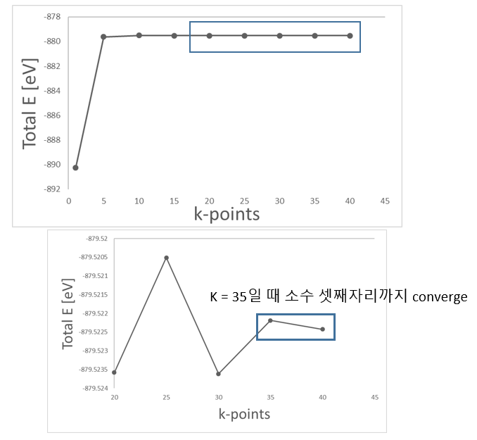
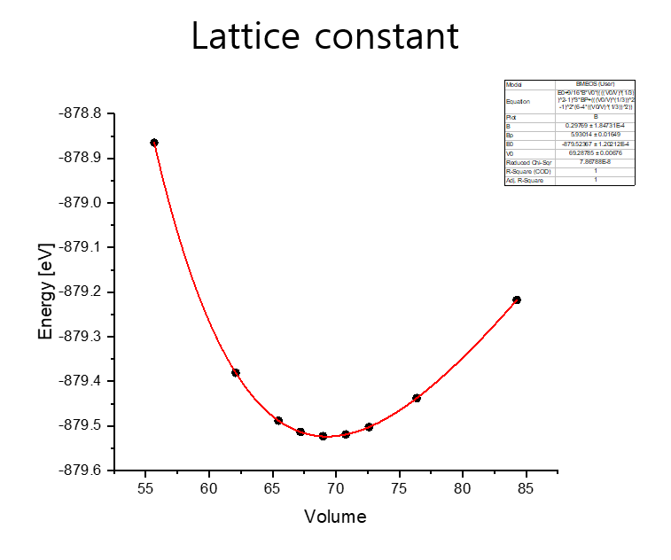
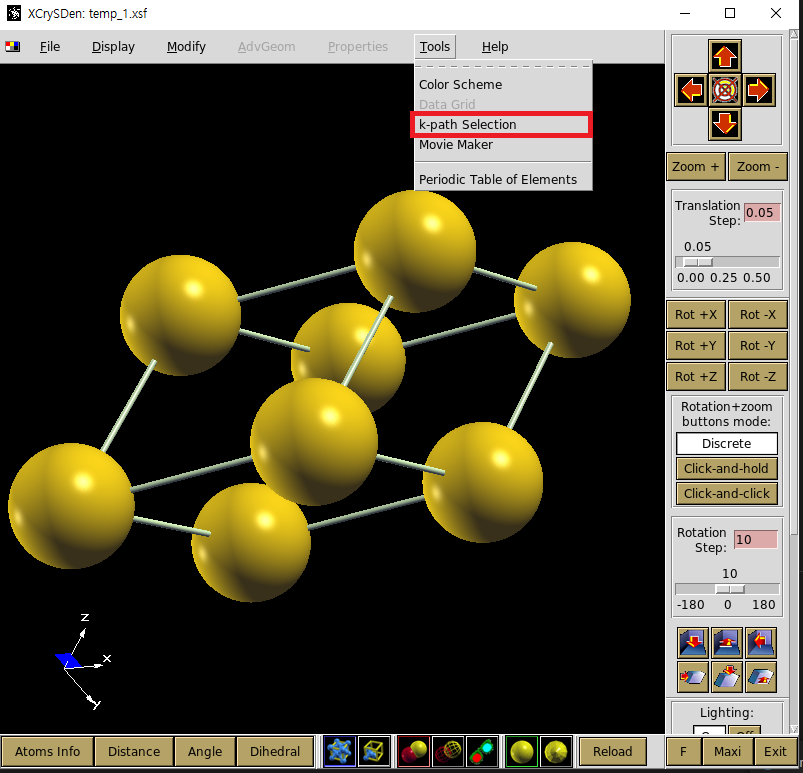
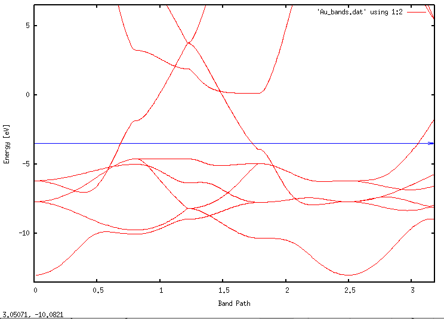

Au bulk 전자 구조 계산
=========================
이번 예제에서는 반도체에서 많이 쓰이는 금속인 `금(Au)`에 대해서 계산을 해보며 기초적인 제일원리 전자구조 계산 방법 중 `k-point sampling`, `lattice constant`, `optimization` 계산을 중점적으로 익힐 것이다.


## Contents

1. Exercise : Structure optimization
2. Exercise : Electronic structure calculation()


## Exercise 1: Structure optimization

올바른 전자구조를 산출하기 위해서는 정해둔 허용 오차(Tolerance) 내의 최적화된 모델을 분석해야 한다. 
이를 위해 실질적인 전자 구조 계산에 앞서 적당한 k-point 값과 lattice constant를 찾아 
Au bulk에 대한 geometry optimization을 진행해야 한다. 
SIESTA 계산을 위한 input 파일들은 ‘1.Gold(band, work function)' 폴더 안에 정리해 두었다.

{:align=right style="height:250px"}

|     Basis size     |      DZP       |
| :----------------: | :------------: |
| Basis energy shift |   100 [meV]    |
|         XC         |      LDA       |
|       DM.tol       | $10^{-3}$ [eV] |

### 1) k-point sampling

첫 번째로 찾아야 할 것은 optimal한 k point의 수이다. 
<br>KPT.fdf 파일에서 k-point 값들을 변경해가며 Total Energy가 converge 하는지 확인한다. 
<br>Gold bulk 모델은 3차원이므로 kx, ky, kz 모두 동일하게 더한다. 
<br>이 때 RUN.fdf의 `CG step은 0`을 주어 구조가 변하지 않는 single point 계산을 한다.

```bash
$ vi RUN.fdf
MD.NumCGsteps         0

$ vi KPT.fdf
#아래처럼 kgrid_Monkhorst_Pack 블록의 value를 바꾸어준다.
# 1 x 1 x 1 k-points              # 5 x 5 x 5 k-points
%block kgrid_Monkhorst_Pack	      %block kgrid_Monkhorst_Pack
1   0   0   0.0			              5   0   0   0.0
0   1   0   0.0			              0   5   0   0.0
0   0   1   0.0			              0   0   5   0.0
%endblock kgrid_Monkhorst_Pack	  %endblock kgrid_Monkhorst_Pack

$ qsub slm_siesta_run
$ grep "Total =" */stdout.txt
01/stdout.txt:siesta:         Total =    -890.242694
05/stdout.txt:siesta:         Total =    -879.628064
10/stdout.txt:siesta:         Total =    -879.501538
15/stdout.txt:siesta:         Total =    -879.521142
20/stdout.txt:siesta:         Total =    -879.523580
25/stdout.txt:siesta:         Total =    -879.520510
30/stdout.txt:siesta:         Total =    -879.523611
35/stdout.txt:siesta:         Total =    -879.522186
40/stdout.txt:siesta:         Total =    -879.522421

```

{: style="display:block; height:500px; margin-left:auto; margin-right:auto;" }

앞선 계산의 DFT parameter 중 SCF Convergence의 Tolerance를 $10^{-3}$ eV로 설정하였기 때문에 k-point가 35에서 수렴한다고 판단할 수 있다.


### 2) Lattice constant
다음으로는 최적화된 lattice constant를 구하기 위해서 
<br>
1)에서 구한 k-point 값 `(35, 35, 35)`으로 고정시킨 뒤 lattice constant를 변화시킨다.  
이 때 구조가 변화해야 하므로 RUN.fdf의 `CG step은 300`을 주어 계산한다

```bash
$ vi RUN.fdf
MD.NumCGsteps         300

$ vi STRUCT.fdf
LatticeConstant	2.7 Ang
%block LatticeVectors
0.81649  0.28867   0.50000
0.00000  0.86602   0.50000
0.00000  0.00000   1.00000
%endblock LatticeVectors
$ qsub slm_siesta_run
```
Lattice constant를 0.1Ang 단위로 변화시켜 계산한 결과는 다음과 같다.

```bash
$ grep "Total =" */stdout.txt
2.7/OUT/stdout.txt:siesta:         Total =    -878.864652
2.8/OUT/stdout.txt:siesta:         Total =    -879.380658
2.9/OUT/stdout.txt:siesta:         Total =    -879.523113
3.0/OUT/stdout.txt:siesta:         Total =    -879.437956
3.1/OUT/stdout.txt:siesta:         Total =    -879.217521

```

보다 정확한 값을 얻기 위해 2.9 근처에서 0.25Ang 단위로 계산해준다.

```bash
2.7/OUT/stdout.txt:siesta:         Total =    -878.864652
2.85/OUT/stdout.txt:siesta:         Total =    -879.488093
2.875/OUT/stdout.txt:siesta:         Total =    -879.513503
2.8/OUT/stdout.txt:siesta:         Total =    -879.380658
2.925/OUT/stdout.txt:siesta:         Total =    -879.519227
2.95/OUT/stdout.txt:siesta:         Total =    -879.502431
2.9/OUT/stdout.txt:siesta:         Total =    -879.523113
3.0/OUT/stdout.txt:siesta:         Total =    -879.437956
3.1/OUT/stdout.txt:siesta:         Total =    -879.217521

```
3D 물질에서 lattice constant를 찾기에 적합한 fitting은 murnaghan fitting이다. 
<br>계산된 결과를 이용해 에너지가 가장 낮은 lattice constant를 **murnaghan fitting**을 통해 찾았다. 
<br>최적화된 volume은 69.28785 Å $^3$이고, 이를 통해 lattice constant를 구하려면 부피의 세제곱근을 하면 된다. 따라서 lattice constant는 4.107Å이고,이를 FCC unit cell의 한 변의 길이로 치환하면 2.904Å이 된다.

{: style="display:block; height:350px; margin-left:auto; margin-right:auto;" }

> lattice constant = 2.904 Å


### 3) Optimize
마지막으로 1)에서 구한 k point (35x35x35)을 KPT.fdf에 입력해주고, 2)에서 찾은 lattice constant(2.904Å)를 STRUCT.fdf에 입력해 준 뒤 RUN.fdf에 CG step 값을 300을 주어 최종적으로 구조를 optimize한다.

```bash
$ vi KPT.fdf
 
%block kgrid_Monkhorst_Pack	
35   0   0   0.0
0   35   0   0.0
0   0   35   0.0
%endblock kgrid_Monkhorst_Pack
```
```bash
$ vi STRUCT.fdf
LatticeConstant	2.91154 Ang
%block LatticeVectors
0.81649  0.28867   0.50000
0.00000  0.86602   0.50000
0.00000  0.00000   1.00000
%endblock LatticeVectors
```
```bash
$ vi RUN.fdf
MD.NumCGsteps         300
$ qsub slm_siesta_run
```

## Exercise 2: Electronic structure calculation

Gold Bulk에 대한 geometry optimization은 끝났으므로 지금부터 `CG step 값은 0`으로 두고 계산한다. 
 `structout2fdf.py`을 통해  `input/STRUCT.fdf`를 Opimized 된 구조로 사용해야 한다.

### 1) Bands
이번에는 Au의 Band를 한번 그려볼 것이다. Band 계산에서는 path에 따라 band가 다르게 보이므로 high symmetry band point를 우선으로 하되, 계산하는 물성의 특성상 주목해야할 band point가 있는지 확인해야 한다. band structure를 그릴 때 사용할 [reference](https://www.sciencedirect.com/science/article/pii/S0927025614007940#t0015)는 이 band 그래프이다. 우리는 이 band 그래프를 siesta 계산을 통해 동일하게 한번 그려볼 것이다.  

{: style="display:block; height:300px; margin-left:auto; margin-right:auto;" }

위 그래프에서 band path는 $\Gamma-X-W-L-\Gamma-K$순으로 진행되고 있음을 볼 수 있다. 이와 같은 순서로 그리려면 siesta의 옵션을 이용하여 동일한 band path를 잡아줘야 한다. 우선 xcrysden으로 band path를 잡는 방법과 이를 siesta에 적용하는 방법을 소개하도록 하겠다.
처음으로 model을 xcrysden로 불러온다. 그 다음에 tools의 k-path selection을 선택하면 band path의 좌표를 계산해주는 화면이 나온다.

{: style="display:block; height:300px; margin-left:auto; margin-right:auto;" }


그 다음에는 그리려고 하는 물질의 critical point를 골라 band path를 올바르게 선택하면 된다. Au는 FCC구조이므로 아래 그림과 같은 brillouin zone에서 살펴봐야 할 점을 xcrysden으로 선택하면 된다. [brillouin zone](https://wiki.fysik.dtu.dk/ase/ase/dft/bztable.html)

{: align=right style="height:300px"}

{: align=center style="height:300px"}

band path의 좌표를 알아냈다면 xcrysden 창의 오른쪽에 적힌 숫자들을 tutorial 1에서 했던 것처럼 RUN.fdf에 넣으면 된다. RUN.fdf에는 다음의 부분을 추가해주면 된다.

```bash
    BandLinesScale ReciprocalLatticeVectors
    %block BandLines
    1  0.0000 0.0000 0.0000 G
    60  0.5000 0.5000 0.0000 X
    60  0.7500 0.5000 0.2500 W
    60  0.5000 0.5000 0.5000 L
    60  0.0000 0.0000 0.0000 G
    60  0.7500 0.3750 0.3750 K
    %endblock BandLines
```

계산을 수행하면 *.bands파일이 나온다. 정확한 범위의 band structure를 그리려면 이 bands파일을 잘 이용해야 한다. 우선, bands파일에 있는 맨 첫번째 숫자는 fermi energy를 뜻한다. 그리고 맨 마지막 부분에 라벨이 달려있는 숫자가 있는데 이 숫자들이 brillouin zone으로 band structure 그래프의 x축에 대응되는 숫자들이다. 적절한 band를 그리려면 x축과 y축을 비교하려는 reference의 숫자들로 정해야 한다.

*.bands

```bash
  -3.50583946128311     #fermi energy
  0.000000000000000E+000   3.18573135134061     
  -10.7870979412504        78.0781178548763     
          15           1         301

    ...

           6            #band path
    0.000000   'G'       
    0.770656   'X'       
    1.155984   'W'       
    1.700920   'L'       
    2.368327   'G'       
    3.185731   'K'       
```

### Band 시각화

계산 결과에서 우리는 band를 그릴 때 필요한 요소가 무엇인지 알 수 있었다. 이제 실제로 이 요소들을 이용해 band 그림을 그려볼 차례이다.

```bash
$ cd (PATH)/output
$ new.gnubands Goldbulk.bands > Au_bands.dat
$ gnuplot
plot 'Au_bands.dat' using 1:2 w l
set xrange [0:3.185731] // 위 band file의 G부터 K까지 band path 
set yrange [-13.505839:6.494161] // 분석할 에너지 범위. Fermi level ±10
set xlabel 'Band Path'
set ylabel 'Energy [eV]'
set arrow from 0, -3.505839, graph 1 to 3.185731, -3.505839 ls 3 // Fermi level plot
```

{: style="display:block; height:300px; margin-left:auto; margin-right:auto;" }

이와 같이 그리게 되면 reference와 흡사한 band 그림을 만들 수 있다. 그러나, 보통 band 그래프를 그리게 되면 y축은 $E-E_F$을 사용하고, x축은 band path는 숫자가 아닌 $\Gamma-X-W-L-\Gamma-K$와 같은 band point로 표현한다.
Origin을 사용해서 에너지를 Fermi Energy에 맞춰준 band path를 그려보면 결과는 다음과 같다.

{: style="display:block; height:300px; margin-left:auto; margin-right:auto;" }


