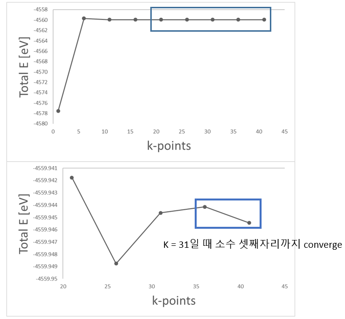

Au slab 전자 구조 계산
=========================

## Contents

1. Exercise : Au Slab electronic structure calculation  


## Exercise 1: Au Slab electronic structure calculation
Exercise 1에서는 Au slab의 work function을 계산하는 방법에 대해 배워 볼 것이다. Slab 모델 생성과 테스트, 그리고 work function을 구하는 방법까지 살펴볼 것이다.

### 1) slab model design
Work function을 구하기 위해서는 bulk 모델로 바로 구할 수 없고, 금속 표면을 모사한 slab model을 만들어야 한다. Slab 모델은 위에서 구한 최적화된 bulk model을 이용해서 [1, 1, 1]면을 표면으로 설정해줄 것이다.

slab 모델을 만드는 방법에는 여러가지 방법이 있지만, 이번에는 NanoCore library를 이용해서 slab 모델을 만들어 볼 것이다. NanoCore는 Siesta를 더 편하게 사용하기 위해서 사용하는 패키지로 원자 모델을 수정, 생성하고, siesta를 실행시키는 등 다양한 것을 할 수 있다.

```bash
from NanoCore import *
from NanoCore import siesta as s2
import os, sys

# Seunghyun Yu, KAIST
# Last revision: 2021/4/29
#
#--REVISION HISTORY--
#210429 make slab model from bulk with NanoCore library.

# command
# python make_slab.py {vacuum length}
# output
# "STRUCT.fdf", generated slab model

if __name__ == "__main__" :
    # input
    vacuum = float(sys.argv[1])

    # make slab model with 5 layers Au atoms in 111 surface.
    # vacuum is added from input
    modified = surflab.fccsurfaces('Au' , '111', (1, 1, 5), vac=vacuum )

    #generate STRUCT.fdf file
    sim = s2.Siesta(modified)
    sim.write_struct()
    print("STRUCT.fdf generated")
```

위 python 코드를 복사해서 make_slab.py 파일을 만들어준다. 그리고 다음의 명령어를 입력해준다.

```bash
  $ python make_slab.py 20 //vacuum 길이
```

위의 코드를 실행시키면 vacuum의 길이가 20Å이고, Au가 5층 으로 쌓인 Au slab모델을 생성할 수 있다.

{: style="display:block; height:300px; margin-left:auto; margin-right:auto;" }

Slab model을 만들고, 구조 최적화를 진행 할 때 주목해야 할 변경사항은 RUN.fdf에서 constraint를 설정해주는 것이다. 
<br>Work funciton을 계산하기 위한 Slab model은 surface에서 bulk로 이어지는 부분을 묘사할 수 있어야 하기 때문에, 표면에서 먼 원자들만 위치를 고정하고 최적화를 진행해야 한다. 
<br>이와 같은 조건을 추가하고 최적화를 진행하기 위해 RUN.fdf에 다음과 같은 Constraint option을 추가해야 한다.

```bash
# Geometry Constraints
%block GeometryConstraints
  position from 1 to 3
%endblock GeometryConstraint
```

위의 코드에서 Position은 STRUCT.fdf 파일에 적힌 atom의 번호를 뜻한다. 
<br>STRUCT.fdf를 보면 Atom 번호 2번은 `[1.442497834, 0.832826513, 2.355589098]`에 위치한 Au 원자임을 알 수 있다. 
<br>따라서 위 코드는 atom 번호 1, 2, 3번을 고정시키므로 z축 아래 3개는 고정시키고 위에 2개의 원자만 풀어놓은 코드임을 확인할 수 있다. 
<br>이제 이 코드를 바탕으로 구조 최적화를 진행해주면 Work function을 구할 수 있다.

```bash
# STRUCT.fdf
NumberOfAtoms    5           # Number of atoms
NumberOfSpecies  1           # Number of species

%block ChemicalSpeciesLabel
 1 79 Au
%endblock ChemicalSpeciesLabel

#(3) Lattice, coordinates, k-sampling

LatticeConstant       1.000000000 Ang
%block LatticeVectors
    2.884995667     0.000000000     0.000000000
    1.442497834     2.498479538     0.000000000
    0.000000000     0.000000000    27.066767295
%endblock LatticeVectors

AtomicCoordinatesFormat Ang
%block AtomicCoordinatesAndAtomicSpecies
     0.000000000     0.000000000     0.000000000    1    1
     1.442497834     0.832826513     2.355589098    1    2
     0.000000000     1.665653025     4.711178197    1    3
     0.000000000     0.000000000     7.066767295    1    4
     1.442497834     0.832826513     9.422356393    1    5
%endblock AtomicCoordinatesAndAtomicSpecies
```

### 2) before work function calculation

Slab 모델을 만든 후에는 basis를 설정해야 한다. 특히 중요하게 봐야할 항목은 PAO.EnergyShift 항목이다. 
<br>Lattice constant를 구할 때 우리는 이 항목을 100meV를 주고 계산한다. 그러나, work function을 구할 때는 cutoff에 의해 결정되는 basis의 크기가 결과에 큰 영향을 주기 때문에 **PAO.EnergyShift 항목을 50meV로 설정**하고 계산을 진행하는 것이 좋다.

|     Basis size     |      DZP      |
| :----------------: | :-----------: |
| Basis energy shift |    50[meV]    |
|         XC         |      LDA      |
|       DM.tol       | $10^{-3}$[eV] |

Work function 계산을 위해 RUN.fdf 또한 바꿔줘야 한다. 
<br>우선적으로 slab 모델 계산에 필요한 옵션과 work function의 시각화를 위한 옵션을 넣어준다.

```bash
$ vi RUN.fdf
SaveElectrostaticPotential T  # VH를 뽑아내는 옵션
SlabDipoleCorrection T        # 매 SCF cycle에서 시스템의 dipole moment로 인해 생성된 진공에서의 전기장을 보정해준다.
```

Work function을 계산하기 전 우선적으로 k-point를 설정해야한다. K-point는 1, 1, 1]부터 시작해서 x, y값은 계속 늘려주고, z값은 1로 고정해둔다. 그리고 수렴하는 지점을 찾을 때까지 x, y값을 늘려간다. 
<br>K-point를 이런 방식으로 찾아보면 **[35, 35, 1]일 때 소수 셋째자리까지 converge**하는 것을 확인할 수 있다.

{: style="display:block; height:500px; margin-left:auto; margin-right:auto;" }


###  Work Function 계산 및 Hartree Potential 시각화

구조 최적화가 완료되면 work function을 구할 수 있다. work function은 $Φ= E_{vac}- E_{Fermi}$로 정의되는데, 두 에너지는 stdout.txt에서 확인할 수 있다.

```bash
$ qsub slm_siesta_run

$ vi stdout.txt
siesta:         Fermi =      -4.506018
...
dhscf: Vacuum level (max, mean) =    0.751977    0.750869 eV
```

$Φ= E_{vac}- E_{Fermi}=(0.750869 eV)-(-4.506018 eV)= 5.256887
eV$

Metal work function의 [reference](https://public.wsu.edu/~pchemlab/documents/Work-functionvalues.pdf)에서 Au의 111면에서 실험 결과 work function은 5.31eV이다. 계산 결과와 유사함을 알 수 있다.

Output 폴더에 Au_slab 폴더 안에 들어있는 macroave.in 파일을 넣어준다. 
<br>macroave는 *.VH를 읽는다. VH파일의 이름에 맞게 macroave.in을 수정해준다. 
<br>예시로 여기서는 *.VH 파일 이름이 Au_111.VH라고 하겠다.

```bash
$ vi macroave.in 
  Au_111         # Name of the file where the input data is stored
$ macroave macroave.in // Au_111.MAV, Au_111.PAV 생성
```

gnuplot을 이용하여 work function을 시각화해본다.

```bash
$ gnuplot
pl 'Au_111.PAV' using 1:2 w l
set xrange [0 : 55.58547] // Au_111 모델의 z lattice 크기[bohr]
set xlabel "z [Bohr]"
set ylabel "Potential energy [eV]"
set arrow from 0, -4.592337, graph 1 to 55.58547, -4.592337 ls 3 # Fermi level plot
replot
```

{: style="display:block; height:300px; margin-left:auto; margin-right:auto;" }