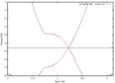
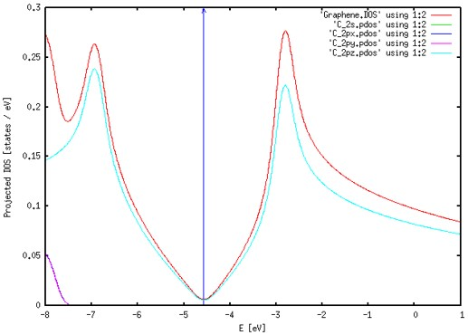

Graphene 전자 구조 계산
===============================


## Contents

1. Exercise : Electronic structure calculation
  
  
  
## Exercise 1: Electronic structure calculation
Graphene 계산을 위해 필요한 파일은 2. Graphene(bands, dos, pdos, fatbands)에 정리해 두었다.
  
### 1) Band 및 Fat-band 계산
Band 계산을 위해 RUN.fdf에 다음과 같은 옵션들을 삽입해 주어야 한다. 특히, Band 계산에서는 결과값이 Band path에 민감하게 결정되므로 high symmetry band point를 우선으로 하되, 계산하는 물성의 특성상 주목해야할 band point가 있는지 확인해야 한다. 각 path는 물질의 구조에 따라 달라지는데 Graphene은 hexagonal lattice를 가지고 있으므로 다음과 같은 path를 잡고 계산을 진행하여 결과 값을 얻는다.

```bash
$ vi RUN.fdf
WriteWaveFunctions   .true.
COOP.Write  .true.
WFS.Write.For.Bands .true.

BandLinesScale ReciprocalLatticeVectors
%block BandLines
  1  0.0000 0.0000 0.0000 G
 60  0.5000 0.0000 0.0000 M
 60  0.6666 0.3333 0.0000 K
 60  0.0000 0.0000 0.0000 G
%endblock BandLines
$ qsub slm_siesta_run
```
  
Band 시각화

```bash
$ cd (PATH)/output
$ new.gnubands Graphene.bands > gr_bands.dat
$ gnuplot
plot ‘gr_bands.dat’ using 1:2 w l
set xrange [0: 2.1270] // gr_bands.dat의 total band length 
set yrange [-8:1] // 분석할 에너지 범위. Fermi level 주위를 잡았다.
set xlabel ‘Band Path’
set ylabel ‘Energy [eV]’
set arrow from 0, -4.5682, graph 1 to 2.1270, -4.5682 ls 3 // Fermi level plot
replot
```


  
Fat band 시각화 (폴더에 있는 fat 파일과 eigfat2plot 파일을 output file에 넣어준다.)

```bash
$ mv Graphene.bands.WFSX Graphene.WFSX
$ vi Graphene.mpr // Graphene.mpr이라는 파일을 만들어야 한다.
Graphene         // System label
DOS               // 파일 생성을 위해 DOS 파일이 필요하다.
fatbands_C_2s   // output file의 이름
C_2s              // Atomic symbol_shell
fatbands_C_2px
C_2px
fatbands_C_2py
C_2py
fatbands_C_2pz
C_2pz
$ ./fat Graphene
$ ./eigfat2plot Graphene.fatbands_C_2s.EIGFAT > C_2s.fat
$ ./eigfat2plot Graphene.fatbands_C_2px.EIGFAT > C_2px.fat
$ ./eigfat2plot Graphene.fatbands_C_2py.EIGFAT > C_2py.fat
$ ./eigfat2plot Graphene.fatbands_C_2pz.EIGFAT > C_2pz.fat
$ gnuplot
plot ‘gr_bands.dat’ using 1:2 w l, ‘C_2s.fat’ using 1:2:(4*$3) with points pt 6 ps variable, ‘C_2px.fat’ using 1:2:(4*$3) with points pt 6 ps variable, ‘C_2py.fat’ using 1:2:(4*$3) with points pt 6 ps variable, ‘C_2pz.fat’ using 1:2:(4*$3) with points pt 6 ps variable
set xrange [0: 2.1270] // gr_bands.dat의 total band length 
set yrange [-8:1] // 분석할 에너지 범위. Fermi level 주위를 잡았다.
set xlabel ‘Band Path’
set ylabel ‘Energy [eV]’
set arrow from 0, -4.5682, graph 1 to 2.1270, -4.5682 ls 3 // Fermi level plot
replot
```


### 2) DOS, PDOS
DOS, PDOS 계산을 위해 다음과 같은 옵션을 KPT.fdf에 추가한다. 다시 한 번 DOS에 대한 k-point sampling을 해야 하는 것이 원칙이나 일반적으로 SCF k-point sampling보다 3~5배를 주어 계산한다. 또한, 앞서 band, fat band 계산을 위해 넣어주었던 옵션은 다시 없앤다.

```bash
$ vi KPT.fdf
%block PDOS.kgrid_Monkhorst_Pack
   150   0   0  0
   0   150   0  0
   0   0     1  0
%endblock PDOS.kgrid_Monkhorst_Pack

%block ProjectedDensityOfStates
   -8.00  1.00  0.2  1000 eV
%endblock ProjectedDensityOfStates
$ qsub slm_siesta_run
```

DOS 시각화
```bash
$ gnuplot
plot ‘Graphene.DOS’ using 1:2 w l
set xlabel ‘E [eV]’
set ylabel ‘Density of States [states / eV]’
set arrow from -4.5682, 0, graph 1 to -4.5682, 0.3 ls 3
replot
```


PDOS 시각화

### 1) pdosxml 파일 생성

```bash
$ cd (PATH)/Util/pdosxml
$ vi m_orbital_chooser.f90
wantit=((orbid%species == 'C').and.( orbid%n == 2).and.(orbid%l == 0)) // C_2s
$ make // pdosxml 파일을 생성함
$ mv pdosxml pdosxml_C_2s
$ vi m_orbital_chooser.f90
wantit =((orbid%species == 'C').and.(orbid%n == 2).and.(orbid%l == 1).and.(orbid%m == -1)) // C_2px
$ make
$ mv pdosxml pdosxml_C_2px
$ vi m_orbital_chooser.f90
wantit =((orbid%species == 'C').and.(orbid%n == 2).and.(orbid%l == 1).and.(orbid%m == 1)) // C_2py
$ make
$ mv pdosxml pdosxml_C_2py
$ vi m_orbital_chooser.f90
wantit =((orbid%species == 'C').and.(orbid%n == 2).and.(orbid%l == 1).and.(orbid%m == 0)) // C_2pz
$ make
$ mv pdosxml pdosxml_C_2pz
$ cp pdosxml_C_* (Working Directory) //pdos를 그릴 폴더에 pdosxml을 복사한다
```

### 2) gnuplot으로 시각화

```bash
$ ./pdosxml_C_2s Graphene.PDOS > C_2s.pdos
$ ./pdosxml_C_2px Graphene.PDOS > C_2px.pdos
$ ./pdosxml_C_2py Graphene.PDOS > C_2py.pdos
$ ./pdosxml_C_2pz Graphene.PDOS > C_2pz.pdos
$ gnuplot
plot 'Graphene.DOS' using 1:2 w l, 'C_2s.pdos' using 1:2 w l, 'C_2px.pdos' using 1:2 w l, 'C_2py.pdos' using 1:2 w l, 'C_2pz.pdos' using 1:2 w l
set xlabel 'E [eV]'
set ylabel 'Projected DOS [states / eV]'
set arrow from -4.5682, 0, graph 1 to -4.5682, 0.3 ls 3
replot
```



### 3) LDOS
LDOS 계산을 위해 다음과 같은 옵션을 RUN.fdf 파일에 넣어준다.

```bash
$ vi RUN.fdf
%block LocalDensityOfStates
 -4.768226 -4.368226 eV               // Around Fermi level(-4.5682eV ± 0.2eV)
%endblock LocalDensityOfStates
$ qsub slm_siesta_run
```
이렇게 나온 Graphene.LDOS 파일을 Graphene.XSF 파일로 바꿔주기 위해 rho2xsf를 사용한다. 단, rho2xsf에서 오타가 나면 원래대로 되돌릴 수 없으므로 하나씩 차근차근한다.

```bash
$ rho2xsf
Specify  SystemLabel (or 'siesta' if none): Graphene
Would you use Bohr (B) or Ang (A) ? A
Enter origin point in Ang : 0 0 0
Enter 1st spanning vector in Ang   : 2.135194724     1.232754255    0.000000000
Enter 2nd spanning vector in Ang   : 0.000000000     2.465510000    0.000000000
Enter 3rd spanning vector in Ang   : 0.000000000     0.000000000    20.211420000
Enter number of grid points along three vectors: 100 100 100
Add grid property (LDOS, RHO, ...; or BYE if none): LDOS
Add grid property (LDOS, RHO, ...; or BYE if none): BYE
$ xcrysden --xsf Graphene.XSF
```
  

  
여기서 isovalue는 임의의 적당한 값을 입력하면 되는데 LDOS를 적절하게 분석할 수 있을 정도의 값을 넣어주면 된다. 이번 Tutorial에서는 0.000005의 값을 입력했다.


