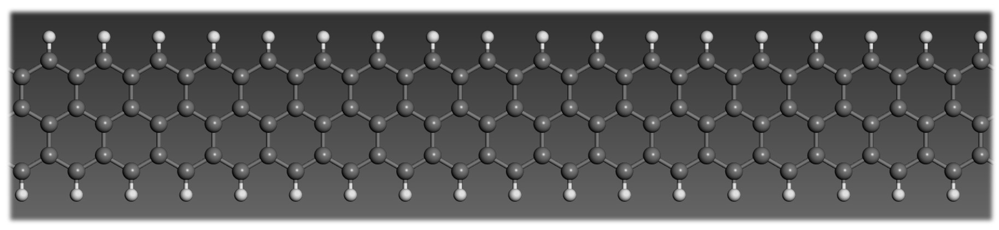
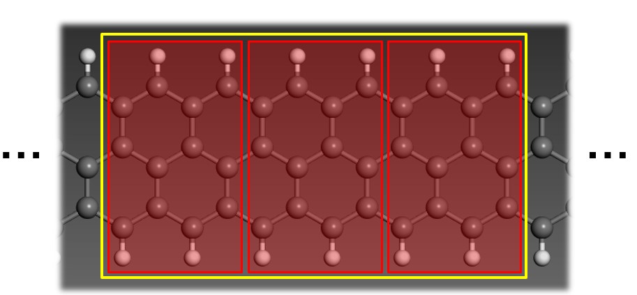
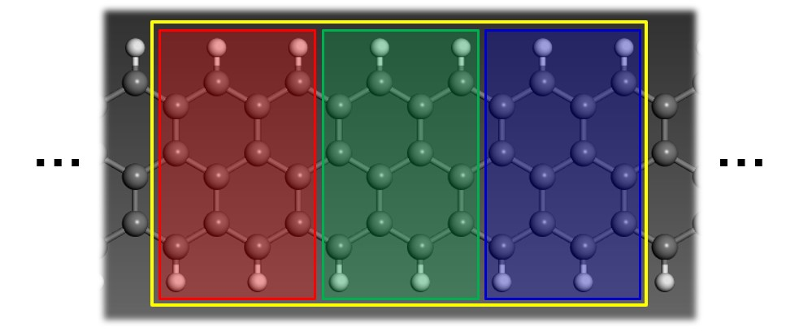
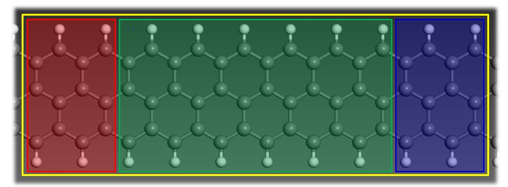
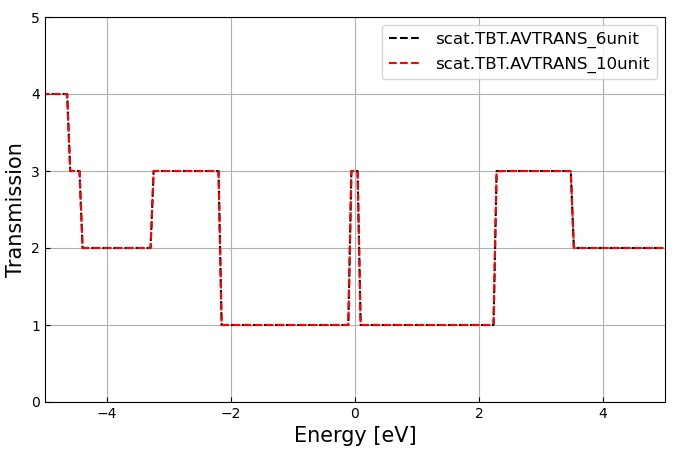
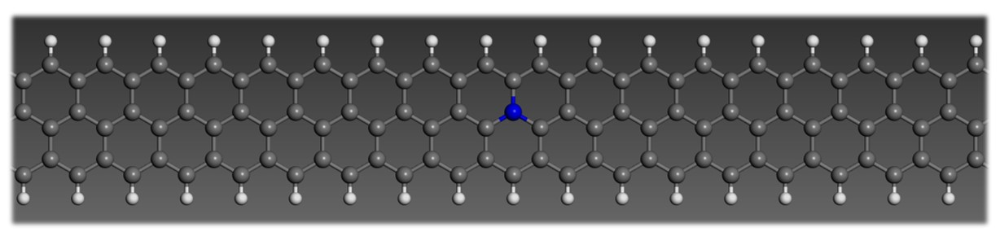
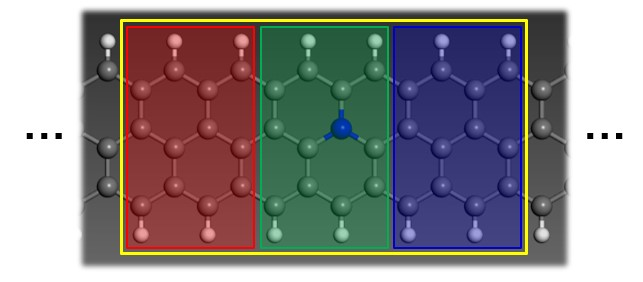
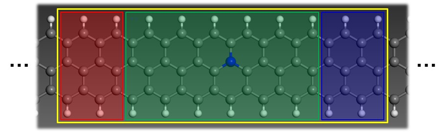
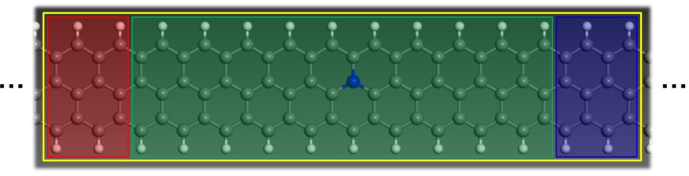
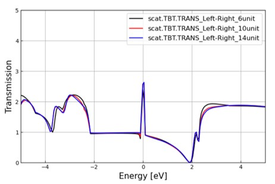

Graphene nanoribbons
=========================
## Contents
1. Pristine graphene nanoribbons
2. N-doped graphene nanoribbons

## Pristine graphene nanoribbons

<center></center>

이번 장에서는 위와 같은 zigzag graphene nanoribbons (GNRs) 구조에 대해 계산한다.

### Step 1. Electrode calculation

<center></center>

전극은 z축 방향으로 주기적 조건을 만족하는 GNRs의 2개의 unit cell로 구성되어 있다.  

```
$ cd 1. Electrode_SZ
$ cd INPUT 
$ vi RUN.fdf
```

RUN.fdf에서 다음과 같이 `DM.MixingWeight`, `DM.NumberPulay`를 수정하면 29번내로 SCF convergence한다. 

- RUN.fdf

```
...
MaxSCFIterations      500           # Default: 50
DM.MixingWeight       0.10          # Default: 0.25
DM.NumberPulay        3             # Default: 0
DM.PulayOnFile        F             # SystemLabel.P1, SystemLabel.P2
DM.Tolerance          1.d-4         # Default: 1.d-4
DM.UseSaveDM          T             # because of the bug
TS.HS.Save  	      T
...
```

slm_siesta_run을 이용해 electrode 계산을 한다.
```
$ cd ../
$ qsub slm_siesta_run
```


### Step 2. Scatting region calculation

<center></center>

Electrode 계산을 끝내고, 위와 같이 채널 영역의 길이가 2-unit cell으로 설정한 scattering 계산하기 위해 2.6unit-GNR_SZ 폴더에 들어간다. 이 다음 1.Electrode 폴더에 생성된 elec.TSHS 파일을 2.6unit-GNR_SZ의 input폴더에 넣어준다. 

```
 $ cd ../2.6unit-GNR_SZ
 $ cp ../1.Electrode_SZ/OUT/elec.TSHS input/
```

 INPUT폴더에서 TS.fdf에서 left와 right의 electrode를 다음과 같이 `HS elec.TSHS` 로 적고 eletrode의 계산에 쓰인 atom수 16개를 `used-atom 16`로 수정한다.

```
 $ cd input
 $ vi TS.fdf
```

- TS.fdf
```
 …
 %block TS.Elecs
  Left
  Right
 %endblock TS.Elecs

 %block TS.Elec.Left
  HS elec.TSHS
  chem-pot Left
  semi-inf-dir -a3
  elec-pos begin 1
  used-atoms 16
 %endblock TS.Elec.Left

 %block TS.Elec.Right
  HS elec.TSHS
  chem-pot Right
  semi-inf-dir +a3
  elec-pos end -1
  used-atoms 16
 %endblock TS.Elec.Right
 …
```
 
slm_siesta_run을 이용해 TranSIESTA 계산을 한다.
```
 $ cd ../
 $ qsub slm_siesta_run
```
 
계산에 끝나면 OUT 폴더에 `.TSHS`와 `.TSDE`가 생성된 것을 확인할 수 있을 것이다.

### Step 3. Post-processing

Transiesta  OUTPUT에서 `.TSHS`파일을 복사해 INPUT폴더에 넣어준 후 slm_transiesta_run_TBT을 이용해 TBTrans 계산을 해준다

```
$ cp OUT/Si1D_Perf.TSHS input/
$ qsub slm_transiesta_run_TBT
```

### Channel 영역의 길이: 2 vs 6 unit cell  

채널 영역의 길이가 6-unit cell인 경우에 대해서도 TranSIESTA와 TBTrans 계산을 진행한다

<center></center>

```
$ cd ../3.10unit-GNR_SZ
$ cp ../1.Electrode_SZ/elec.TSHS input/
$ qsub slm_siesta_run
$ cp OUT/scat.TSHS input/
$ qsub slm_siesta_run_TBT
```

이제 2-unit 6-unit channel GNRs의 transmission을 비교해보자.

```
$ cd ../
$ cp 2.6unit-GNR_SZ/tbtrans/scat.AVTRANs_Left-Right ./scat.TBT.AVTRANS_6unit
$ cp 3.10unit-GNR_SZ/tbtrans/scat.AVTRANs_Left-Right ./scat.TBT.AVTRANS_10unit
$ python show_trans.py scat.TBT.AVTRANS_6unit scat.TBT.AVTRANS_10unit
```

<center></center>


그림에서 보면 channel의 unit 개수와 상관없이 trasmission은 동일한 것을 확인할 수 있다.


## N-doped graphene nanoribbons

<center></center>

위와 같이 pristine GNRs에 모델에서 채널 영역에 N-dopant를 추가하여 도핑시킨 모델에 대해서 계산을 진행해보자.

- 2-unit channel

<center></center>

먼저 2-unit cell의 채널의 길이를 계산을 진행한다.
```
$ cd 4.6unit-GNR+N_SZ
$ cp ../1.Electrode/elec.TSHS input/
$ qsub slm_siesta_run
...
$ cp OUT/scat_ input/
$ qsub slm_siesta_run_tbt
```

- 6-unit channel

<center></center>

6-unit cell의 채널의 길이를 계산을 진행한다.
```
$ cd 5.10unit-GNR+N_SZ
$ cp ../1.Electrode/elec.TSHS input/
$ qsub slm_siesta_run
...
$ cp OUT/scat. input/
$ qsub slm_siesta_run_tbt
```

- 10-unit channel

<center></center>

10-unit cell의 채널의 길이를 계산을 진행한다.
```
$ cd 6.14unit-GNR+N_SZ
$ cp ../1.Electrode/elec.TSHS input/
$ qsub slm_siesta_run
...
$ cp OUT/scat.TSHS input/
$ qsub slm_siesta_run_tbt
```

### Channel 영역의 길이: 2 vs 6 vs 10 unit cell

GNRs + N-dopant 구조에 대해 채널의 길이가 2, 6, 10 unit cells인 경우의 transmission을 비교해보자.
```
$ cd ../
$ cp 4.6unit-GNR+N_SZ/TBtrans/scat.TBT.AVTRANS_Left-Right ./scat.TBT.AVTRANS_Ndopant_6unit
$ cp 5.10unit-GNR+N_SZ/TBtransscat.TBT.AVTRANS_Left-Right ./scat.TBT.AVTRANS_Ndopant_10unit
$ cp 6.14unit-GNR+N_SZ/TBtrans/scat.TBT.AVTRANS_Left-Right ./scat.TBT.AVTRANS_Ndopant_14unit
$ python show_trans.py scat.TBT.AVTRANS_Ndopant_6unit scat.TBT.AVTRANS_Ndopant_10unit scat.TBT.AVTRANS_Ndopant_14unit
```

<center></center>
