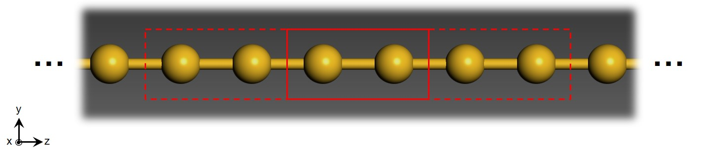
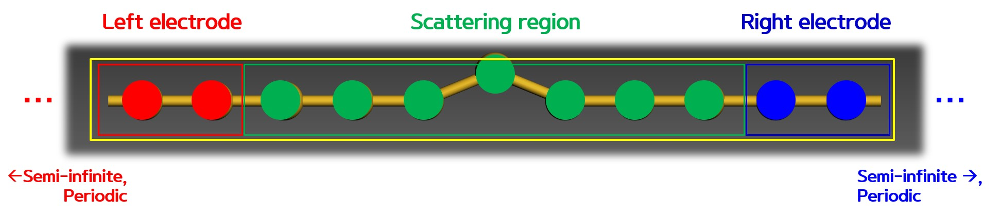
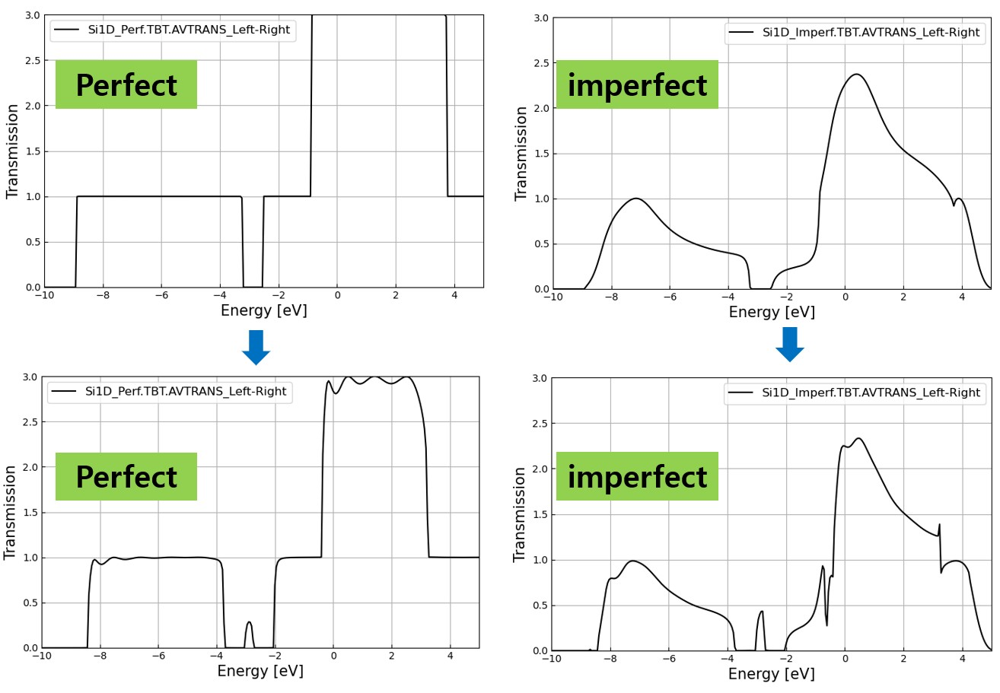

Basic TranSIESTA calculation
=========================
## Contents
1. Perfect Si chain
2. Imperfect Si chain

<center></center>

앞서 개요에서 설명했듯이 SIESTA 및 TranSIESTA 프로그램을 통해서 양자수송 특성을 계산하는 과정을 위와 같다. 이번 장에서 TranSIESTA 프로그램을 통해 Si chain (1D) 모델에 대해 평형상태 및 비평행상태의 전자수송 특성 계산과정을 제시한 단계에 따라서 소개하겠다.

## Perfect Si chain

<center></center>

먼저 위와 같이 양 전극에 2개의 Si 원자와 scattering 영역에 7개의 Si 원자로 이루어진 균일한 Si chain 모델에 대해서 **평형상태**의 양자수송 특성 계산을 진행하겠다.

### Step 1. Electrode calculation

<center></center>

양자수송 특성 계산의 가장 첫번째 단계는 우선 전극에 대한 전자구조 계산을 통해 전극 구조의 `.TSHS` 파일을 얻는 과정이 필요하다. 이는 Hamiltonian 및 overlap 행렬의 정보를 담고 있으며, 추후 scattering 영역의 계산에서 필요한 surface Green function을 만들 때 사용된다.

```
$ cd 1.electrode/input
```

- RUN.fdf
```
#------------------------------------------------------
# FDF for 1d Si chain
#------------------------------------------------------ 
SystemName       1D Si GGA system
SystemLabel        Si1D_Elec
%include STRUCT.fdf
%include BASIS.fdf
%include KPT.fdf

SolutionMethod        diagon
XC.functional         GGA
XC.authors            PBE
MeshCutoff            90.0 Ry
SaveHS                T
DM.UseSaveDM          true     # to use continuation files
TS.HS.Save 	          true
```

Electrode 계산 단계에서는 DFT 계산을 진행하므로 `SolutionMethod`이 `diagon`으로 되어있는 것을 꼭 확인하자.

- KPT.fdf
```
%block kgrid_Monkhorst_Pack
 1    0    0    0.0
 0    1    0    0.0
 0    0   50    0.0
%endblock kgrid_Monkhorst_Pack
```

전극의 벌크 구조는 전류가 흐르는 z축 방향으로 주기성을 가지고 있으므로 z축 방향으로 50의 k-point가 주어진 것을 확인할 수 있다. 여기서 명심해야할 점은 electrode 계산을 통해서 self-energy를 계산할 시에 k-point sampling에 따라서 양자수송 특성 계산의 결과가 다르게 나타날 수 있으니 일반적인 DFT 계산과 마찬가지로 꼭 k-point 수렴 테스트를 진행해야한다.  


- STRUCT.fdf
```
NumberOfAtoms         2      
NumberOfSpecies       1       
LatticeConstant       4.8 Ang  

%block ChemicalSpeciesLabel
  1  14  Si 
%endblock ChemicalSpeciesLabel

%block LatticeVectors          
 5.00000  0.00000  0.00000
 0.00000  5.00000  0.00000 
 0.00000  0.00000  1.00000
%endblock LatticeVectors

AtomicCoordinatesFormat   ScaledCartesian  

%block AtomicCoordinatesAndAtomicSpecies
 0.00000  0.00000  0.00000  1 
 0.00000  0.00000  0.50000  1 
%endblock AtomicCoordinatesAndAtomicSpecies
```

위는 원자구조에 대한 정보를 담고 있는 파일이다. 위와 같이 Input 파일이 준비되면 TranSIESTA를 실행한다.

```
$ transiesta RUN.fdf
```
참고로 electrode 계산은 DFT 계산임에도 SIESTA 실행 파일이 아닌 TranSIESTA 실행 파일로 진행하는 이유는 두 실행파일은 원칙적으로 동일하나 input의 기본설정이 다르기 때문이다. TranSIESTA는 기본적으로 `.TSHS` 파일을 출력값으로 계산하기 때문에 양자수송 특성 계산에서는 TranSIESTA 실행파일을 사용하는 것이 편리하다. 만약 SIESTA 실행파일을 이용하는 경우라면 다음과 같은 명령어를 이용하면 된다.

```
% siesta --electrode RUN.fdf
```

계산에 끝나면 OUT 폴더에 `Si1D_Elec.TSHS`가 생성된 것을 확인할 수 있을 것이다. 이는 두번째 단계에서 전극의 self-energy를 만드는데 필요한 헤밀토니안 정보를 담고 있다.


### Step 2. Scatter region calculation

<center></center>

Electrode 계산을 끝내고 scatter region에 대한 계산을 하기 위해 `2.scattering/1.perfect_chain` 폴더에 들어간다. 이 다음 이전 `1.electrode` 폴더에 생성된 `Si1D_Elec.TSHS` 파일을 `2.perfect_chain`의 input폴더에 넣어준다. 

```
$ cd ../2.perfect_chain/scattering
$ cp ../../1.electrode/input/Si1D_Elec.TSHS input/
```

TranSIESTA 계산에서는 필요한 입력값에 대한 정보는 `input` 폴더의 `TS.fdf` 파일에 명시되어 있다. 여기에는 전극 영역에 대한 지정과 파일 이름에 대한 지정이 필요하다. `TS.fdf`에서 `1.electrode`에서 가져온 파일의 이름을 다음과 같이 `HS Si1D_Elec.TSHS` 로 적고 eletrode의 계산에 쓰인 atom수 2개를 `used-atom 2`로 수정한다.
```
$ cd INPUT
$ vi TS.fdf
```

- TS.fdf
```
…
%block TS.Elecs
  Left
  Right
%endblock TS.Elecs

%block TS.Elec.Left
  HS Si1D_Elec.TSHS
  chem-pot Left
  semi-inf-dir -a3
  elec-pos begin 1
  used-atoms 2
%endblock TS.Elec.Left

%block TS.Elec.Right
  HS Si1D_Elec.TSHS
  chem-pot Right
  semi-inf-dir +a3
  elec-pos end -1
  used-atoms 2
%endblock TS.Elec.Right
…
```

TranSIESTA를 통한 Green's function 계산을 위해서는 다음과 같이 `SolutionMethod`을 `TranSIESTA`로 바꾸어준다.

- RUN.fdf
```
SolutionMethod transiesta
```

또한 scattering 계산에서는 electrode 계산과 다르게 양자수송 방향으로 열린 경계조건으로 계산이 되기 때문에 주기성을 가지고 있지 않다. 따라서 k-point를 다음과 같이 바꾸어준다.

- KPT.fdf
```
%block kgrid_Monkhorst_Pack
 1    0    0    0.0
 0    1    0    0.0
 0    0    1    0.0
%endblock kgrid_Monkhorst_Pack
```

이제 다음 명령어를 통해 Transiesta를 계산한다
```
$ transiesta RUN.fdf
```
계산에 끝나면 폴더에 `Si1D_Perf.TSHS`와 `Si1D_Perf.TSDE`가 생성된 것을 확인할 수 있을 것이다. 이 `Si1D_Perf.TSHS` 파일은 Green's function 계산을 통해 얻은 열린 경계조건의 헤밀토니안의 정보를 가지고 있어 추후 TBtrans 계산을 통해 양자수송 특성을 얻는데 이용된다. `Si1D_Perf.TSDE` 파일은 계산이 중간에 멈추거나 다시 계산할 시에, 혹은 전압을 인가할 시에 self consistent field (SCF) 계산의 초기조건으로 이용되는 파일이다.


### Step 3. Post-processing

<center></center>

위 계산이 마친다면 폴더 내에 TBtrans를 계산하기 위한 전극의 `TSHS` 파일, scattering 계산 후의 `TSHS` 파일이 모두 포함되어있다. 이제는 post-processing 단계로 TBtrans 계산을 통해 최종적인 양자수송 특성을 얻을 수 있다. 참고로 TBtrans 계산에 대한 옵션은 이미 `TS.fdf` 명시되어있다.

```
$ tbtrans RUN.fdf
```

### Results: Transmission, Band, DOS, 

TBtrans 계산이 끝나면 `.AVTRANS_Left-Right` 파일을 얻을 수 있다. 이는 에너지 스펙트럼에 대한 transmission 값에 대한 정보를 담고 있다. Transmission을 plot해보자.

```
$ python ../show_trans.py Si1D_perf.AVTRANS_Left-Right
```
<center></center>

아래와 같이 전극의 density of states (DOS)나 band와 같은 전자구조와 transmission을 비교할 수 있다.

```
$ cd ../../1.Electrodes
$ xv2xsf

...

$ cp ../2.PerfectChain/TBtrans/Si1D_Perf.AVTRANS .
$python band+dos+T.py
```
<center></center>


## Imperfect Si chain

<center></center>

이번에는 채널 구역의 중심 Si 원자가 위쪽 방향으로 이동된 비균질한 구조를 이용하여 평형상태 및 비평형상태의 전자수송 특성 계산을 한다. 참고할 점은 전극의 구조는 perfect Si chain과 동일하다는 점이다.

### Equilibrium calculation (0V)

우선 이전과 마찬가지로 전압이 인가되지 않는 평형상태의 계산을 진행해보자.

`1.electrode/input` 폴더  `Si1D_Elec.TSHS`를 INPUT에 복사한 후 TranSIESTA 계산을 한다.
```
$ cd ../3.imperfect_chain/scattering
$ cp ../../1.electrode/input/Si1D_Elec.TSHS input/.
```

이전과 마찬가지로 `TS.fdf`에서 electrode left와 right, used-atom을 수정해준 후 transiesta 계산을 한다.
```
$ cd input
$ transiesta RUN.fdf
```

폴더에 `Si1D_Perf.TSHS`이 생성된 것을 확인한 후에 TBtrans 계산을 통해 양자수송특성 계산을 진행한다.
```
$ tbtrans RUN.fdf
```

Silicon chain (1D)의 perfect구조와 imperfect구조의 0V 상황에서의 transmission을 비교해보자.

```
$ cd ../../../
$ cp 2.perfect_chain/scattering/input/Si1D_Perf.TBT.AVTRANS_Left-Right .
$ cp 3.imperfect_chain/Scattering/input/Si1D_Imperf.TBT.AVTRANS_Left-Right .
$ python show_trans.py Si1D_Perf.TBT.AVTRANS Si1D_Perf.TBT.AVTRANS
```

<center></center>


### Non-equilibrium calculation (1V)

이제 imperfect Si chain 모델에 대해 전압이 인가된 비평형 상태에 대한 계산을 진행해보자. 이 때도 마찬가지로 electrode의 `.TSHS` 파일이 필요하다. 그리고 추가적으로 `4.1.5` 버전의 TranSIESTA부터는 필수적으로 비평형 상태의 계산을 진행할 시에 평형상태의 `.TSDE` 파일을 이용하도록 되어있다. 따라서 평형상태의 scattering 계산을 통해 얻은 `.TSDE` 파일 또한 넣어준다.
다.

```
$ cd 4.imperfect_chain_1V/
$ cp ../../1.electrode/input/Si1D_Elec.TSHS .
$ cp ../../3.imperfect_chain/input/Si1D_Perf.TSDE .
```

비평형 상태의 NEGF 계산은 평형 상태의 계산과 거의 동일하다. 1V의 전압을 인가하기 위해서는 다음과 같은 옵션을 바꾸어 주면 된다.

- TS.fdf
```
TS.Voltage    1.00000 eV
```

이제 TranSIESTA 계산을 진행해준다.

```
$ transiesta RUN.fdf
```

### Result: Imperfect Si chain 0V vs 1V

Silicon chain (1D) 0V, 1V의 imperfect구조의 transmission을 비교하자.

```
$ cd ../../../
$ cp 4.imperfect_chain_1V/scattering/input/Si1D_Perf.AVTRANS_Left-Right ./Si1D_Imperf_1V.TBT.AVTRANS
$ python show_trans.py Si1D_Imperf.TBT.AVTRANS_Left-Right Si1D_Imperf_1V.TBT.AVTRANS
```

<center></center>


### 요약

**Electrode 계산 (SIESTA)**
Output: `electrode.TSHS`

**Scattering 계산 (TranSIESTA)**
Input: `electrode.TSHS`, `scattering.TSDE` (전압 인가시, 재 계산시)
Output: `scattering.TSHS`, `scattering.TSDE`

**Post-processing 계산 (TBtrans)**
Input: `electrode.TSHS`, `scattering.TSHS`
Output: `scattering.AVTRANS_Left-Right`